# Java 基础语法特性

## 注释

空白行，或者注释的内容，都会被 Java 编译器忽略掉。

Java 支持多种注释方式，下面的示例展示了各种注释的使用方式：

```java
public class HelloWorld {
    /*
     * JavaDoc 注释
     */
    public static void main(String[] args) {
        // 单行注释
        /* 多行注释：
           1. 注意点a
           2. 注意点b
         */
        System.out.println("Hello World");
    }
}
```

## 基本数据类型


> 
<!-- > 👉 扩展阅读：[深入理解 Java 基本数据类型](02.Java基本数据类型.md)  -->

## 变量和常量

Java 支持的变量类型有：

- `局部变量` - 类方法中的变量。
- `成员变量（也叫实例变量）` - 类方法外的变量，不过没有 `static` 修饰。
- `静态变量（也叫类变量）` - 类方法外的变量，用 `static` 修饰。

特性对比：

| 局部变量                                                                                                                   | 实例变量（也叫成员变量）                                                                                                                                | 类变量（也叫静态变量）                                                                                                                                                                          |
| -------------------------------------------------------------------------------------------------------------------------- | ------------------------------------------------------------------------------------------------------------------------------------------------------- | ----------------------------------------------------------------------------------------------------------------------------------------------------------------------------------------------- |
| 局部变量声明在方法、构造方法或者语句块中。                                                                                 | 实例变量声明在方法、构造方法和语句块之外。                                                                                                              | 类变量声明在方法、构造方法和语句块之外。并且以 static 修饰。                                                                                                                                    |
| 局部变量在方法、构造方法、或者语句块被执行的时候创建，当它们执行完成后，变量将会被销毁。                                   | 实例变量在对象创建的时候创建，在对象被销毁的时候销毁。                                                                                                  | 类变量在第一次被访问时创建，在程序结束时销毁。                                                                                                                                                  |
| 局部变量没有默认值，所以必须经过初始化，才可以使用。                                                                       | 实例变量具有默认值。数值型变量的默认值是 0，布尔型变量的默认值是 false，引用类型变量的默认值是 null。变量的值可以在声明时指定，也可以在构造方法中指定。 | 类变量具有默认值。数值型变量的默认值是 0，布尔型变量的默认值是 false，引用类型变量的默认值是 null。变量的值可以在声明时指定，也可以在构造方法中指定。此外，静态变量还可以在静态语句块中初始化。 |
| 对于局部变量，如果是基本类型，会把值直接存储在栈；如果是引用类型，会把其对象存储在堆，而把这个对象的引用（指针）存储在栈。 | 实例变量存储在堆。                                                                                                                                      | 类变量存储在静态存储区。                                                                                                                                                                        |
| 访问修饰符不能用于局部变量。                                                                                               | 访问修饰符可以用于实例变量。                                                                                                                            | 访问修饰符可以用于类变量。                                                                                                                                                                      |
| 局部变量只在声明它的方法、构造方法或者语句块中可见。                                                                       | 实例变量对于类中的方法、构造方法或者语句块是可见的。一般情况下应该把实例变量设为私有。通过使用访问修饰符可以使实例变量对子类可见。                      | 与实例变量具有相似的可见性。但为了对类的使用者可见，大多数静态变量声明为 public 类型。                                                                                                          |
|                                                                                                                            | 实例变量可以直接通过变量名访问。但在静态方法以及其他类中，就应该使用完全限定名：ObejectReference.VariableName。                                         | 静态变量可以通过：ClassName.VariableName 的方式访问。                                                                                                                                           |
|                                                                                                                            |                                                                                                                                                         | 无论一个类创建了多少个对象，类只拥有类变量的一份拷贝。                                                                                                                                          |
|                                                                                                                            |                                                                                                                                                         | 类变量除了被声明为常量外很少使用。                                                                                                                                                              |

**变量修饰符**

- **访问级别修饰符**
  - 如果变量是实例变量或类变量，可以添加访问级别修饰符（public/protected/private）
- **静态修饰符**
  - 如果变量是类变量，需要添加 static 修饰
- **final**
  - 如果变量使用 `final` 修饰符，就表示这是一个常量，不能被修改。

## 方法

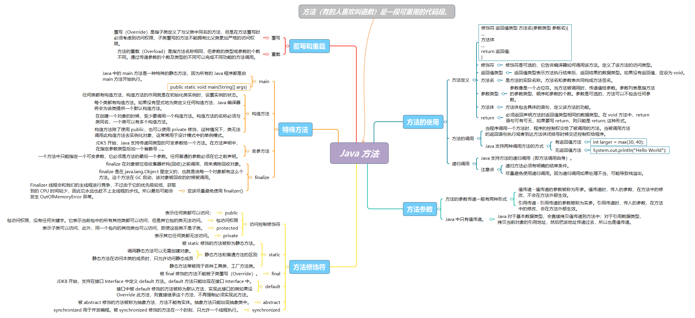

> 
<!-- > 👉 扩展阅读：[深入理解 Java 方法](04.Java方法.md) -->


## 数组

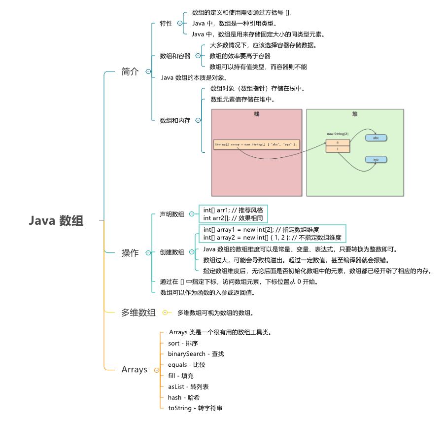

> 

<!-- > 👉 扩展阅读：[深入理解 Java 数组](05.Java数组.md) -->

## 枚举


05.Java数组

> 

<!-- > 👉 扩展阅读：[深入理解 Java 枚举](06.Java枚举.md) -->

## 操作符

Java 中支持的操作符类型如下：

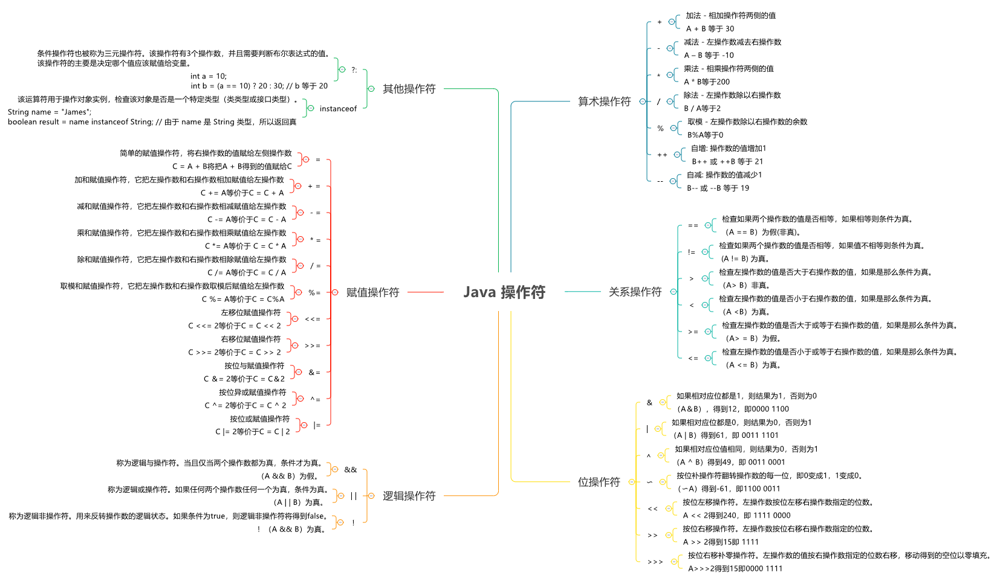


> 👉 扩展阅读：[Java 操作符](http://www.runoob.com/java/java-operators.html)


## 控制语句

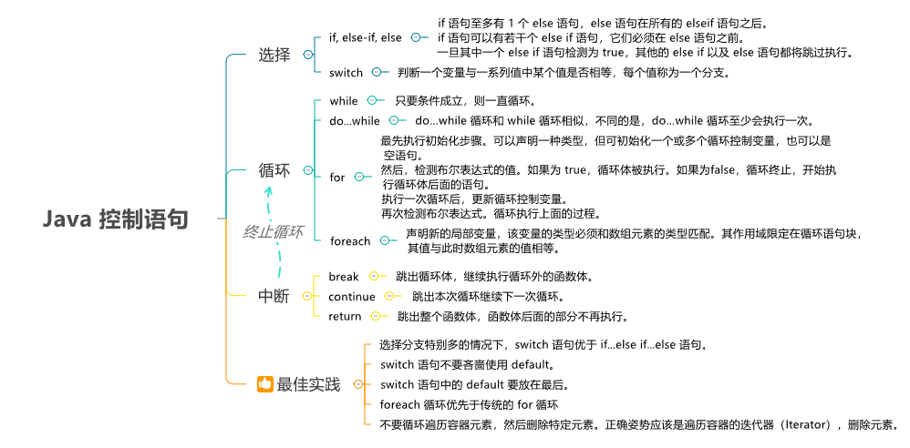

> 

<!-- > 👉 扩展阅读：[Java 控制语句](07.Java控制语句.md) -->

## 异常

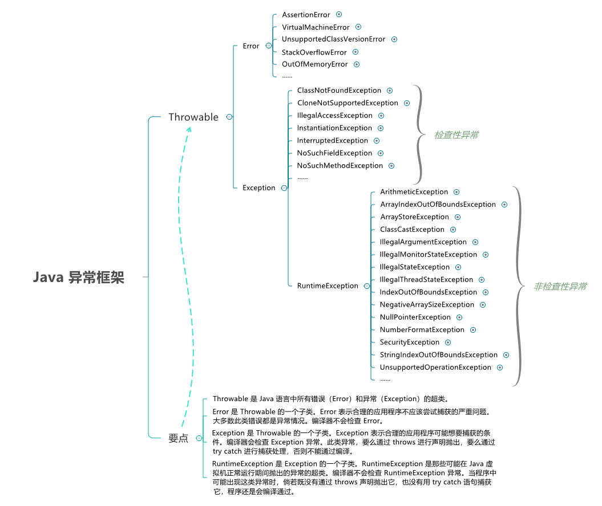

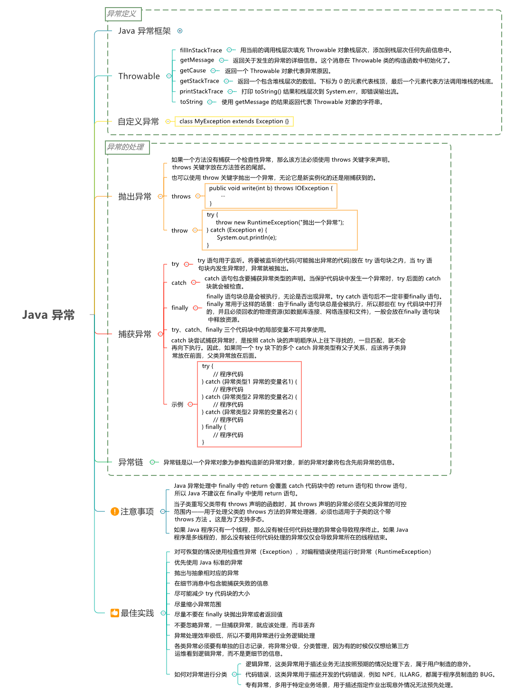

> 


<!-- > 👉 扩展阅读：[深入理解 Java 异常](08.Java异常.md) -->

## 泛型

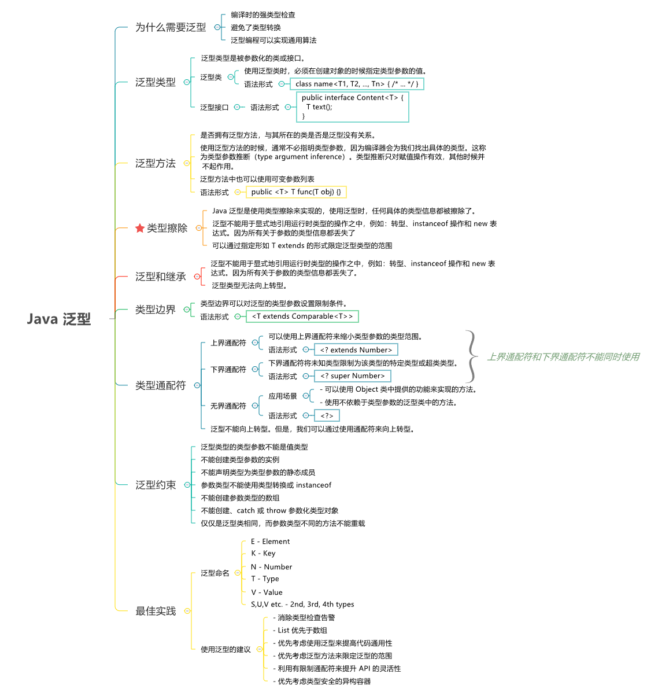

> 

<!-- > 👉 扩展阅读：[深入理解 Java 泛型](09.Java泛型.md) -->

## 反射

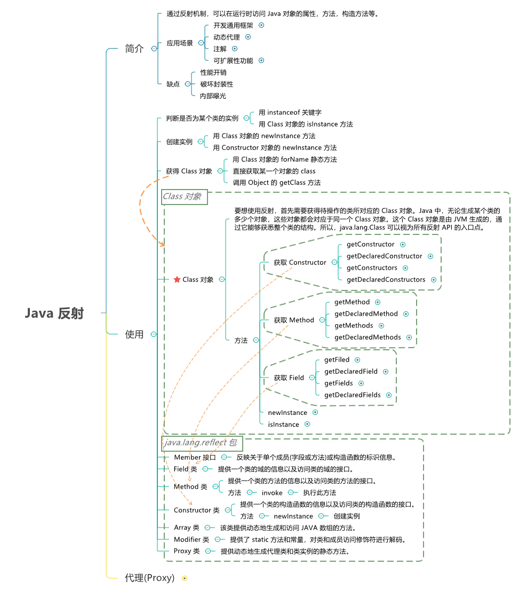

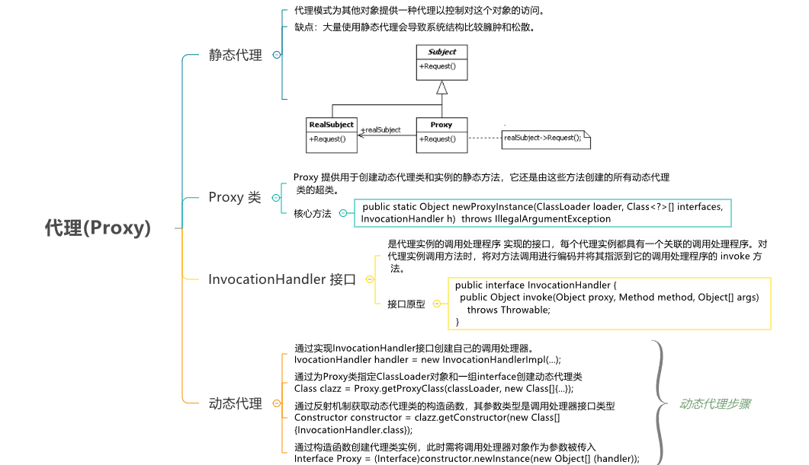

> 

<!-- > 👉 扩展阅读：[深入理解 Java 反射和动态代理](https://dunwu.github.io/waterdrop/pages/0d066a/) -->

## 注解

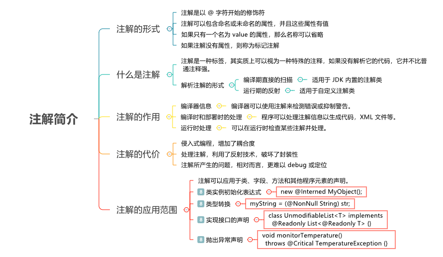

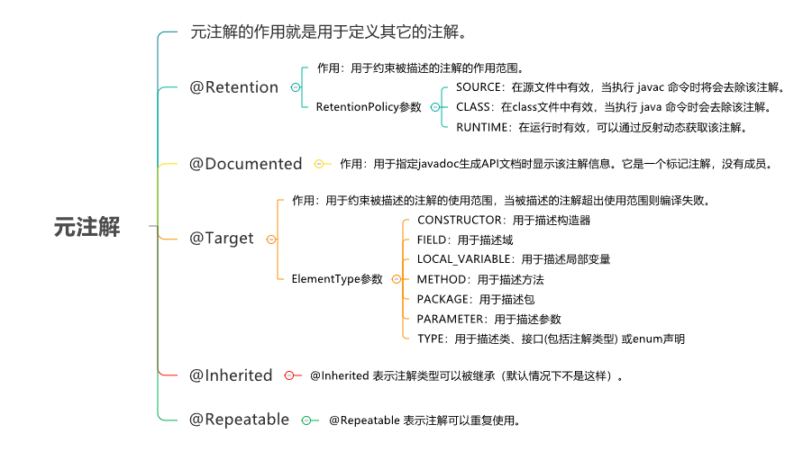

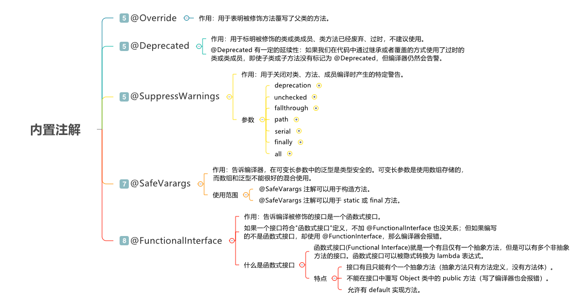

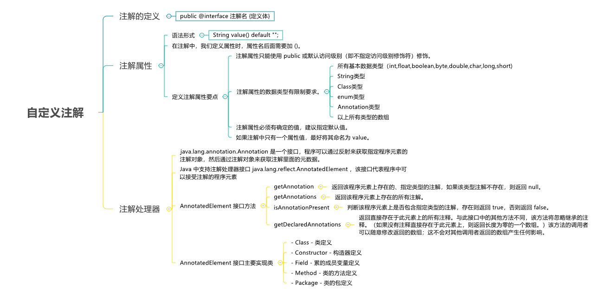

> 

<!-- > 👉 扩展阅读：[深入理解 Java 注解](https://dunwu.github.io/waterdrop/pages/ecc011/) -->


