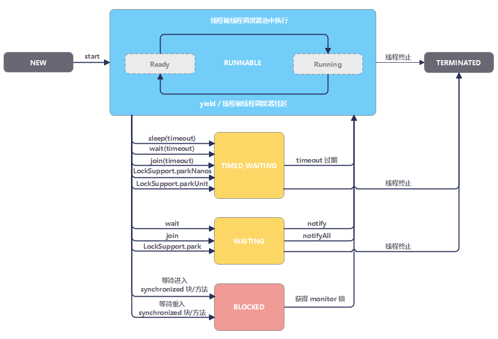

## Java 高级


### 数据结构
数组、列表、集合、映射、栈、队列、堆、树。

### Java 集合框架


[点击查看UML图](https://www.cnblogs.com/Bytezero/p/15270427.html)

| 类型                | 描述            | 特点                                  | 常用实现类                                                                      |
|-------------------|---------------|-------------------------------------|----------------------------------------------------------------------------|
| **`Collection`**  | 单列数据集合的根接口    | 存储一组对象的容器                           | (它下面有List和Set)                                                             |
| **`List`**        | **有序、可重复**的集合 | 有索引，允许重复，元素有顺序                      | **`ArrayList`**, **`LinkedList`**, `Vector`                                |
| **`Set`**         | **唯一、无序**的集合  | 无索引，不允许重复元素，不保证顺序                   | **`HashSet`**（无序）, **`LinkedHashSet`**(有序), **`TreeSet`**(升序)              |
| **`Map`**         | **双列数据**的集合   | 存储**键值对(Key-Value)**，Key唯一，排序由key决定 | **`HashMap`**（无序）, **`LinkedHashMap`**（有序）, **`TreeMap`**（升序）, `Hashtable` |
| **`Collections`** | **操作集合的工具类**  | 提供了一系列静态方法，用于对集合进行排序、搜索、线程安全化等操作    | (这是一个工具类，不是接口)                                                             |


#### 单列集合遍历

1. iterator

```java
List<Integer> list = new ArrayList<>();
list.add(1);
list.add(2);
list.add(3);
Iterator it = list.iterator();
while (it.hasNext()) {
    System.out.println(it.next());
}
```
2. 增强 for 循环，可以遍历集合和数组

3. lambda 表达式 `default void forEach(Consumer<? super T> action)`
```java
arr.forEach(e -> System.out.println(1))
```

> 集合中，边遍历边增删，只能使用迭代器。

#### 双列集合遍历
1. 键找值
```java
HashMap<String,Integer> map = new HashMap();
Set<String> keys = map.keySet();
for(String key: keys){
    Integer val = map.get(key);
}
// Collection<Integer> values =map.values();
```

2. 键值对 
```java
Set< Map.Entry<string,Integer> entries = map.entryset();
for(Map.Entry<string, Integer>entry :entries){
    String key = entry.getKey();
    Integer value = entry.getValue();
    System.out.println(key +"====>" + value);
}
```

3. lambda 表达式 `default void forEach(BigConsumer<? super K,? super V> action)`
需要用到forEach方法
```java
map.forEach((k,v)->{
    // xxx
})
```
#### List
##### ArrayList


它可以动态修改数组，没有固定大小，可以删除和添加元素。
**特点**：查询快，增删慢
**底层原理**：底层采用数组存储元素，默认构造器初始化 size 是0，第一次 add size 扩容为 10。oldCapacity >> 1，相当于*1/2，也就是扩容为原来的1.5倍。

详细api方法可以查看：[官方API文档](https://docs.oracle.com/javase/8/docs/api/index.html)

##### LinkedList
链表（Linked list）是一种线性表，但是并不会按线性的顺序存储数据，而是在每一个节点里存到下一个节点的地址。
链表可以分为单链表和双链表。

**特点**：查询慢，增删相对快；但是对于首尾元素的增删改查极快（双链表，不需要遍历整个链表），因此可以用来设计队列和栈。
**底层原理**：底层采用双链表存储元素，


#### Set

##### 认识哈希值
就是一个int类型的随机值，Java每个对象都有一个哈希值。
Object中定义了HashCode()，每个对象都可以调用。
特点：
- 同一个对象多次调用 HashCode() 返回值是一样的
- 不同的对象调用 HashCode() 返回值一般是不相等的，相等的情况被叫做哈希碰撞
##### HashSet

1. **哈希表**
- JDK8之前，哈希表= 数组+链表
- JDK8开始，哈希表= 数组+链表+红黑树
- 哈希表是一种增删改查，性能都比较好的数据结构

2. **底层原理**
HashSet 底层基于哈希表存储数据的。
- ① 创建一个默认长度为16的数字，默认加载因子为0.75（元素个数=oldcapacity * 0.75 时，扩容），数组名为table
- ② 使用元素的哈希值对数组的长度做运算，计算出应存入的位置
- ③ 判断当前位置是否为null，如果是null，就直接存入
- ④ 如果不为null，调用equals比较，相等，则不存；不相等，则存入数组。
    + JDK8之前，新元素存入数组，老元素挂在下面，就是链表。
    + JDK8开始，新元素直接挂在老元素下面；当链表长度>8，且数组长度>=64时，自动将链表转为红黑树。

3. **自定义去重**
加入两个属性一样的student对象，因为对象地址不一样，不会去重。要去除这种形式的重复对象，就只能自定义
这时候，就需要重写 HashCode() 和 equals()。这里不明白的话，就在看看**底层原理**
重写时在 Student 类里面重写，idea可以快捷生成。

##### LinkedHashSet
也是基于哈希表（数组、链表、红黑树）实现的，通过双链表来维护先后顺序。

##### TreeSet
底层基于红黑树
> 数值类型默认按大小升序排列
> String 类型按首字符编号升序排列   
**对象类型：如 Student，是无法直接排序的。**
如果非要排序，也可以；有两种方法
1. 对象类实现comparable接口，重写compareTo方法，指定大小比较规则。
```java
// o1.compareTo(o2)
// o1 是比较者，o2 是被比较者
// 升序规定：如果左边大于右边，请放回正整数；反之，请返回负整数；相等返回0
@Override
public int compareTo(Student o){
    if(this.age > o.getAge()) return 1;//类里面可以直接用 this 调用 
    if(this.age < o.getAge()) return -1;
    return 0;//TreeSet中，相等只会保留一个；如果一定要保留，这不要 0 的情况，重新自定义
}
```
2. 使用集合自带比较器 Comparator，指定比较规则：`public TreeSet(Comparator c)`
```java
Set<Student> stu = new TreeSet(new Comparator<Student>(){
    @Override
    public int compare(Student o1,Student o2){
        return o1.getAge()-o2.getAge();//如果是小数的话，尽量调用 Double.Compare(o1.getxx-o2.getxxx)
    }
});
```


#### Map
存储 Key-Value 键值对数据，格式为{key1=val1,key2=val2,……}，Key 不允许重复（重复则覆盖），Value 可以重复。允许至多一个 null 键 和多个 null 值。
##### HashMap

常用方法：
```java
HashMap<String,Integer> map = new HashMap();
// put get size clear isEmpty
Set<String> keys = map.keySet();//Set 集合的特点与key的特点一致，因此用Set集合接收。
Collection<Integer> values =map.values();
```

HashMap 底层和HashSet 一样，HashSet 底层调用的 HashMap

##### LinkedHashMap
LinkedHashMap是LinkedHashset的底层原理，底层直接 new LinkedHashMap

##### TreeMap
从 Java 7 开始，TreeMap 不允许使用 null 作为键
底层就是TreeSet的底层，TreeSet 底层就是 new TreeMap


### 泛型
定义：定义类、接口、方法时，同时声明一个或者多个类型的变量
格式：`public <T> void printArray(T[] arr){...}` 或者 `public class ArrayList<T>{....}`，在 "<>" 中声明类型。
作用：在编译阶段约束所能操作的数据类型，避免强制转换出错。

> 像 `public <T> void printArray(T[] arr){...}` 定义时拥有返回值，void 就改为 T。
**泛型类型参数约定：**

| 类型参数     | 含义            | 常用场景                        |
|----------|---------------|-----------------------------|
| `E`      | Element (元素)  | 在集合中使用，因为集合中存放的是元素          |
| `T`      | Type (类型)     | 表示一个Java类                   |
| `K`      | Key (键)       | 在映射中表示键的类型                  |
| `V`      | Value (值)     | 在映射中表示值的类型                  |
| `N`      | Number (数值类型) | 表示数值类型                      |
| `?`      | 通配符           | **使用泛型时**（不是定义），表示所有的Java类型 |
| `R`      | Result (结果)   | 表示方法返回值的类型                  |
| `U`, `S` | 其他类型          | 当需要多个类型参数时使用                |

**上下限：**
- 泛型上限：? extends Car，? 必须接收 Car 或者其子类
- 泛型下限：? super Car，? 必须接收Car 或者其父类

**支持的类型：**
不支持基本数据类型，只支持对象类型（引用类型）

### 序列化
是将对象转为字节流，反序列化是将字节流重新转为对象。
要实现序列化，只需要类实现 Serializable 接口即可。
### 网络编程
基本的通信架构有2种形式:CS架构(Client客户端/Server服务端)、BS架构(Browser浏览器/Server服务端)。
#### 网络编程三要素
1. IP
- 设备在网络中的地址，是设备在网络中的唯一标识；Java中InetAdress类表示IP对象
| InetAdress类常用方法 | 说明 |
| :--- | :--- |
| `public static InetAddress getLocalHost() throws UnknownHostException` | 获取本机IP，返回一个InetAddress对象 |
| `public String getHostName()` | 获取该IP地址对象对应的主机名（参数可以是域名） |
| `public String getHostAddress()` | 获取该IP地址对象中的IP地址信息 |
| `public static InetAddress getByName(String host) throws UnknownHostException` | 根据IP地址或者域名，返回一个InetAddress对象 |
| `public boolean isReachable(int timeout) throws IOException` | 判断主机在指定毫秒内与该IP对应的主机是否能连通 |

2. 端口
- 应用程序在设备中的唯一标识

3. 协议
- 连接和数据在网络中传输的规则。
#### 传输层两个传输协议
1. UDP：用户数据报协议
- 一般数据报大小限制在64kb以内
- 无连接，不可靠协议
```java
//Java提供了一个java.net.DatagramSocket类来实现UDP通信:
//=============client===========
DatagramSocket socket = new DatagramSocket();//系统随机分配端口
bytep[] bytes = "内容".getBytes();
DatagramPacket packet = new DatagramPacket(bytes,bytes.length,InetAdress.getLocalHost(),8080);//数据包参数:内容，内容长度，目的地址，目的端口
socket.send(packet);//发送数据包

//===============server============
DatagramSocket socket = new DatagramSocket(8080);//端口8080
byte[] buf = new byte[1024 * 64];
DatagramPacket packet = new DatagramPacket(buf,buf.length);
socket.receive(packet);//接收数据
//查看接收数据
int len = packet.getLength();//收到数据的长度
String data = new String(buf,0,len);
```

2. TCP：传输控制协议
- 在不可靠的信道上，实现可靠的数据传送（三次握手，四次挥手  ）。
- 面向连接，可靠通信
```java
//Java提供了一个java.net.Socket类来实现TCP客户端通信:
//=============client==========
Socket client = new Socket("127.0.0.1",8080);
OutputStream os = client.getOutputStream();//客户端和服务端使用的流必须一样。
DataOutputStream dos = new DataOutputStream(os);
dos.writeInt(1);
dos.writeUTF("x地方");
client.close();

//服务端是通过java.net包下的Serversocket类来实现的服务的通信：
//============server========
ServerSokcet server = new ServerSocket(8080);
Socket socket = server.accpet();//阻塞等待连接
InputStream in = socket.getInputStream()
DataInputStream dis = new DataInputStream(in);
int id = dis.readInt();
String msg = dis.readUTF();
```

> tcp和udp的多发多收，加上while即可
> Socket 长连接，指的是在客户和服务端之间保持一个 socket 连接长时间不断开:`socket.setKeepAlive(true);`

#### B/S架构原理
访问浏览器 127.0.0.1:8080 就可以看到 hello world。
```java
ServerSokcet server = new ServerSocket(8080);
Socket socket = server.accpet();
OutputStream os = socket.getOutputStream();
PrintStream ps = new PrintStream(s);
ps.println("HTTP/1.1 200 OK");
ps.println("Content-Type:text/html;charset=utf-8")
ps.println();//必须换一行
ps.println("<html>")
ps.println("<head>")
ps.println("<meta charset='utf-8'>");
ps.println("<title>");
ps.println("黑马Java磊哥的视频");
ps.println("</title>");
ps.println("</head>");
ps.println("<body>"):
ps.println("<h1 style='color:red;font-size=20px'>hello world</h1>")ps.println("</body>");
ps.println("</html>");
ps.close();
socket.close();
```
### 发送邮件
遇到再补充


### 多线程编程
线程：程序内一条执行流程。
进程：正在运行的程序（软件）就是一个独立的进程。

**进程中，多个线程是并发和并行执行的。**

并发：cpu轮询执行每个线程，由于切换速度很快，看起来像是同时执行。
并行：在某一时刻上，同时有多个线程在cpu调度。
#### Thread
```java
public class ThreadDemo {

    public static void main(String[] args) {
        // 实例化对象
        MyThread tA = new MyThread("Thread 线程-A");
        MyThread tB = new MyThread("Thread 线程-B");
        // 调用线程主体
        tA.start();
        tB.start();
    }

    static class MyThread extends Thread {
        private int ticket = 5;

        MyThread(String name) {
            super(name);
        }
        @Override
        public void run() {
            while (ticket > 0) {
                System.out.println(Thread.currentThread().getName() + " 卖出了第 " + ticket + " 张票");
                ticket--;
            }
        }

    }

}
```
#### Runable
**实现 Runnable 接口优于继承 Thread 类**，因为Java不能多继承
```java
public class RunnableDemo {

    public static void main(String[] args) {
        // 实例化对象
        Thread tA = new Thread(new MyThread(), "Runnable 线程-A");
        Thread tB = new Thread(new MyThread(), "Runnable 线程-B");
        // 调用线程主体
        tA.start();
        tB.start();
    }

    static class MyThread implements Runnable {

        private int ticket = 5;

        @Override
        public void run() {
            while (ticket > 0) {
                System.out.println(Thread.currentThread().getName() + " 卖出了第 " + ticket + " 张票");
                ticket--;
            }
        }

    }

}
```
> runable 可以用匿名内部类，直接简写。

#### Callable、Future、FutureTask
**继承 Thread 类和实现 Runnable 接口这两种创建线程的方式都没有返回值**，为了得到结果，Java 1.5 后，提供了 Callable 接口和 Future 接口，通过它们，可以在线程执行结束后，返回执行结果。

**Callable + Future + FutureTask 示例**
通过实现 Callable 接口创建线程的步骤：

1. 创建 Callable 接口的实现类，并实现 call 方法。该 call 方法将作为线程执行体，并且有返回值。
2. 创建 Callable 实现类的实例，使用 FutureTask 类来包装 Callable 对象，该 FutureTask 对象封装了该 Callable 对象的 call 方法的返回值。
3. 使用 FutureTask 对象作为 Thread 对象的 target 创建并启动新线程。
4. 调用 FutureTask 对象的 get 方法来获得线程执行结束后的返回值。
```java
public class CallableDemo {

    public static void main(String[] args) {
        Callable<Long> callable = new MyThread();
        FutureTask<Long> future = new FutureTask<>(callable);
        new Thread(future, "Callable 线程").start();
        try {
            System.out.println("任务耗时：" + (future.get() / 1000000) + "毫秒");
        } catch (InterruptedException | ExecutionException e) {
            e.printStackTrace();
        }
    }

    static class MyThread implements Callable<Long> {

        private int ticket = 10000;

        @Override
        public Long call() {
            long begin = System.nanoTime();
            while (ticket > 0) {
                System.out.println(Thread.currentThread().getName() + " 卖出了第 " + ticket + " 张票");
                ticket--;
            }

            long end = System.nanoTime();
            return (end - begin);
        }

    }

}
```
**Callable**
Callable 接口只声明了一个方法，这个方法叫做 call()：

```java
public interface Callable<V> {
    /**
     * Computes a result, or throws an exception if unable to do so.
     *
     * @return computed result
     * @throws Exception if unable to compute a result
     */
    V call() throws Exception;
}
```
那么怎么使用 Callable 呢？一般情况下是配合 ExecutorService 来使用的，在 ExecutorService 接口中声明了若干个 submit 方法的重载版本：

```java
<T> Future<T> submit(Callable<T> task);
<T> Future<T> submit(Runnable task, T result);
Future<?> submit(Runnable task);
```
第一个 submit 方法里面的参数类型就是 Callable。

**Future**
Future 就是对于具体的 Callable 任务的执行结果进行取消、查询是否完成、获取结果。必要时可以通过 get 方法获取执行结果，该方法会阻塞直到任务返回结果。

```java
public interface Future<V> {
    boolean cancel(boolean mayInterruptIfRunning);
    boolean isCancelled();
    boolean isDone();
    V get() throws InterruptedException, ExecutionException;
    V get(long timeout, TimeUnit unit)
        throws InterruptedException, ExecutionException, TimeoutException;
}
```
**FutureTask**
FutureTask 类实现了 RunnableFuture 接口，RunnableFuture 继承了 Runnable 接口和 Future 接口。

所以，FutureTask 既可以作为 Runnable 被线程执行，又可以作为 Future 得到 Callable 的返回值。

```java
public class FutureTask<V> implements RunnableFuture<V> {
    // ...
    public FutureTask(Callable<V> callable) {}
    public FutureTask(Runnable runnable, V result) {}
}

public interface RunnableFuture<V> extends Runnable, Future<V> {
    void run();
}
```
事实上，FutureTask 是 Future 接口的一个唯一实现类
#### 线程的常用方法

线程（`Thread`）基本方法清单：

| 方法              | 描述                                                                                                                    |
|-----------------|-----------------------------------------------------------------------------------------------------------------------|
| `run`           | 线程的执行实体。                                                                                                              |
| `start`         | 线程的启动方法。                                                                                                              |
| `currentThread` | 返回对当前正在执行的线程对象的引用。                                                                                                    |
| `setName`       | 设置线程名称。                                                                                                               |
| `getName`       | 获取线程名称。                                                                                                               |
| `setPriority`   | 设置线程优先级。Java 中的线程优先级的范围是 [1,10]，一般来说，高优先级的线程在运行时会具有优先权。可以通过 `thread.setPriority(Thread.MAX_PRIORITY)` 的方式设置，默认优先级为 5。 |
| `getPriority`   | 获取线程优先级。                                                                                                              |
| `setDaemon`     | 设置线程为守护线程。守护线程是在后台执行并且不会阻止 JVM 终止的线程，当所有非守护线程结束时，程序也就终止，同时会杀死所有守护线程。                                                  |
| `isDaemon`      | 判断线程是否为守护线程。                                                                                                          |
| `isAlive`       | 判断线程是否启动。                                                                                                             |
| `interrupt`     | 中断另一个线程的运行状,打断 sleep，wait，join 的线程 会进入阻塞状态，会清空打断状                                                                                                         |
| `interrupted`   | 测试当前线程是否已被中断。通过此方法可以清除线程的中断状态。换句话说，如果要连续调用此方法两次，则第二次调用将返回 false（除非当前线程在第一次调用清除其中断状态之后且在第二次调用检查其状态之前再次中断）。             |
| `join`          | 可以使一个线程强制运行，线程强制运行期间，其他线程无法运行，必须等待此线程完成之后才可以继续执行。                                                                     |
| `Thread.sleep`  | 静态方法。将当前正在执行的线程休眠。                                                                                                    |
| `Thread.yield`  | 静态方法。将当前正在执行的线程暂停，让其他线程执行。                                                                                            |

**sleep**
1. 调用 sleep 会让当前线程从 Running 进入 Timed Waiting 状态（阻塞）
2. 其它线程可以使用 interrupt 方法打断正在睡眠的线程，这时 sleep 方法会抛出 InterruptedException 
3. 睡眠结束后的线程未必会立刻得到执行
4. 建议用 TimeUnit 的 sleep 代替 Thread 的 sleep 来获得更好的可读性

**yield**
1. 调用 yield 会让当前线程从 Running 进入 Runnable 就绪状态，然后调度执行其它线程
2. 具体的实现依赖于操作系统的任务调度器
#### 同步代码块
1. synchronizd
- 同步实例方法 - 对于普通同步方法，锁是当前实例对象
- 同步静态方法 - 对于静态同步方法，锁是当前类的 Class 对象
- 同步代码块 - 对于同步方法块，锁是 synchonized 括号里配置的对象
#### 线程通信

> 当多个线程可以一起工作去解决某个问题时，如果某些部分必须在其它部分之前完成，那么就需要对线程进行协调。

##### wait/notify/notifyAll

- `wait` - `wait` 会自动释放当前线程占有的对象锁，**让线程从 `Running` 状态转入 `Waiting` 状态**，等待 `notify` / `notifyAll` 来唤醒。
- `notify` - 唤醒一个正在 `Waiting` 状态的线程，并让它拿到对象锁，具体唤醒哪一个线程由 JVM 控制 。
- `notifyAll` - 唤醒所有正在 `Waiting` 状态的线程，接下来它们需要竞争对象锁。

> 注意：
>
> - **`wait`、`notify`、`notifyAll` 都是 `Object` 类中的方法**，而非 `Thread`。
> - **`wait`、`notify`、`notifyAll` 只能用在 `synchronized` 方法或者 `synchronized` 代码块中使用，否则会在运行时抛出 `IllegalMonitorStateException`**。

生产者、消费者模式是 `wait`、`notify`、`notifyAll` 的一个经典使用案例：

```java
public class ThreadWaitNotifyDemo02 {

    private static final int QUEUE_SIZE = 10;
    private static final PriorityQueue<Integer> queue = new PriorityQueue<>(QUEUE_SIZE);

    public static void main(String[] args) {
        new Producer("生产者A").start();
        new Producer("生产者B").start();
        new Consumer("消费者A").start();
        new Consumer("消费者B").start();
    }

    static class Consumer extends Thread {

        Consumer(String name) {
            super(name);
        }

        @Override
        public void run() {
            while (true) {
                synchronized (queue) {
                    while (queue.size() == 0) {
                        try {
                            System.out.println("队列空，等待数据");
                            queue.wait();
                        } catch (InterruptedException e) {
                            e.printStackTrace();
                            queue.notifyAll();
                        }
                    }
                    queue.poll(); // 每次移走队首元素
                    queue.notifyAll();
                    try {
                        Thread.sleep(500);
                    } catch (InterruptedException e) {
                        e.printStackTrace();
                    }
                    System.out.println(Thread.currentThread().getName() + " 从队列取走一个元素，队列当前有：" + queue.size() + "个元素");
                }
            }
        }
    }

    static class Producer extends Thread {

        Producer(String name) {
            super(name);
        }

        @Override
        public void run() {
            while (true) {
                synchronized (queue) {
                    while (queue.size() == QUEUE_SIZE) {
                        try {
                            System.out.println("队列满，等待有空余空间");
                            queue.wait();
                        } catch (InterruptedException e) {
                            e.printStackTrace();
                            queue.notifyAll();
                        }
                    }
                    queue.offer(1); // 每次插入一个元素
                    queue.notifyAll();
                    try {
                        Thread.sleep(500);
                    } catch (InterruptedException e) {
                        e.printStackTrace();
                    }
                    System.out.println(Thread.currentThread().getName() + " 向队列取中插入一个元素，队列当前有：" + queue.size() + "个元素");
                }
            }
        }
    }
}
```

##### join

在线程操作中，可以使用 `join` 方法让一个线程强制运行，线程强制运行期间，其他线程无法运行，必须等待此线程完成之后才可以继续执行。

```java
public class ThreadJoinDemo {

    public static void main(String[] args) {
        MyThread mt = new MyThread(); // 实例化Runnable子类对象
        Thread t = new Thread(mt, "mythread"); // 实例化Thread对象
        t.start(); // 启动线程
        for (int i = 0; i < 50; i++) {
            if (i > 10) {
                try {
                    t.join(); // 线程强制运行
                } catch (InterruptedException e) {
                    e.printStackTrace();
                }
            }
            System.out.println("Main 线程运行 --> " + i);
        }
    }

    static class MyThread implements Runnable {

        @Override
        public void run() {
            for (int i = 0; i < 50; i++) {
                System.out.println(Thread.currentThread().getName() + " 运行，i = " + i); // 取得当前线程的名字
            }
        }
    }
}
```

#### 线程生命周期



`java.lang.Thread.State` 中定义了 **6** 种不同的线程状态，在给定的一个时刻，线程只能处于其中的一个状态。

以下是各状态的说明，以及状态间的联系：

- **新建（New）** - 尚未调用 `start` 方法的线程处于此状态。此状态意味着：**创建的线程尚未启动**。

- **就绪（Runnable）** - 已经调用了 `start` 方法的线程处于此状态。此状态意味着：**线程已经在 JVM 中运行**。
- **阻塞（Blocked）** - 此状态意味着：**线程处于被阻塞状态**。

- **等待（Waiting）** - 此状态意味着：**线程无限期等待，直到被其他线程显式地唤醒**。 阻塞和等待的区别在于，阻塞是被动的，它是在等待获取 `synchronized` 的隐式锁。而等待是主动的，通过调用 `Object.wait` 等方法进入。

  | 进入方法                                                       | 退出方法                             |
  | -------------------------------------------------------------- | ------------------------------------ |
  |  `Object.wait` 方法                     | `Object.notify` / `Object.notifyAll` |
  |  `Thread.join` 方法                     | 被调用的线程执行完毕                 |
  | `LockSupport.park` 方法（Java 并发包中的锁，都是基于它实现的） | `LockSupport.unpark`                 |

- **定时等待（Timed waiting）** - 此状态意味着：**无需等待其它线程显式地唤醒，在一定时间之后会被系统自动唤醒**。

  | 进入方法                                                                       | 退出方法                                        |
  | ------------------------------------------------------------------------------ | ----------------------------------------------- |
  | `Thread.sleep` 方法                                                            | 时间结束                                        |
  | 获得 `synchronized` 隐式锁的线程，调用设置了 Timeout 参数的 `Object.wait` 方法 | 时间结束 / `Object.notify` / `Object.notifyAll` |
  | 设置了 Timeout 参数的 `Thread.join` 方法                                       | 时间结束 / 被调用的线程执行完毕                 |
  | `LockSupport.parkNanos` 方法                                                   | `LockSupport.unpark`                            |
  | `LockSupport.parkUntil` 方法                                                   | `LockSupport.unpark`                            |

- **终止(Terminated)** - 线程执行完 `run` 方法，或者因异常退出了 `run` 方法。此状态意味着：线程结束了生命周期。

#### 锁
1. Lock
    - Lock锁是IDK5开始提供的一个新的锁定操作，通过它可以创建出锁对象进行加锁和解锁，更灵活、更方便、更强大。
    - Lock是接口，不能直接实例化，可以采用它的实现类ReentrantLock来构建Lock锁对象。常用的就是`lock();unlock()`方法

#### 线程池
目标：是用于重复运用线程
##### ExecutorService
使用ExecutorService的实现类ThreadPoolExecutor，创建一个线程池对象
```java
// 其最完整的构造函数如下：
public ThreadPoolExecutor(int corePoolSize,
                          int maximumPoolSize,
                          long keepAliveTime,
                          TimeUnit unit,
                          BlockingQueue<Runnable> workQueue,
                          ThreadFactory threadFactory,
                          RejectedExecutionHandler handler)
//demo
ExecutorService pool = new ThreadPoolExecutor( 3, 5, 10,TimeUnit.SEcONDS, 
    new ArrayBlockingQueue<>(3),Executors.defaultThreadFactory(), 
    new ThreadPoolExecutor.AbortPolicy());
```
| 参数名                   | 含义与作用                                                                       | 注意事项                                             |
| :---                  | :---                                                                        | :---                                             |
| **`corePoolSize`**    | **核心线程数**。线程池中长期维持的线程数量，即使这些线程处于空闲状态也不会被回收（除非设置了 `allowCoreThreadTimeOut`）。 | 线程池刚创建时，其中没有线程。来新任务时才会创建。                        |
| **`maximumPoolSize`** | **最大线程数**。线程池允许创建的最大线程数量。                                                   | 当工作队列满了之后，新来的任务会尝试创建新线程执行，直到线程数达到此上限。            |
| **`keepAliveTime`**   | **线程空闲存活时间**。当线程池中的线程数量超过 `corePoolSize` 时，多余的空闲线程在终止前等待新任务的最长时间。           | 仅针对超过 `corePoolSize` 的那部分线程。                     |
| **`unit`**            | **`keepAliveTime` 参数的时间单位**。例如 `TimeUnit.SECONDS`、`TimeUnit.MILLISECONDS`。  | 是 `java.util.concurrent.TimeUnit` 枚举类型的值。        |
| **`workQueue`**       | **工作队列**。用于保存等待执行的任务的阻塞队列。                                                  | **选择不同的队列对线程池行为影响巨大**（见下文补充）。                    |
| **`threadFactory`**   | **线程工厂**。用于创建新线程的工厂。可以用来自定义线程的名称、优先级、是否为守护线程等。                              | 如果不指定，会使用默认的 `Executors.defaultThreadFactory()`。 |
| **`handler`**         | **拒绝策略处理器**。当线程池已经关闭**或**线程数和队列都已达到上限（饱和）时，用于处理新提交的任务的策略。                   | 内置了4种策略（见下文补充）。                                  |


**工作队列 (`workQueue`) 的常见类型**

| 队列类型                      | 特点                                      | 使用场景                                                                                                |
| :---                      | :---                                    | :---                                                                                                |
| **`SynchronousQueue`**    | 一个不存储元素的阻塞队列。每个插入操作必须等待另一个线程的对应移除操作。    | `newCachedThreadPool` 使用它。任务提交后立即寻找空闲线程执行，找不到就创建新线程。适合大量短异步任务。                                      |
| **`LinkedBlockingQueue`** | 一个基于链表结构的**无界**队列（除非显式指定容量）。FIFO（先进先出）。 | `newFixedThreadPool` 和 `newSingleThreadExecutor` 使用它。由于无界，`maximumPoolSize` 参数会失效。适合任务量未知，但可能很大的场景。 |
| **`ArrayBlockingQueue`**  | 一个基于数组结构的**有界**队列。FIFO（先进先出）。           | 需要限制队列大小时使用。有助于防止资源耗尽。                                                                              |

**拒绝策略 (`handler`) 的内置实现**

| 策略                                           | 行为                                             |
| :---                                         | :---                                           |
| **`ThreadPoolExecutor.AbortPolicy`**         | **默认策略**。直接抛出 `RejectedExecutionException` 异常。 |
| **`ThreadPoolExecutor.CallerRunsPolicy`**    | 由提交任务的**调用者线程**自己来执行这个任务。                      |
| **`ThreadPoolExecutor.DiscardPolicy`**       | 直接静默地丢弃这个无法处理的任务，不做任何通知。                       |
| **`ThreadPoolExecutor.DiscardOldestPolicy`** | 丢弃工作队列中**最早**的那个未处理任务，然后尝试重新提交当前任务。            |


**ExecutorService常用方法**
| 方法签名                                 | 说明                                  |
| :---                                 | :---                                |
| `void execute(Runnable command)`     | 执行 Runnable 任务                      |
| `Future<T> submit(Callable<T> task)` | 执行 Callable 任务，返回未来任务对象，用于获取线程返回的结果 |
| `void shutdown()`                    | 等全部任务执行完毕后，再关闭线程池！                  |
| `List<Runnable> shutdownNow()`       | 立刻关闭线程池，停止正在执行的任务，并返回队列中未执行的任务      |

> 当新任务提交时发现核心线程都在忙，任务队列也满了，并且还可以创建临时线程，此时就会创建临时线程

##### Executors
JDK 的 Executors(线程池的工具类) 类中提供了几种具有代表性的线程池，这些线程池都是基于 ThreadPoolExecutor 的定制化实现。

在实际使用线程池的场景中，我们往往不是直接使用 ThreadPoolExecutor ，而是使用 JDK 中提供的具有代表性的线程池实例。
| 方法签名 | 说明 |缺点|
| :--- | :--- |:---|
| `public static ExecutorService newFixedThreadPool(int nThreads)` | 创建固定线程数量的线程池，如果某个线程因为执行异常而结束，那么线程池会补充一个新线程替代它。 |队列长度无法控制，容易OOM|
| `public static ExecutorService newSingleThreadExecutor()` | 创建只有一个线程的线程池对象，如果该线程出现异常而结束，那么线程池会补充一个新线程。 |队列长度无法控制，容易OOM|
| `public static ExecutorService newCachedThreadPool()` | 线程数量随着任务增加而增加，如果线程任务执行完毕且空闲了一段时间（默认60秒）则会被回收掉。 |最大线程无法控制，容易OOM|
| `public static ScheduledExecutorService newScheduledThreadPool(int corePoolSize)` | 创建一个线程池，可以实现在给定的延迟后运行任务，或者定期执行任务。 |最大线程无法控制，容易OOM|

### Applet
嵌入 HTML 的小程序，已经过时，不必理会。
### 文档注释
后续将常用的idea文档注释添加到这里

### Junit单元测试
作用：编写测试代码对方法进行正确性测试，很多开发工具已经集成了Junit框架，比如IDEA
```java
public class DemoTest{
    //测试方法必须是 public，必须有注解@Test
    @Test
    public void TestDemo1(){
        //xxxx
        //断言相关，略  
    }
}
```

## 注解
注解就是Java代码里的特殊标记，比如:@Override、@Test等；作用是:对Java中的类、方法、成员变量做标记，然后进行特殊处理。

### 自定义注解
格式：`public @interface 注解名 {public 属性类型 属性名() default 默认值}`
特殊属性名：value
- 如果注解只有一个value属性，使用注解时，value名称可以不写；在其他value都有default时，也可以省略。
- @interface的本质时，继承了Annotation接口的接口。
- @注解(...)：其实就是一个实现类对象，实现了该注解以及Annotation接口。反编译可以查看。
eg：
```java
//自定义注解
public @interface MyBook{
    String name();
    int age() default 18;
    String[] address();
}

// 创建最简单的切面：
@Aspect
@Component
public class MyBookAspect {

    @Before("@annotation(MyBook)")
    public void printOne() {
        System.out.println("1");
    }
}

//特殊注解
public @interface A{
    String value();//如果注解只有一个value属性，使用注解时，value名称可以不写。
    String val() default 1;//在其他value都有default时，也可以省略。
}
//使用注解
@MyBook(name="旅行者"，age= 18,address{"提瓦特"，"蒙德"})
@A("value")
public class Demo{}
```

### 元注解

JDK 中虽然内置了几个注解，但这远远不能满足开发过程中遇到的千变万化的需求。所以我们需要自定义注解，而这就需要用到元注解。

**元注解的作用就是用于定义其它的注解**。

Java 中提供了以下元注解类型：

- `@Retention`
- `@Target`
- `@Documented`
- `@Inherited`（JDK8 引入）
- `@Repeatable`（JDK8 引入）

这些类型和它们所支持的类在 `java.lang.annotation` 包中可以找到。下面我们看一下每个元注解的作用和相应分参数的使用说明。
#### @Documented

[`@Documented`](https://docs.oracle.com/javase/8/docs/api/java/lang/annotation/Documented.html) 表示无论何时使用指定的注解，都应使用 Javadoc（默认情况下，注释不包含在 Javadoc 中）。更多内容可以参考：[Javadoc tools page](https://docs.oracle.com/javase/8/docs/technotes/guides/javadoc/index.html)。


#### @Retention

**[`@Retention`](https://docs.oracle.com/javase/8/docs/api/java/lang/annotation/Retention.html) 指明了注解的保留级别。**

`@Retention` 源码：

```java
@Documented
@Retention(RetentionPolicy.RUNTIME)
@Target(ElementType.ANNOTATION_TYPE)
public @interface Retention {
    RetentionPolicy value();
}
```

`RetentionPolicy` 是一个枚举类型，它定义了被 `@Retention` 修饰的注解所支持的保留级别：

- `RetentionPolicy.SOURCE` - 仅在源文件中有效，编译器会忽略。
- `RetentionPolicy.CLASS` - 默认值，在 class 文件中有效，JVM 会忽略。
- `RetentionPolicy.RUNTIME` - 在运行时有效。


#### @Target

**[`@Target`](https://docs.oracle.com/javase/8/docs/api/java/lang/annotation/Target.html) 指定注解可以修饰的元素类型。**

`@Target` 源码：

```java
@Documented
@Retention(RetentionPolicy.RUNTIME)
@Target(ElementType.ANNOTATION_TYPE)
public @interface Target {
    ElementType[] value();
}
```

`ElementType` 是一个枚举类型，它定义了被 `@Target` 修饰的注解可以应用的范围：

- `ElementType.ANNOTATION_TYPE` - 应用于注解类型。
- `ElementType.CONSTRUCTOR` - 应用于构造函数。
- `ElementType.FIELD` - 应用于字段或属性。
- `ElementType.LOCAL_VARIABLE` - 应用于局部变量。
- `ElementType.METHOD` - 应用于方法。
- `ElementType.PACKAGE` - 应用于包声明。
- `ElementType.PARAMETER` - 应用于方法的参数。
- `ElementType.TYPE` - 应用于类的任何元素。

`@Target` 示例：

```java
//自定义注解
@Target(ElementType.TYPE)
public @interface Table {
    /**
     * 数据表名称注解，默认值为类名称
     * @return
     */
    public String tableName() default "className";
}
//使用自定义注解
@Table()
public class Demo{}
```

#### @Inherited

**[`@Inherited`](https://docs.oracle.com/javase/8/docs/api/java/lang/annotation/Inherited.html) 表示注解类型可以被继承（默认情况下不是这样）**。

表示自动继承注解类型。 如果注解类型声明中存在 `@Inherited` 元注解，则注解所修饰类的所有子类都将会继承此注解。

> 🔔 注意：`@Inherited` 注解类型是被标注过的类的子类所继承。类并不从它所实现的接口继承注解，方法并不从它所覆写的方法继承注解。
>
> 此外，当 `@Inherited` 类型标注的注解的 `@Retention` 是 `RetentionPolicy.RUNTIME`，则反射 API 增强了这种继承性。如果我们使用 `java.lang.reflect` 去查询一个 `@Inherited` 类型的注解时，反射代码检查将展开工作：检查类和其父类，直到发现指定的注解类型被发现，或者到达类继承结构的顶层。

```java
@Inherited
public @interface Greeting {
    public enum FontColor{ BULE,RED,GREEN};
    String name();
    FontColor fontColor() default FontColor.GREEN;
}
```

#### @Repeatable

**[`@Repeatable`](https://docs.oracle.com/javase/8/docs/api/java/lang/annotation/Repeatable.html) 表示注解可以重复使用。**

以 Spring `@Scheduled` 为例：

```java
@Target({ElementType.METHOD, ElementType.ANNOTATION_TYPE})
@Retention(RetentionPolicy.RUNTIME)
@Documented
public @interface Schedules {
	Scheduled[] value();
}

@Target({ElementType.METHOD, ElementType.ANNOTATION_TYPE})
@Retention(RetentionPolicy.RUNTIME)
@Documented
@Repeatable(Schedules.class)
public @interface Scheduled {
  // ...
}
```

应用示例：

```java
public class TaskRunner {

    @Scheduled("0 0/15 * * * ?")
    @Scheduled("0 0 12 * ?")
    public void task1() {}
}
```
### 注解的解析
主要是通过AnnotatedElement接口里面的方法来解析：
| AnnotatedElement的方法 | 说明 |
| :--- | :--- |
| `public Annotation[] getDeclaredAnnotations()` | 获取当前对象上面的注解 |
| `public T getDeclaredAnnotation(Class<T> annotationClass)` | 获取指定的注解对象 |
| `public boolean isAnnotationPresent(Class<Annotation> annotationClass)` | 判断当前对象上是否存在某个注解 |

示例：
```java
//解析类上面的注解
public void parseClass() throws Exception{
    Class c1 = Demo.class;//Demo类中，只有一个方法；类和方法都有一个注解
    if(c1.isAnnotationPresent(A.class)){//A.class 是注解类 @interface
        A a = c1.getAnnotation(A.class);
        a.getxxx;//这里可以获取注解A，类的各种属性
    }
}
//解析方法上面的注解
public void parseMethod(){
     Class c1 = Demo.class;
     Method method = c1.getMethod("go");
     if(c1.isAnnotationPresent(A.class)){
        A a = method.getDeclareAnnotation(A.class);
         a.getxxx;//这里可以获取注解A，类的各种属性
     }
}
```
### 动态代理
是设计模式中的一种，类似明星中介公司下的代理人，给明星代理。
中介公司就是接口，代理对象和被代理对象都需要实现这个接口

**java.lang.reflect.Proxy 类**
Proxy 这个类的作用就是用来动态创建一个代理对象的类，它提供了许多的方法，但是我们用的最多的就是 newProxyInstance 这个方法：
```java
public static Object newProxyInstance(ClassLoader loader, Class<?>[] interfaces,  InvocationHandler h)  throws IllegalArgumentException
```
这个方法的作用就是得到一个动态的代理对象。
参数说明：
- loader - 决定用哪个类加载器去加载生成代理类。
- interfaces - 决定指定代理类需要实现的接口。
- h - 决定指定代理类需要如何去代理（代理需要做的事情）
eg:
```java
//接口
public interface StarService{
    void sing(String name);
    String dance();
}
//明星类
public class Star implements StarService{
    private String name;
    @Override
    public void sing(String name){
        System.out.println("明星唱歌")
    }
    @Override
    public String dance(){
        return "xx";
    }
}
//代理工具类，就是中介公司
public class ProxyUtil{
    //返回类型，还能加入泛型
    public Static StarService createProxy(Star s){
        StarService proxy = (StarService) Proxy.newProxyInstance(ProxyUtil.class.getClassLoader(),
        s.getClass.getInterfaces(),new InvocationHandler(){
            @Override//proxy 代理对象本身，method 代表正在被代理的方法（sing()、dance()），args 正在被代理的方法的参数
            public Object invoke(Object proxy,Method method,Object[] args) throws Throwable{
                //用来声明代理对象要干的事情
                String methodName = method.getName();
                if("sing".equals(methodName)){
                    System.out.println("准备话筒，收起20w");
                }else if("dance".equals(methodName)){
                    System.out.println("准备场地，收起200w");
                }

                //=====这里可以处理dance和sing中重复的代码，比如计算方法处理时间。

                Objcet res = method.invoke(s,args);//明星干活儿了，调用Star中的方法
                return res;
            }
        });
        return proxy;//返回这个明星对象的代理对象;
    }
}
//demo
Star star = new Star("刘亦菲");
StarService proxy = ProxyUtil.createProxy(star);//代理人
proxy.sing("生日快乐");
System.out.println(proxy.dance());


```
## MySql 连接
1. [下载驱动 jar](https://static.jyshare.com/download/mysql-connector-java-8.0.16.jar)
2. 示例代码如下：
```java
package com.runoob.test;
 
import java.sql.*;
 
public class MySQLDemo {
 
    // MySQL 8.0 以下版本 - JDBC 驱动名及数据库 URL
    static final String JDBC_DRIVER = "com.mysql.jdbc.Driver";  
    static final String DB_URL = "jdbc:mysql://localhost:3306/RUNOOB";
 
    // MySQL 8.0 以上版本 - JDBC 驱动名及数据库 URL
    //static final String JDBC_DRIVER = "com.mysql.cj.jdbc.Driver";  
    //static final String DB_URL = "jdbc:mysql://localhost:3306/RUNOOB?useSSL=false&allowPublicKeyRetrieval=true&serverTimezone=UTC";
 
 
    // 数据库的用户名与密码，需要根据自己的设置
    static final String USER = "root";
    static final String PASS = "123456";
 
    public static void main(String[] args) {
        Connection conn = null;
        Statement stmt = null;
        try{
            // 注册 JDBC 驱动
            Class.forName(JDBC_DRIVER);
        
            // 打开链接
            System.out.println("连接数据库...");
            conn = DriverManager.getConnection(DB_URL,USER,PASS);
        
            // 执行查询
            System.out.println(" 实例化Statement对象...");
            stmt = conn.createStatement();
            String sql;
            sql = "SELECT id, name, url FROM websites";
            ResultSet rs = stmt.executeQuery(sql);
        
            // 展开结果集数据库
            while(rs.next()){
                // 通过字段检索
                int id  = rs.getInt("id");
                String name = rs.getString("name");
                String url = rs.getString("url");
    
                // 输出数据
                System.out.print("ID: " + id);
                System.out.print(", 站点名称: " + name);
                System.out.print(", 站点 URL: " + url);
                System.out.print("\n");
            }
            // 完成后关闭
            rs.close();
            stmt.close();
            conn.close();
        }catch(SQLException se){
            // 处理 JDBC 错误
            se.printStackTrace();
        }catch(Exception e){
            // 处理 Class.forName 错误
            e.printStackTrace();
        }finally{
            // 关闭资源
            try{
                if(stmt!=null) stmt.close();
            }catch(SQLException se2){
            }// 什么都不做
            try{
                if(conn!=null) conn.close();
            }catch(SQLException se){
                se.printStackTrace();
            }
        }
        System.out.println("Goodbye!");
    }
}
```


### Java 8新特性
#### Lambda
可以替代某些**函数式接口**的内部类的对象，让代码更加简洁。
而函数式接口就是：有且只有一个抽象方法的接口。
> @FunctionalInterface 是专门给函数式接口中的注解，声明后只能有一个抽象方法。
格式：`(args)->{}`

实例：可以简化集合里面的comparator的写法,如将上文的 comparator 简写为下面：
```java
//初步省略
Arrays.sort(arr,(Integer o1, Integer o2) -> {return o1-o2});
//参数类型也可以不写
Arrays.sort(arr,(o1, o2) -> {return o1-o2});
//方法体只有一行代码时，大括号可以不写，“;”省略，如果式return语句，return也不写。
Arrays.sort(arr,(o1, o2) ->  o1-o2);
//只有一个参数时候，小括号也可以省略
btn.btn.addActionListener(e->{});
```
##### 方法引用
1. 静态方法引用
使用场景：lambda 表达式只调用了一个静态方法，并且“->”前后方法参数形式一致。
格式：类名::静态方法

示例1：
```java
Arrays.sort(arr,(o1, o2) ->  orderArr(o1,o2));
//像这样的情况，orderArr 是静态方法，可以进一步简写。其中 integer 可以换成 student 中的 age 去理解
Arrays.sort(arr,Integer::orderArr)
```

示例2：
```java
arr.forEach(e -> System.out.println(1))
arr.forEach(System.out::println(1))
```


2. 实例方法引用
使用场景：lambda 表达式只通过对象名调用实例方法，并且“->”前后方法参数形式一致。
格式：对象名::实例方法
```java
Arrays.sort(arr,(o1, o2) ->  obj.orderArr(o1,o2));
//简写为
Arrays.sort(arr,obj::orderArr);
```
3. 特定类的方法引用
使用场景：lambda 表达式只调用了一个特定类型的实例方法，并且前面参数列表中的第一个参数作为方法的主调，其他所有参数都是被调用方法的参数。
格式：特定类的名称::方法
```java
String[] arr = {"angel","bro","andy"};
//忽略英文大小写排序
Arrays.sort(arr,(o1, o2) ->  {
    return o1.compareToIngnoreCase(o2);
});
//使用特定类的方法引用，可以简写为
Arrays.sort(arr,String::compareToIngnoreCase)
```

4. 构造器引用
使用场景：lambda 表达式里面只创建对象，并且“->”前后方法参数形式一致。
格式：类名::new
示例1：
```java
@FunctionalInterface
interface CarFactory{
    Car getCar(String name);
}
// lambda 表达式改写内部类如下
CarFactory cf = name -> new Car(name);
//使用构造器引用，改写为
CarFactory cf = Car::new;

Car ca = cf.getCar("xxx");
```

示例2：
```java
//JDK11 才有
ArrayList<String> list = xxx;
String[] arr = list.toArray(String::new);
```

#### Stream
用于操作集合或者数组的数据，性能高效，结合了大量lambda表达式，代码简洁，可读性好。

1. 获取Stream流
- 集合中 Collection 中封装了 `default Stream<E> stream()`，可以直接调用。
    + 单列集合调用这个Collectin中stream获取流
    + 双列集合用`map.keySet().stream();map.values().stream();map.entrySet().stream()`获取stream流
- 数组中：
    + Arrays类提供了`public static<T> stream<T> stream(T[] array)`；
    + Stream类提供了`public static<T> Stream<T> of(T... values)`

2. Stream流常用中间方法
| 方法名                                                                    | 说明                                 |
|------------------------------------------------------------------------|------------------------------------|
| :--------------------------------------------------------------------- | :--------------------------------- |
| `Stream<T> filter(Predicate<? super T> predicate)`                     | 用于对流中的数据进行过滤。                      |
| `Stream<T> sorted()`                                                   | 对元素进行升序排序。                         |
| `Stream<T> sorted(Comparator<? super T> comparator)`                   | 按照指定规则排序。                          |
| `Stream<T> limit(long maxSize)`                                        | 获取前几个元素。                           |
| `Stream<T> skip(long n)`                                               | 跳过前几个元素。                           |
| `Stream<T> distinct()`                                                 | 去除流中重复的元素。                         |
| `<R> Stream<R> map(Function<? super T, ? extends R> mapper)`           | 对元素进行加工，并返回对应的新流。                  |
| `static <T> Stream<T> concat(Stream a, Stream b)`                      | 合并a和b两个流为一个流。                      |

3. Stream常用终结方法
终结方法：获取处理的结果的方法。
| 方法名                                                                       | 说明                   |
|---------------------------------------------------------------------------|----------------------|
| `void forEach(Consumer<? super T> action)`                                | 对此流运算后的元素执行遍历        |
| `long count()`                                                            | 统计此流运算后的元素个数         |
| `Optional<T> max(Comparator<? super T> comparator)`                       | 获取此流运算后的最大值元素        |
| `Optional<T> min(Comparator<? super T> comparator)`                       | 获取此流运算后的最小值元素        |
| `Object[] toArray()`                                                      | 把流处理后的结果收集到一个数组中去    |
| `R collect(Collector collector)`                                          | 把流处理后的结果收集到一个指定的集合中去 |
| `boolean anyMatch(Predicate<? super T> predicate)`                                          | 它接受一个谓词（Predicate）作为参数，并返回一个布尔值，指示流中是否存在至少一个元素满足给定的谓词条件。 |


| **Collectors工具类方法**                                                       | **说明**               |
| `public static <T> Collector toList()`                                    | 把元素收集到List集合中        |
| `public static <T> Collector toSet()`                                     | 把元素收集到Set集合中         |
| `public static Collector toMap(Function keyMapper, Function valueMapper)` | 把元素收集到Map集合中         |


## 参考
- https://www.runoob.com/java
- https://www.bilibili.com/video/BV1gb42177hm
- https://dunwu.github.io/
