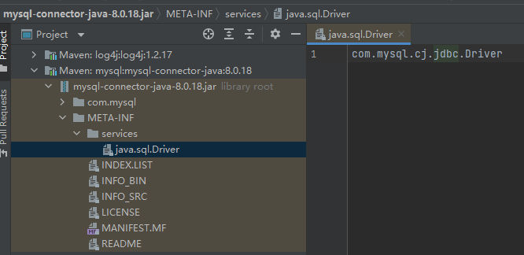

# 深度理解 Java SPI

## SPI 简介

SPI 全称 Service Provider Interface，是 Java 提供的，旨在由第三方实现或扩展的 API，它是一种用于动态加载服务的机制。它的作用是让程序能够自动发现、加载和使用第三方提供的实现，从而实现**基于接口的解耦**和**可插拔**的扩展架构。

Java SPI 有四个要素：

- **SPI 接口**：为服务提供者实现类约定的接口或抽象类。
- **SPI 实现类**：实际提供服务的实现类。
- **SPI 配置**：Java SPI 机制约定的配置文件，提供查找服务实现类的逻辑。配置文件必须置于 `META-INF/services` 目录中，并且，文件名应与服务提供者接口的完全限定名保持一致。文件中的每一行都有一个实现服务类的详细信息，同样是服务提供者类的完全限定名称。
- **ServiceLoader**：Java SPI 的核心类，用于加载 SPI 实现类。 `ServiceLoader` 中有各种实用方法来获取特定实现、迭代它们或重新加载服务。

## SPI 示例


1. 定义接口 
需要定义一个 SPI 接口，和普通接口并没有什么差别。

```java
public interface DataStorage {
    String search(String key);
}
```

2. 实现接口

假设，我们需要在程序中使用两种不同的数据存储——Mysql 和 Redis。因此，我们需要两个不同的实现类去分别完成相应工作。

Mysql 查询 MOCK 类

```java
public class MysqlStorage implements DataStorage {
    @Override
    public String search(String key) {
        return "【Mysql】搜索" + key + "，结果：No";
    }
}
```

Redis 查询 MOCK 类

```java
public class RedisStorage implements DataStorage {
    @Override
    public String search(String key) {
        return "【Redis】搜索" + key + "，结果：Yes";
    }
}
```

到目前为止，定义接口，并实现接口和普通的 Java 接口实现没有任何不同。

3. SPI 配置

如果想通过 Java SPI 机制来发现服务，就需要在 SPI 配置中约定好发现服务的逻辑。配置文件必须置于 `META-INF/services` 目录中，并且，文件名与服务提供者接口名保持一致。文件中的每一行都有一个实现服务类的详细信息，同样是服务提供者类的名称。以本示例代码为例，其文件名应该为 `com.study.javacore.spi.DataStorage`，文件中的内容如下：

```
com.study.javacore.spi.MysqlStorage
com.study.javacore.spi.RedisStorage
```

4. ServiceLoader 演示

完成了上面的步骤，就可以通过 `ServiceLoader` 来加载服务。示例如下：

```java
import java.util.ServiceLoader;

public class SpiDemo {

    public static void main(String[] args) {
        ServiceLoader<DataStorage> serviceLoader = ServiceLoader.load(DataStorage.class);
        System.out.println("============ Java SPI 测试============");
        serviceLoader.forEach(loader -> System.out.println(loader.search("Yes Or No")));
    }

}
```

输出：

```
============ Java SPI 测试============
【Mysql】搜索Yes Or No，结果：No
【Redis】搜索Yes Or No，结果：Yes
```

## SPI 原理

Java SPI 机制依赖于 `ServiceLoader` 类去解析、加载服务。因此，掌握了 `ServiceLoader` 的工作流程，就掌握了 SPI 的原理。


### SPI 和类加载器

Java SPI 大致的工作原理，就是通过 `ClassLoader` 加载 SPI 配置文件，解析 SPI 服务，然后通过反射，实例化 SPI 服务实例。

先了解类加载器的**双亲委派模型（Parents Delegation Model）**： 是Java类加载的基本原则，其目的是保证Java核心库的类型安全

双亲委派模型要求除了顶层的 **`BootstrapClassLoader`** 外，其余的类加载器都应有自己的父类加载器。这里类加载器之间的父子关系一般通过组合（Composition）关系来实现，而不是通过继承（Inheritance）的关系实现。双亲委派继承体系图如下：


双亲委派机制约定了：**一个类加载器首先将类加载请求传送到父类加载器，只有当父类加载器无法完成类加载请求时才尝试加载**。

**双亲委派的好处**：使得 Java 类伴随着它的类加载器，天然具备一种带有优先级的层次关系，从而使得类加载得到统一，不会出现重复加载的问题：

- 系统类防止内存中出现多份同样的字节码
- 保证 Java 程序安全稳定运行

例如： `java.lang.Object` 存放在 `rt.jar` 中，如果编写另外一个 `java.lang.Object` 的类并放到 `classpath` 中，程序可以编译通过。因为双亲委派模型的存在，所以在 rt.jar 中的 `Object` 比在 `classpath` 中的 `Object` 优先级更高，因为 rt.jar 中的 `Object` 使用的是启动类加载器，而 `classpath` 中的 `Object` 使用的是应用程序类加载器。正因为 rt.jar 中的 `Object` 优先级更高，因为程序中所有的 `Object` 都是这个 `Object`。

**双亲委派的限制**：子类加载器可以使用父类加载器已经加载的类，而父类加载器无法使用子类加载器已经加载的。——这就导致了双亲委派模型并不能解决所有的类加载器问题。Java SPI 就面临着这样的问题：

- SPI 的接口是 Java 核心库的一部分，是由 `BootstrapClassLoader` 加载的；
- 而 SPI 实现的 Java 类一般是由 `AppClassLoader` 来加载的。`BootstrapClassLoader` 是无法找到 SPI 的实现类的，因为它只加载 Java 的核心库。它也不能代理给 `AppClassLoader`，因为它是最顶层的类加载器。因此加载 SPI 服务时，需要指定类加载器 `ClassLoader` ，如果不指定 `ClassLoader`，则无法获取 SPI 服务。

如果不做任何的设置，Java 应用的线程的上下文类加载器默认就是 `AppClassLoader`。在核心类库使用 SPI 接口时，传递的类加载器使用线程上下文类加载器，就可以成功的加载到 SPI 实现的类。线程上下文类加载器在很多 SPI 的实现中都会用到。

通常可以通过 `Thread.currentThread().getClassLoader()` 和 `Thread.currentThread().getContextClassLoader()` 获取线程上下文类加载器。

### Java SPI 的不足

Java SPI 存在一些不足：

- 不能按需加载，需要遍历所有的实现，并实例化，然后在循环中才能找到我们需要的实现。如果不想用某些实现类，或者某些类实例化很耗时，它也被载入并实例化了，这就造成了浪费。

- 获取某个实现类的方式不够灵活，只能通过 Iterator 形式获取，不能根据某个参数来获取对应的实现类。

- 多个并发多线程使用 ServiceLoader 类的实例是不安全的。

## SPI 应用场景
### SPI 应用案例之 JDBC DriverManager

作为 Java 工程师，尤其是 CRUD 工程师，相必都非常熟悉 JDBC。众所周知，关系型数据库有很多种，如：Mysql、Oracle、PostgreSQL 等等。JDBC 如何识别各种数据库的驱动呢？

#### 创建数据库连接

我们先回顾一下，JDBC 如何创建数据库连接的呢？

在 **JDBC4.0 之前**，连接数据库的时候，通常会用 **`Class.forName(XXX)`** 方法来加载数据库相应的驱动，然后再获取数据库连接，继而进行 CRUD 等操作。

```java
Class.forName("com.mysql.jdbc.Driver")
```

而 **JDBC4.0 之后**，不再需要用 **`Class.forName(XXX)`** 方法来加载数据库驱动，直接获取连接就可以了。显然，这种方式很方便，但是如何做到的呢？

- JDBC 接口：首先，Java 中内置了接口 `java.sql.Driver`。

- JDBC 接口实现：各个数据库的驱动自行实现 `java.sql.Driver` 接口，用于管理数据库连接。

  - Mysql：在 mysql 的 Java 驱动包 `mysql-connector-java-XXX.jar` 中，可以找到 `META-INF/services` 目录，该目录下会有一个名字为`java.sql.Driver` 的文件，文件内容是 `com.mysql.cj.jdbc.Driver`。 `com.mysql.cj.jdbc.Driver` 正是 Mysql 版的 `java.sql.Driver` 实现。如下图所示：

  

  - PostgreSQL 实现：在 PostgreSQL 的 Java 驱动包 `postgresql-42.0.0.jar` 中，也可以找到同样的配置文件，文件内容是 `org.postgresql.Driver`，`org.postgresql.Driver` 正是 PostgreSQL 版的 `java.sql.Driver` 实现。

- 创建数据库连接

  以 Mysql 为例，创建数据库连接代码如下：

  ```java
  final String DB_URL = String.format("jdbc:mysql://%s:%s/%s", DB_HOST, DB_PORT, DB_SCHEMA);
  connection = DriverManager.getConnection(DB_URL, DB_USER, DB_PASSWORD);
  ```

## 参考
- https://dunwu.github.io/