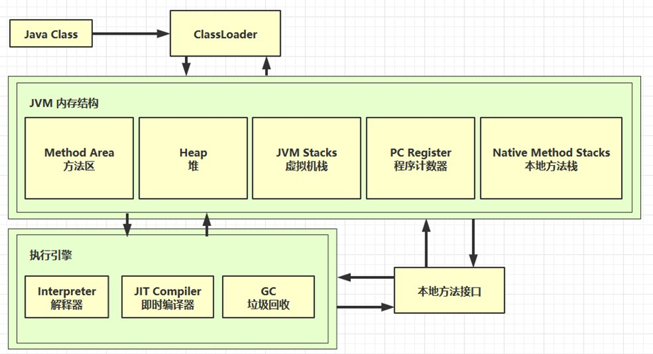
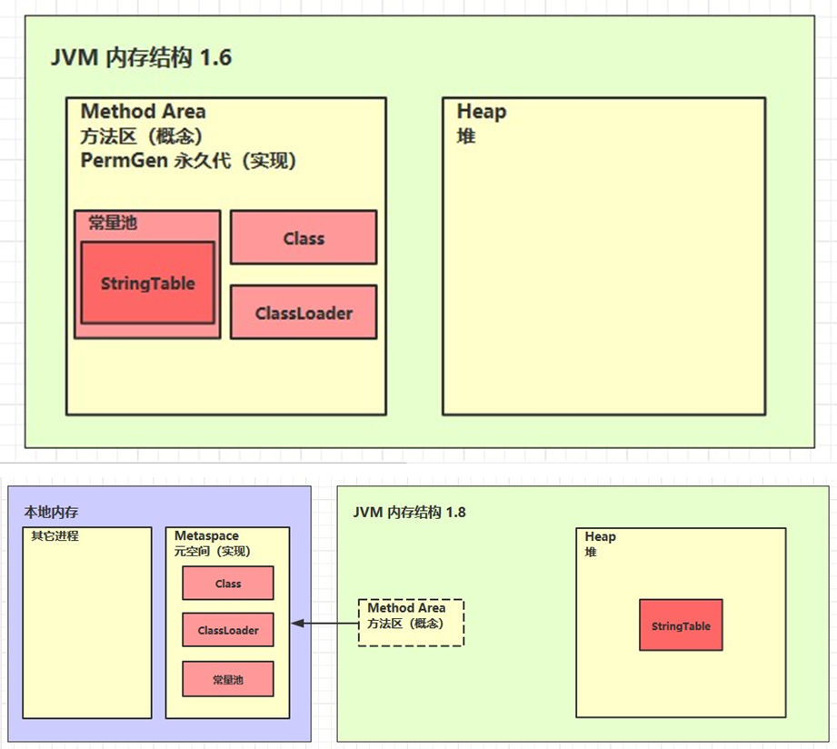
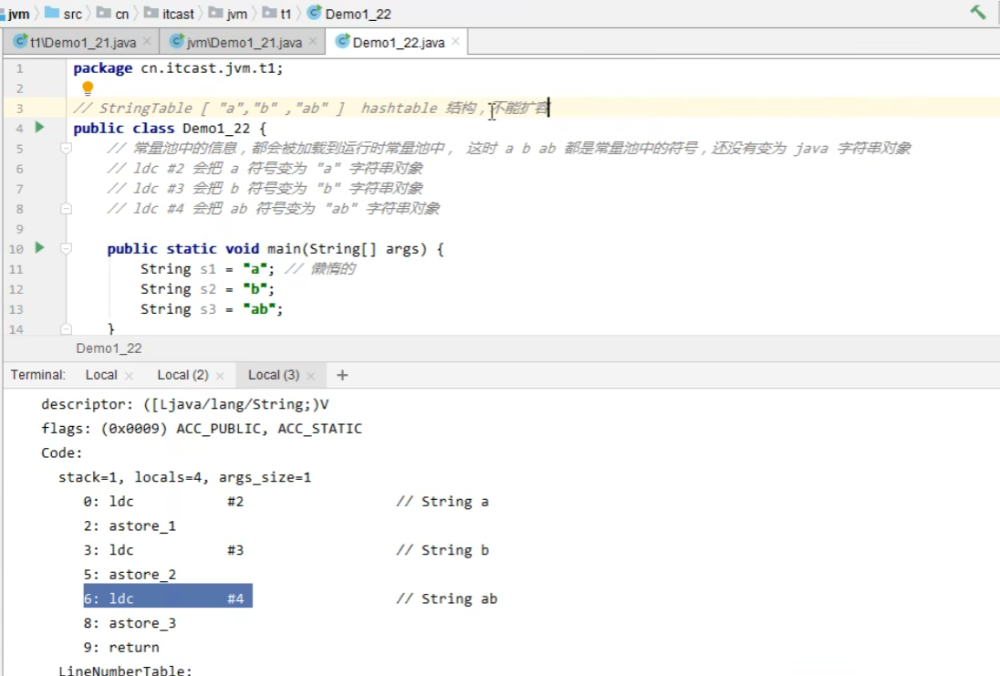

## 简介

> 更多信息查看[官网](https://docs.oracle.com/javase/specs/jvms/se8/html/index.html)

JVM，全称是 Java Virtual Machine，Java运行环境（Java二进制字节码的运行环境）

优点：
  - 是Java一次编写，到处运行的基石。
  - 自动内存管理，垃圾回收功能
  - 数组下标越界检查
  - 多态

JVM有很多，常见的JVM有：HotSpot Opent JDK edition（平时使用的）、Eclipse OpenJ9等


## 内存架构

### 程序计数器
Program Counter Register，程序计数器（寄存器）：作用是**记住下一条jvm指令的执行地址**，在物理上，是通过cpu中的寄存器来实现的。他是**线程私有**，且是**唯一一个不会存在内存溢出的区域**。

工作流程：java源码编译为二进制字节码，字节码中包含jvm指令，这些指令交给解释器->机器码->CPU执行。

```txt
//  二进制字节码                         java 源代码
// 其中iconst_x 就是程序计数器
0: getstatic    #20                 | PrintStream out = System.out;
3: astore_1                         | 
4: aload_1                          | out.println(1);
5: iconst_1                         |
6: invokevirtual #26                |
9: aload_1                          | out.println(2);
10: iconst_2                        |
11: invokevirtual #26               |
14: aload_1                         | out.println(3);
15: iconst_3                        |
16: invokevirtual #26               |
19: aload_1                         | out.println(4);
20: iconst_4                        |
21: invokevirtual #26               |
24: aload_1                         | out.println(5);
25: iconst_5                        |
26: invokevirtual #26               |
29: return                          |
```


### 虚拟机栈
Java Virtual Machine Stacks(Java 虚拟机栈)：
- 虚拟机栈是**每个线程运行需要的内存空间**，原理是数据结构中的栈，先进后出；
- 每个栈由多个栈帧（Frame，栈帧中包括参数、局部变量、返回地址等）组成，对应着每次方法调用时所占用的内存；
- 每个线程只能有一个活动栈帧，一个栈帧表示一个方法的调用，对应着当前正在执行的那个方法，如果一个方法里面调用了其他方法，后续方法会依次压入栈。


> 垃圾回收没有涉及管理栈内存
> 方法内的局部变量没有逃离方法的作用范围时，它是线程安全的；如果是局部变量引用了对象，并逃离方法的作用方法，需要考虑线程安全。

#### 内存溢出
此外，某些情况会引起栈内存溢出：
- 栈帧过多导致占内存溢出，如果方法递归没有正确结束，就会导致栈内存溢出。
- 栈帧过大导致栈帧内存溢出。

参数：-Xss 指定栈内存大小，如 - Xss 1024k

### 本地方法栈

给本地方法的运行提供内存运行空间，如Object中的native方法。

### 堆
通过new关键字创建的对象，都会使用堆内存。**它是线程共享的，堆中的对象需要考虑线程安全问题；并且它有垃圾回收机制**

但是存储的**对象太大会导致堆内存溢出**

参数： -Xmx 指定堆内存空间大小，如 - Xmx 1024M

#### 内存溢出
可以使用堆内存诊断工具（JDK内）来监测堆：
- jsp工具（查看当前系统中有哪些java程序，可以查看当前Java程序中有那些线程）
- Jmap工具（查看堆内存占用情况：Jmap -head 进程id）
- jconsole(图像界面的多功能检测工具，可以连续监测)
- jvisualvm（和jconsole有点像）


### 方法区
方法区（Method Area）也被称为永久代。**方法区用于存放已被加载的类信息、常量、静态变量、即时编译器编译后的代码等数据**。
<!-- 类基本信息，常量池，类方法定义，包含了虚拟机指令 -->


#### 内存溢出


1. 1.8 以前会导致永久代内存溢出
```
永久代内存溢出 java.lang.0utOfMemoryError:PermGen space
XX:MaxPermSize=8m
```
2. 1.8 之后会导致元空间内存溢出
```
元空间内存溢出 java.lang.0utOfMemoryError: Metaspace
-XX:MaxMetaspaceSize=8m
```
1.8后，元空间使用的系统内存，一般不容易内存溢出

#### 运行时常量池

运行时常量池（JDK 8 之前是永久代，JDK 8 及之后是元空间），Class 文件中除了有类的版本、字段、方法、接口等描述信息，还有一项信息是常量池（Constant Pool Table），**就是一张表，虚拟机指令根据这张常量表找到要执行的类名、方法名、参数类型、字面量等信息**，这部分内容会在类加载后被放入这个区域。


除了在编译期生成的常量，还允许动态生成，例如 String 类的 intern()。这部分常量也会被放入运行时常量池。

> 🔔 注意：当常量池无法再申请到内存时会抛出 OutOfMemoryError 异常


#### 字符串常量池
为了极致地优化字符串性能和减少内存开销，JVM 设计了一块特殊的存储区域——字符串常量池（StringTable[]）。
JDK6 时，字符串常量池存在于运行时常量池之中，而运行时常量池在方法区（永久代）。而JDK 7 及之后：字符串常量池被移动到了 Java 堆中。
至于为什么移动，原因有两点：
- **永久代空间有限**且垃圾回收条件苛刻，容易发生 OutOfMemoryError: PermGen space。
- **堆空间更大**，并且垃圾回收机制更高效。将字符串常量池放在堆中，可以更及时地回收不再使用的字符串对象，从而减少内存泄漏的风险。


##### StringTable 运行逻辑
- 1.当代码中出现字面量（直接双引号声明）方式创建字符串时（例如 String s = "abc";），JVM 会首先去字符串常量池中查找是否存在内容相等的字符串。
- 2.如果存在，则直接返回池中该字符串的引用；如果不存在，则在字符串常量池中创建一个新的字符串对象，然后返回其引用。
- 3.使用 new 关键字（例如 String s = new String("abc");）会在堆上（注意，不是池里）创建一个新的字符串对象。但如果字面量 "abc" 之前不在池中，这个操作也会导致池中先创建 "abc"。

StringTable的底层逻辑可细看下面demo图：



StringTable特点：
- 常量池中的字符串仅是符号，第一次用到时才变为对象
- 利用字符串常量池的机制，来避免重复创建字符串
- 对象字符串变量拼接的原理是 StringBuilder (1.8)，如下面的：`s1+s2`
- 字符串常量拼接的原理是编译期优化
- 可以使用 inten 方法，主动将串池中还没有的字符串对象放入串池
    + 1.8 将这个字符串对象尝试放入串池，如果有则并不会放入，如果没有则放入串池， 会把串池中的对象返回
    + 1.6 将这个字符串对象尝试放入串池，如果有则并不会放入，如果没有会把此对象复制一份，放入串池，会把串池中的对象返回

常量字符串拼接底层原理：
```java
String s1 = "a";
String s2 = "b";
String s3 = "ab";
String s4 = s1 + s2;//字节码底层是new stringBuilder().append("a").append("b").tostring()；toString()底层是new string("ab")
String s5 = "a" + "b";//javac 在编译期间的优化，结果已经在编译期确定为ab
System.out.println(s3 == s4);//false
System.out.println(s3 == s5);// true


//String x = "ab";
String s = ew string("a") + new string("b");//new string("ab”)
//堆 new string("a”) new string("b") new string("ab")
String s2 = s.intern();//将这个字符串对象尝试放入串池,如果有则并不会放入,如果没有则放入串池, 会把串池中的对象返回
System.out.println(s2 = "ab");//true
System.out.println(s = "ab");//true
System.out.println(s2 = x);//true
System.out.println(s = x);//false
```

> StringTable 有垃圾回收机制

##### StringTable 调优
1. StringTable 性能调优，它的底层是数组+红黑树，调优主要就是设置桶的个数，去调整哈希分布，减少哈希冲突；可以通过`-XX:StringTableSize=桶个数`设置桶的个数，让哈希查找变快。
2. 考虑字符串对象是否入池，程序中存在大量字符串可以考虑入池减少内存的使用。


#### 面试题
```java
String s1 = "a";
String s2 = "b";
String s3 = "a" + "b";
String s4 = s1 + s2;
String s5 = "ab";
String s6 = s4.intern();

// 问
System.out.println(s3 == s4);//fasle ，一个在串池，另一个在堆中
System.out.println(s3 == s5);//true
System.out.println(s3 == s6);//true

String x2 = new String("c") + new String("d");//堆中
String x1 = "cd";
x2.intern();//堆中常量入池

// 问，如果调换了【最后两行代码】的位置呢，如果是jdk1.6呢
System.out.println(x1 == x2);//false；true；false
```

### 直接内存
直接内存（Direct Memory）并不是虚拟机运行时数据区的一部分，也不是 JVM 规范中定义的内存区域。
是操作系统的内存，分配回收成本较高，但读写性能高。

在 JDK 1.4 中新加入了 NIO 类，它可以使用 Native 函数库直接分配堆外内存，然后通过一个存储在 Java 堆里的 DirectByteBuffer 对象作为这块内存的引用进行操作。这样能在一些场景中显著提高性能，因为避免了在 Java 堆和 Native 堆中来回复制数据。

> 🔔 注意：直接内存这部分也被频繁的使用，且也可能导致 OutOfMemoryError 异常。
>💡 提示：直接内存容量可通过 -XX:MaxDirectMemorySize 指定，如果不指定，则默认与 Java 堆最大值（-Xmx 指定）一样。


**分配和回收机制**
- 使用了 Unsafe 对象完成直接内存的分配回收，并且回收需要主动调用 freeMemory 方法
- ByteBuffer 的实现类内部，使用了 Cleaner(虚引用)来监测 ByteBufer 对象，一旦 ByteBuffer 对象被垃圾回收，那么就会由 ReferenceHandler 线程通过 Cleaner 的 clean 方法用 freeMemory 来释放直接内存

### Java 内存区域对比

| 内存区域      | 内存作用范围   | 异常                                       |
| ------------- | -------------- | ------------------------------------------ |
| 程序计数器    | 线程私有       | 无                                         |
| Java 虚拟机栈 | 线程私有       | `StackOverflowError` 和 `OutOfMemoryError` |
| 本地方法栈    | 线程私有       | `StackOverflowError` 和 `OutOfMemoryError` |
| Java 堆       | 线程共享       | `OutOfMemoryError`                         |
| 方法区        | 线程共享       | `OutOfMemoryError`                         |
| 运行时常量池  | 线程共享       | `OutOfMemoryError`                         |
| 直接内存      | 非运行时数据区 | `OutOfMemoryError`                         |


## 参考
- https://www.bilibili.com/video/BV1yE411Z7AP
- https://dunwu.github.io/