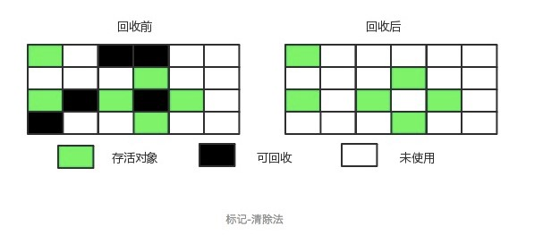

##  如何判断对象可以回收
### 引用计数法


给对象添加一个引用计数器，当对象增加一个引用时计数器加 1，引用失效时计数器减 1。引用计数为 0 的对象可被回收。

两个对象出现循环引用的情况下，此时引用计数器永远不为 0，导致无法对它们进行回收。

```java
public class ReferenceCountingGC {
    public Object instance = null;

    public static void main(String[] args) {
        ReferenceCountingGC objectA = new ReferenceCountingGC();
        ReferenceCountingGC objectB = new ReferenceCountingGC();
        objectA.instance = objectB;
        objectB.instance = objectA;
    }
}
```

因为循环引用的存在，所以 **Java 虚拟机不适用引用计数算法**。


### 可达性分析法

通过 **GC Roots** 作为起始点进行搜索，JVM 将能够到达到的对象视为**存活**，不可达的对象视为**死亡**。

**可作为 GC Roots 的对象**包括下面几种：
- 虚拟机栈中引用的对象
- 本地方法栈中引用的对象（Native 方法）
- 方法区中，类静态属性引用的对象
- 方法区中，常量引用的对象


### 引用类型

无论是通过引用计算算法判断对象的引用数量，还是通过可达性分析算法判断对象的引用链是否可达，判定对象是否可被回收都与引用有关。

Java 具有四种强度不同的引用类型。
1. 强引用
**被强引用（Strong Reference）关联的对象不会被垃圾收集器回收。**
强引用：使用 `new` 一个新对象的方式来创建强引用。
```java
Object obj = new Object();
```

2. 软引用
**被软引用（Soft Reference）关联的对象，只有在内存不够的情况下才会被回收。**
软引用：使用 `SoftReference` 类来创建软引用。

```java
Object obj = new Object();
SoftReference<Object> sf = new SoftReference<Object>(obj);
obj = null; // 使对象只被软引用关联
```

3. 弱引用
**被弱引用（Weak Reference）关联的对象一定会被垃圾收集器回收，也就是说它只能存活到下一次垃圾收集发生之前。**
使用 `WeakReference` 类来实现弱引用。

```java
Object obj = new Object();
WeakReference<Object> wf = new WeakReference<Object>(obj);
obj = null;
```
4. 虚引用
又称为幽灵引用或者幻影引用。一个对象是否有虚引用的存在，完全不会对其生存时间构成影响，也无法通过虚引用取得一个对象实例。
**为一个对象设置虚引用关联的唯一目的就是能在这个对象被收集器回收时收到一个系统通知。**
使用 `PhantomReference` 来实现虚引用。

```java
Object obj = new Object();
PhantomReference<Object> pf = new PhantomReference<Object>(obj);
obj = null;
```

### finalize()

finalize() 类似 C++ 的析构函数，用来做关闭外部资源等工作。但是 try-finally 等方式可以做的更好，并且该方法运行代价高昂，不确定性大，无法保证各个对象的调用顺序，因此**最好不要使用 finalize()**。

当一个对象可被回收时，如果需要执行该对象的 finalize() 方法，那么就有可能通过在该方法中让对象重新被引用，从而实现自救。

## 垃圾收集算法

### 垃圾收集性能

垃圾收集器的性能指标主要有两点：

- **停顿时间** - 停顿时间是因为 GC 而导致程序不能工作的时间长度。
- **吞吐量** - 应用程序运行时间占总运行时间的比例，`吞吐量 = 应用程序运行时间 / (应用程序运行时间 + GC时间)`

### 标记 - 清除（Mark-Sweep）

<div align="center">

</div>

将需要回收的对象进行标记，然后清理掉被标记的对象，**速度比较快**。

不足：

- 标记和清除过程效率都不高；
- 会产生大量不连续的内存碎片，导致无法给大对象分配内存。

### 标记 - 整理（Mark-Compact）

<div align="center">

</div>

让所有存活的对象都向一端移动，然后直接清理掉端边界以外的内存。

这种做法能够解决内存碎片化的问题，但代价是压缩算法的性能开销，**速度较慢**。

### 复制（Copying）

<div align="center">

</div>

将内存划分为大小相等的两块，每次只使用其中一块，当这一块内存用完了就将还存活的对象复制到另一块上面，然后再把使用过的内存空间进行一次清理。

不会存在内存碎片，主要不足是会使用双倍内存。

现在的商业虚拟机都**采用这种收集算法来回收年轻代**

### 分代垃圾回收


现在的商业虚拟机采用分代收集算法，它根据对象存活周期将内存划分为几块，不同块采用适当的收集算法。

一般将 Java 堆分为年轻代和老年代。

- 年轻代使用：**复制** 算法
- 老年代使用：**标记 - 清理** 或者 **标记 - 整理** 算法

<div align="center">

</div>

#### 新生代

新生代是大部分对象创建和销毁的区域，在通常的 Java 应用中，绝大部分对象生命周期都是很短暂的。其内部又分为 `Eden`（伊甸园） 区域，作为对象初始分配的区域；两个 `Survivor`，有时候也叫 `from`、`to` 区域，被用来放置从 Minor GC（次要垃圾回收） 中保留下来的对象。

JVM 会随意选取一个 `Survivor` 区域作为 `to`，然后会在 GC 过程中进行区域间拷贝，也就是将 Eden 中存活下来的对象和 `from` 区域的对象，拷贝到这个`to`区域。这种设计主要是为了防止内存的碎片化，并进一步清理无用对象。

Java 虚拟机会记录 `Survivor` 区中的对象一共被来回复制了几次。如果一个对象被复制的次数为 15（对应虚拟机参数 `-XX:+MaxTenuringThreshold`），那么该对象将被晋升（promote）至老年代。另外，如果单个 `Survivor` 区已经被占用了 50%（对应虚拟机参数 `-XX:TargetSurvivorRatio`），那么较高复制次数的对象也会被晋升至老年代。

#### 老年代

放置长生命周期的对象，通常都是从 `Survivor` 区域拷贝过来的对象。当然，也有特殊情况，如果对象较大，JVM 会试图直接分配在 `Eden` 其他位置上；如果对象太大，完全无法在新生代找到足够长的连续空闲空间，JVM 就会直接分配到老年代。

#### 永久代

这部分就是早期 Hotspot JVM 的方法区实现方式了，储存 Java 类元数据、常量池、Intern 字符串缓存。在 JDK 8 之后就不存在永久代这块儿了。

#### JVM 参数

这里顺便提一下，JVM 允许对堆空间大小、各代空间大小进行设置，以调整 JVM GC。

| 配置                | 描述                                                                                                               |
| ------------------- | ------------------------------------------------------------------------------------------------------------------ |
| `-Xss`              | 虚拟机栈大小。                                                                                                     |
| `-Xms`              | 堆空间初始值。                                                                                                     |
| `-Xmx`              | 堆空间最大值。                                                                                                     |
| `-Xmn`              | 新生代空间大小。                                                                                                   |
| `-XX:NewSize`       | 新生代空间初始值。                                                                                                 |
| `-XX:MaxNewSize`    | 新生代空间最大值。                                                                                                 |
| `-XX:NewRatio`      | 新生代与年老代的比例。默认为 2，意味着老年代是新生代的 2 倍。                                                      |
| `-XX:SurvivorRatio` | 新生代中调整 eden 区与 survivor 区的比例，默认为 8。即 `eden` 区为 80% 的大小，两个 `survivor` 分别为 10% 的大小。 |
| `-XX:PermSize`      | 永久代空间的初始值。                                                                                               |
| `-XX:MaxPermSize`   | 永久代空间的最大值。                                                                                               |

## 垃圾回收器

<div align="center">

</div>

以上是 HotSpot 虚拟机中的 7 个垃圾收集器，连线表示垃圾收集器可以配合使用。

注：G1 垃圾收集器既可以回收年轻代内存，也可以回收老年代内存。而其他垃圾收集器只能针对特定代的内存进行回收。


### 串行收集器

串行收集器（Serial）是最基本、发展历史最悠久的收集器。

串行收集器是 **`client` 模式下的默认收集器配置**。因为在客户端模式下，分配给虚拟机管理的内存一般来说不会很大。Serial 收集器收集几十兆甚至一两百兆的年轻代停顿时间可以控制在一百多毫秒以内，只要不是太频繁，这点停顿是可以接受的。

**串行收集器采用单线程 stop-the-world 的方式进行收集**。当内存不足时，串行 GC 设置停顿标识，待所有线程都进入安全点（Safepoint）时，应用线程暂停，串行 GC 开始工作，**采用单线程方式回收空间并整理内存**。

<div align="center">

<p>Serial / Serial Old 收集器运行示意图</p>
</div>

单线程意味着复杂度更低、占用内存更少，垃圾回收效率高；但同时也意味着不能有效利用多核优势。事实上，串行收集器特别适合堆内存不高、单核甚至双核 CPU 的场合。

#### Serial 收集器

> 开启选项：`-XX:+UseSerialGC`
>
> 打开此开关后，使用 **Serial** + **Serial Old** 收集器组合来进行内存回收。

#### Serial Old 收集器

Serial Old 是 Serial 收集器的老年代版本，也是给 Client 模式下的虚拟机使用。如果用在 Server 模式下，它有两大用途：

- 在 JDK 1.5 以及之前版本（Parallel Old 诞生以前）中与 Parallel Scavenge 收集器搭配使用。
- 作为 CMS 收集器的后备预案，在并发收集发生 Concurrent Mode Failure 时使用。

> 🔔其他收集器以后再说


## 参考
- https://www.bilibili.com/video/BV1yE411Z7AP
- https://dunwu.github.io/