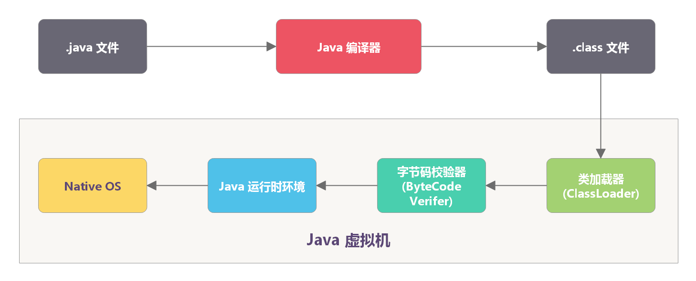

## 字节码

Java 字节码是Java虚拟机执行的一种指令格式。之所以被称之为字节码，是因为：**Java 字节码文件（`.class`）是一种以 8 位字节为基础单位的二进制流文件**，各个数据项严格按照顺序紧凑地排列在 .class 文件中，中间没有添加任何分隔符。**整个 .class 文件本质上就是一张表**。

Java 能做到 “**一次编译，到处运行**”，一是因为 JVM 针对各种操作系统、平台都进行了定制；二是因为无论在什么平台，都可以编译生成固定格式的Java 字节码文件（`.class`）。


### 字节码文件结构

一个简单的 HelloWorld.java 
```java
package cn.itcast.jvm.t5;
 // HelloWorld 示例
public class HelloWorld {
 public static void main(String[] args) {
 System.out.println("hello world");
 }
 }
 ```
 执行 `javac -parameters -d . HellowWorld.java`
编译为 HelloWorld.class 后是这个样子的：
```shell
[root@localhost ~]# od -t xC HelloWorld.class 
 0000000 ca fe ba be 00 00 00 34 00 23 0a 00 06 00 15 09
 0000020 00 16 00 17 08 00 18 0a 00 19 00 1a 07 00 1b 07
 0000040 00 1c 01 00 06 3c 69 6e 69 74 3e 01 00 03 28 29
 0000060 56 01 00 04 43 6f 64 65 01 00 0f 4c 69 6e 65 4e
 0000100 75 6d 62 65 72 54 61 62 6c 65 01 00 12 4c 6f 63
 0000120 61 6c 56 61 72 69 61 62 6c 65 54 61 62 6c 65 01
 0000140 00 04 74 68 69 73 01 00 1d 4c 63 6e 2f 69 74 63
 0000160 61 73 74 2f 6a 76 6d 2f 74 35 2f 48 65 6c 6c 6f
 0000200 57 6f 72 6c 64 3b 01 00 04 6d 61 69 6e 01 00 16
 0000220 28 5b 4c 6a 61 76 61 2f 6c 61 6e 67 2f 53 74 72
 0000240 69 6e 67 3b 29 56 01 00 04 61 72 67 73 01 00 13
 0000260 5b 4c 6a 61 76 61 2f 6c 61 6e 67 2f 53 74 72 69
 0000300 6e 67 3b 01 00 10 4d 65 74 68 6f 64 50 61 72 61
 0000320 6d 65 74 65 72 73 01 00 0a 53 6f 75 72 63 65 46
 0000340 69 6c 65 01 00 0f 48 65 6c 6c 6f 57 6f 72 6c 64
 0000360 2e 6a 61 76 61 0c 00 07 00 08 07 00 1d 0c 00 1e
 0000400 00 1f 01 00 0b 68 65 6c 6c 6f 20 77 6f 72 6c 64
 0000420 07 00 20 0c 00 21 00 22 01 00 1b 63 6e 2f 69 74
 0000440 63 61 73 74 2f 6a 76 6d 2f 74 35 2f 48 65 6c 6c
 0000460 6f 57 6f 72 6c 64 01 00 10 6a 61 76 61 2f 6c 61
 0000500 6e 67 2f 4f 62 6a 65 63 74 01 00 10 6a 61 76 61
 0000520 2f 6c 61 6e 67 2f 53 79 73 74 65 6d 01 00 03 6f
 0000540 75 74 01 00 15 4c 6a 61 76 61 2f 69 6f 2f 50 72
 0000560 69 6e 74 53 74 72 65 61 6d 3b 01 00 13 6a 61 76
 0000600 61 2f 69 6f 2f 50 72 69 6e 74 53 74 72 65 61 6d
 0000620 01 00 07 70 72 69 6e 74 6c 6e 01 00 15 28 4c 6a
 0000640 61 76 61 2f 6c 61 6e 67 2f 53 74 72 69 6e 67 3b
 0000660 29 56 00 21 00 05 00 06 00 00 00 00 00 02 00 01
 0000700 00 07 00 08 00 01 00 09 00 00 00 2f 00 01 00 01
 0000720 00 00 00 05 2a b7 00 01 b1 00 00 00 02 00 0a 00
 0000740 00 00 06 00 01 00 00 00 04 00 0b 00 00 00 0c 00
 0000760 01 00 00 00 05 00 0c 00 0d 00 00 00 09 00 0e 00
 0001000 0f 00 02 00 09 00 00 00 37 00 02 00 01 00 00 00
 0001020 09 b2 00 02 12 03 b6 00 04 b1 00 00 00 02 00 0a
 0001040 00 00 00 0a 00 02 00 00 00 06 00 08 00 07 00 0b
 0001060 00 00 00 0c 00 01 00 00 00 09 00 10 00 11 00 00
 0001100 00 12 00 00 00 05 01 00 10 00 00 00 01 00 13 00
 0001120 00 00 02 00 14
```


根据 JVM 规范，类文件结构如下
```txt
classfile {
    u4    magic;
    u2    minor_version;
    u2    major_version;
    u2    constant_pool_count;
    cp_info    constant_pool[constant_pool_count-1];
    u2    access_flags;
    u2    this_class;
    u2    super_class;
    u2    interfaces_count;
    u2    interfaces[interface_s_count];
    u2    fields_count;
    field_info    fields[fields_count];
    u2    methods_count;
    method_info    methods[methods_count];
    u2    attributes_count;
    attribute_info attributes[attributes_count];
}
```

虽然字节码看似杂乱无序，实际上是由严格的格式要求组成的。


### 魔数
每个 `.class` 文件的头 4 个字节称为 **`魔数（magic_number）`**，它的唯一作用是确定这个文件是否为一个能被虚拟机接收的 `.class` 文件。魔数的固定值为：`0xCAFEBABE`。
如上例字节码中的第一行：0000000 <font color="red">ca fe ba be </font>00 00 00 34 00 23 0a 00 06 00 15 09

### 版本
版本号（version）有 4 个字节，**前两个字节表示次版本号（Minor Version），后两个字节表示主版本号（Major Version）**。
举例来说，如果版本号为：“00 00 00 34”。那么，次版本号转化为十进制为 0，主版本号转化为十进制为 52，在 Oracle 官网中查询序号 52 对应的主版本号为 1.8，所以编译该文件的 Java 版本号为 1.8.0。

### 常量池
紧接着主版本号之后的字节为常量池（constant_pool），常量池可以理解为 .class 文件中的资源仓库。
常量池整体上分为两部分，常量池计数器以及常量池数据区：
- **常量池计数器（constant_pool_count）** - 由于常量的数量不固定，所以需要先放置两个字节来表示常量池容量计数值。
- **常量池数据区** - 数据区的每一项常量都是一个表，且结构各不相同。<br/>

常量池主要存放两类常量：
- **字面量** - 如文本字符串、声明为 `final` 的常量值。
- **符号引用**
  - 类和接口的全限定名
  - 字段的名称和描述符
  - 方法的名称和描述符

### 访问标志
紧接着常量池的 2 个字节代表访问标志（access_flags），这个标志**用于识别一些类或者接口的访问信息**，描述该 Class 是类还是接口，以及是否被 `public`、`abstract`、`final` 等修饰符修饰。

### 类索引、接口索引、父类索引
索引（this_class）和父类索引都是一个 u2 类型的数据，而接口索引集合是一组 u2 类型的数据的集合。.class 文件中由这 3 项数据来确定这个类的继承关系。

### 字段表
字段表用于描述类和接口中声明的变量。包含类级变量以及实例级变量，但是不包含方法内部声明的局部变量。

字段表也分为两部分，第一部分为两个字节，描述字段个数；第二部分是每个字段的详细信息 fields_info。

### 方法表
字段表结束后为方法表，方法表的结构如同字段表一样，依次包括了访问标志、名称索引、描述符索引、属性表集合几项。

### 属性表集合
属性表集合存放了在该文件中类或接口所定义属性的基本信息。

## 字节码指令
字节码指令是Java虚拟机执行的基本单位，它们构成了Java程序在JVM上运行的基础。

JVM字节码指令是由一个字节长度的操作码(opcode)和零个或多个操作数(operand)组成的。由于操作码长度为一个字节，所以最多只能有256条指令。目前Java虚拟机规范定义了约200条指令。


### 字节码指令分类

#### 加载和存储指令

用于将数据在局部变量表和操作数栈之间来回传输：

```java
// 对应的Java代码
int a = 10;
String b = "hello";
Object c = new Object();

// 对应的字节码指令示例
bipush 10      // 将10压入栈
istore_1       // 存储到局部变量表索引1
ldc "hello"    // 加载常量"hello"
astore_2       // 存储到局部变量表索引2
new Object     // 创建新对象
dup            // 复制栈顶值
invokespecial  // 调用构造方法
astore_3       // 存储到局部变量表索引3
```

#### 运算指令

用于对操作数栈上的值进行算术运算：

```java
// 对应的Java代码
int result = a + b * c;

// 对应的字节码指令示例
iload_1        // 加载a
iload_2        // 加载b
iload_3        // 加载c
imul           // b * c
iadd           // a + (b*c)
istore 4       // 存储结果
```

#### 类型转换指令

用于实现不同数值类型之间的转换：

```java
// 对应的Java代码
double d = (double) intValue;
int i = (int) longValue;

// 对应的字节码指令示例
iload_1        // 加载intValue
i2d            // int转换为double
dstore_2       // 存储d
lload_3        // 加载longValue
l2i            // long转换为int
istore 4       // 存储i
```

#### 对象创建与操作指令

用于创建和操作对象、数组：

```java
// 对应的Java代码
String str = new String("test");
int[] arr = new int[10];
int len = arr.length;

// 对应的字节码指令示例
new String     // 创建String对象
dup            // 复制引用
ldc "test"     // 加载常量"test"
invokespecial  // 调用构造方法
astore_1       // 存储str
bipush 10      // 数组长度10
newarray int   // 创建int数组
astore_2       // 存储arr
aload_2        // 加载arr
arraylength    // 获取数组长度
istore_3       // 存储len
```

#### 操作数栈管理指令

用于直接操作操作数栈：

```java
// 对应的Java代码
int a = 5, b = 10, c = 15;
int result = a + b + c;

// 对应的字节码指令示例
iconst_5       // 压入5
istore_1       // 存储a
bipush 10      // 压入10
istore_2       // 存储b
bipush 15      // 压入15
istore_3       // 存储c
iload_1        // 加载a
iload_2        // 加载b
iadd           // a+b
iload_3        // 加载c
iadd           // (a+b)+c
istore 4       // 存储result
```

#### 控制转移指令

用于有条件或无条件地改变程序计数器值：

```java
// 对应的Java代码
if (a > b) {
    max = a;
} else {
    max = b;
}

// 对应的字节码指令示例
iload_1        // 加载a
iload_2        // 加载b
if_icmple else // 如果a<=b跳转到else标签
iload_1        // 加载a
istore_3       // max = a
goto end       // 跳转到结束
else:
iload_2        // 加载b
istore_3       // max = b
end:
```

#### 方法调用和返回指令

用于调用方法和从方法返回：

```java
// 对应的Java代码
public int add(int a, int b) {
    return a + b;
}

// 对应的字节码指令示例
.method public add(II)I
    iload_1     // 加载第一个参数a
    iload_2     // 加载第二个参数b
    iadd        // 相加
    ireturn     // 返回int结果
.end method
```

####  异常处理指令

用于抛出异常和实现异常处理：

```java
// 对应的Java代码
try {
    throw new Exception("error");
} catch (Exception e) {
    e.printStackTrace();
}

// 对应的字节码指令示例
new Exception          // 创建异常对象
dup                    // 复制引用
ldc "error"            // 加载错误信息
invokespecial          // 调用构造方法
athrow                 // 抛出异常
```

####  同步指令

用于实现方法或代码块的同步：

```java
// 对应的Java代码
public synchronized void syncMethod() {
    // 同步方法体
}

// 或者
synchronized(obj) {
    // 同步代码块
}

// 对应的字节码指令示例
// 同步方法会在方法标志位添加ACC_SYNCHRONIZED

// 同步代码块的字节码
aload_1        // 加载对象引用
monitorenter   // 进入监视器
// ... 代码块内容
aload_1        // 加载对象引用
monitorexit    // 退出监视器
```

## 字节码查看工具

可以使用以下工具查看和分析字节码：

1. **javap** (JDK自带工具)
   ```bash
   javap -c -p -v YourClass.class
   ```

2. **JClassLib** (图形化工具)
3. **Bytecode Viewer** (多功能查看器)

## 参考
- https://www.bilibili.com/video/BV1yE411Z7AP
- https://dunwu.github.io/