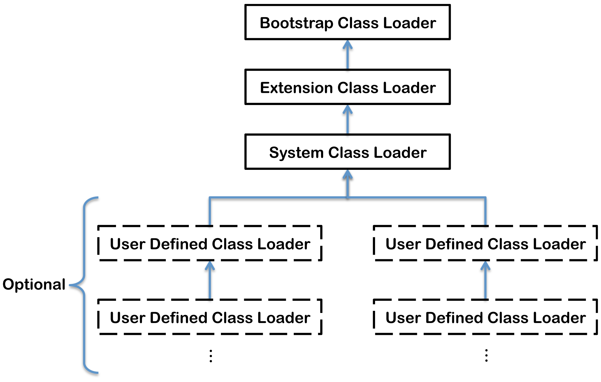

## 类加载机制

> 类是在运行期间动态加载的。

类的加载指的是将类的 `.class` 文件中的二进制数据读入到内存中，并转为可执行的代码的过程。

## 类的生命周期


Java 类的完整生命周期包括图片中这几个阶段：

加载、验证、准备、初始化和卸载这 5 个阶段的顺序是确定的，类的加载过程必须按照这种顺序按部就班地开始。而**解析过程在某些情况下可以在初始化阶段之后再开始，这是为了支持 Java 的动态绑定**。

类加载过程是指加载、验证、准备、解析和初始化这 5 个阶段。

### （一）加载
加载流程：
- 通过类的全限定名获取定义此类的二进制字节流
- 将字节流所代表的静态存储结构转换为方法区的运行时数据结构
- 在内存中生成一个代表该类的java.lang.Class对象

加载来源：
- 本地文件系统: .class文件
- 网络下载: Applet
- 压缩包: JAR、WAR文件
- 运行时计算生成: 动态代理
- 其他文件生成: JSP

### （二）验证

验证是链接阶段的第一步。**验证的目标是确保 Class 文件的字节流中包含的信息符合当前虚拟机的要求**，并且不会危害虚拟机自身的安全。

验证阶段大致会完成 4 个阶段的检验动作：

- **文件格式验证** - 魔数CAFEBABE、版本号等
- **元数据验证** - 语义分析，是否符合Java语言规范
- **字节码验证** - 数据流和控制流分析
- **符号引用验证** - 解析阶段前的预备检查


### （三）准备

**为类变量分配内存并设置初始值**

```java
public class Example {
    public static int value = 123;        // 准备阶段后value=0
    public static final int CONST = 456;  // 准备阶段后CONST=456
}
```


准备阶段有以下几点需要注意：
- 只分配类变量（静态变量），不包括实例变量
- 初始值通常是数据类型的零值
- final修饰的常量直接赋值为指定值

### （四）解析

**将常量池内的符号引用替换为直接引用**

解析类型：
- 类或接口的解析
- 字段解析
- 类方法解析
- 接口方法解析


### （五）初始化
```java
// 1. 创建类的实例
new MyClass();

// 2. 访问类的静态变量（非常量）或为静态变量赋值
int x = MyClass.staticVar;

// 3. 调用类的静态方法
MyClass.staticMethod();

// 4. 反射调用
Class.forName("com.example.MyClass");

// 5. 初始化子类时，如果父类未初始化则先初始化父类

// 6. 包含main方法的启动类
```
**初始化过程**

执行类构造器<clinit>()方法：
- 由编译器自动收集类中的所有静态变量赋值动作和静态语句块合并产生
- JVM保证子类的<clinit>()执行前，父类的<clinit>()已经执行完毕
- 线程安全，多个线程同时初始化同一个类时只有一个线程能执行

```java
public class InitializationExample {
    static {
        System.out.println("静态代码块执行");
    }
    
    public static int value = 123;  // 静态变量赋值
    
    // 编译器生成的<clinit>()方法包含以上两部分内容
}
```


## ClassLoader

`ClassLoader` 即类加载器，负责将类加载到 JVM。在 Java 虚拟机外部实现，以便让应用程序自己决定如何去获取所需要的类。

JVM 加载 `class` 文件到内存有两种方式：

- 隐式加载 - JVM 自动加载需要的类到内存中。
- 显示加载 - 通过使用 `ClassLoader` 来加载一个类到内存中。

### 类与类加载器

如何判断两个类是否相等：类本身相等，并且使用同一个类加载器进行加载。这是因为**每一个 `ClassLoader` 都拥有一个独立的类名称空间**。

这里的相等，包括类的 `Class` 对象的 `equals()` 方法、`isAssignableFrom()` 方法、`isInstance()` 方法的返回结果为 true，也包括使用 `instanceof` 关键字做对象所属关系判定结果为 true。

### 类加载器分类


#### Bootstrap ClassLoader

`Bootstrap ClassLoader` ，即启动类加载器 ，**负责加载 JVM 自身工作所需要的类**。

**`Bootstrap ClassLoader` 会将存放在 `<JAVA_HOME>\lib` 目录中的，或者被 `-Xbootclasspath` 参数所指定的路径中的，并且是虚拟机识别的（仅按照文件名识别，如 rt.jar，名字不符合的类库即使放在 lib 目录中也不会被加载）类库加载到虚拟机内存中**。

`Bootstrap ClassLoader` 是由 C++ 实现的，它完全由 JVM 自己控制的，启动类加载器无法被 Java 程序直接引用，用户在编写自定义类加载器时，如果需要把加载请求委派给启动类加载器，直接使用 `null` 代替即可。

#### ExtClassLoader

`ExtClassLoader`，即扩展类加载器，这个类加载器是由 `ExtClassLoader(sun.misc.Launcher\$ExtClassLoader)`实现的。

**`ExtClassLoader` 负责将 `<JAVA_HOME>\lib\ext` 或者被 `java.ext.dir` 系统变量所指定路径中的所有类库加载到内存中，开发者可以直接使用扩展类加载器**。

#### AppClassLoader

`AppClassLoader`，即应用程序类加载器，这个类加载器是由 `AppClassLoader(sun.misc.Launcher\$AppClassLoader)` 实现的。由于这个类加载器是 `ClassLoader` 中的 `getSystemClassLoader()` 方法的返回值，因此一般称为系统类加载器。

**`AppClassLoader` 负责加载用户类路径（即 `classpath`）上所指定的类库**，开发者可以直接使用这个类加载器，如果应用程序中没有自定义过自己的类加载器，一般情况下这个就是程序中默认的类加载器。

#### 自定义类加载器

自定义类加载器可以做到如下几点：

- 在执行非置信代码之前，自动验证数字签名。
- 动态地创建符合用户特定需要的定制化构建类。
- 从特定的场所取得 java class，例如数据库中和网络中。

假设，我们需要自定义一个名为 `FileSystemClassLoader` 的类加载器，继承自 `java.lang.ClassLoader`，用于加载文件系统上的类。它首先根据类的全名在文件系统上查找类的字节代码文件（`.class` 文件），然后读取该文件内容，最后通过 `defineClass()` 方法来把这些字节代码转换成 `java.lang.Class` 类的实例。

`java.lang.ClassLoader` 类的方法 `loadClass()` 实现了双亲委派模型的逻辑，因此自定义类加载器一般不去覆写它，而是通过覆写 `findClass()` 方法。

`ClassLoader` 常用的场景：

- 容器 - 典型应用：Servlet 容器（如：Tomcat、Jetty）、udf （Mysql、Hive）等。加载解压 jar 包或 war 包后，加载其 Class 到指定的类加载器中运行（通常需要考虑空间隔离）。
- 热部署、热插拔 - 应用启动后，动态获得某个类信息，然后加载到 JVM 中工作。很多著名的容器软件、框架（如：Spring 等），都使用 `ClassLoader` 来实现自身的热部署。

【示例】自定义一个类加载器

```java
public class FileSystemClassLoader extends ClassLoader {

    private String rootDir;

    public FileSystemClassLoader(String rootDir) {
        this.rootDir = rootDir;
    }

    protected Class<?> findClass(String name) throws ClassNotFoundException {
        byte[] classData = getClassData(name);
        if (classData == null) {
            throw new ClassNotFoundException();
        } else {
            return defineClass(name, classData, 0, classData.length);
        }
    }

    private byte[] getClassData(String className) {
        String path = classNameToPath(className);
        try {
            InputStream ins = new FileInputStream(path);
            ByteArrayOutputStream baos = new ByteArrayOutputStream();
            int bufferSize = 4096;
            byte[] buffer = new byte[bufferSize];
            int bytesNumRead;
            while ((bytesNumRead = ins.read(buffer)) != -1) {
                baos.write(buffer, 0, bytesNumRead);
            }
            return baos.toByteArray();
        } catch (IOException e) {
            e.printStackTrace();
        }
        return null;
    }

    private String classNameToPath(String className) {
        return rootDir + File.separatorChar
                + className.replace('.', File.separatorChar) + ".class";
    }
}
```

### 双亲委派

理解双亲委派之前，先让我们看一个示例。

【示例】寻找类加载示例

```java
public static void main(String[] args) {
    ClassLoader loader = Thread.currentThread().getContextClassLoader();
    System.out.println(loader);
    System.out.println(loader.getParent());
    System.out.println(loader.getParent().getParent());
}
```

输出：

```
sun.misc.Launcher$AppClassLoader@18b4aac2
sun.misc.Launcher$ExtClassLoader@19e1023e
null
```

从上面的结果可以看出，并没有获取到 `ExtClassLoader` 的父 Loader，原因是 `Bootstrap Loader`（引导类加载器）是用 C 语言实现的，找不到一个确定的返回父 Loader 的方式，于是就返回 null。

下图展示的类加载器之间的层次关系，称为类加载器的**双亲委派模型（Parents Delegation Model）**。**该模型要求除了顶层的 Bootstrap ClassLoader 外，其余的类加载器都应有自己的父类加载器**。**这里类加载器之间的父子关系一般通过组合（Composition）关系来实现，而不是通过继承（Inheritance）的关系实现**。

<div align="center">

</div>

**（1）工作过程**

**一个类加载器首先将类加载请求传送到父类加载器，只有当父类加载器无法完成类加载请求时才尝试加载**。

**（2）好处**

**使得 Java 类随着它的类加载器一起具有一种带有优先级的层次关系**，从而使得基础类得到统一：

- 系统类防止内存中出现多份同样的字节码
- 保证 Java 程序安全稳定运行

例如： `java.lang.Object` 存放在 rt.jar 中，如果编写另外一个 `java.lang.Object` 的类并放到 `classpath` 中，程序可以编译通过。因为双亲委派模型的存在，所以在 rt.jar 中的 `Object` 比在 `classpath` 中的 `Object` 优先级更高，因为 rt.jar 中的 `Object` 使用的是启动类加载器，而 `classpath` 中的 `Object` 使用的是应用程序类加载器。正因为 rt.jar 中的 `Object` 优先级更高，因为程序中所有的 `Object` 都是这个 `Object`。

**（3）实现**

以下是抽象类 `java.lang.ClassLoader` 的代码片段，其中的 `loadClass()` 方法运行过程如下：

```java
public abstract class ClassLoader {
    // The parent class loader for delegation
    private final ClassLoader parent;

    public Class<?> loadClass(String name) throws ClassNotFoundException {
        return loadClass(name, false);
    }

    protected Class<?> loadClass(String name, boolean resolve) throws ClassNotFoundException {
        synchronized (getClassLoadingLock(name)) {
            // 首先判断该类型是否已经被加载
            Class<?> c = findLoadedClass(name);
            if (c == null) {
                // 如果没有被加载，就委托给父类加载或者委派给启动类加载器加载
                try {
                    if (parent != null) {
                        // 如果存在父类加载器，就委派给父类加载器加载
                        c = parent.loadClass(name, false);
                    } else {
                        // 如果不存在父类加载器，就检查是否是由启动类加载器加载的类，通过调用本地方法native Class findBootstrapClass(String name)
                        c = findBootstrapClassOrNull(name);
                    }
                } catch (ClassNotFoundException e) {
                    // 如果父类加载器加载失败，会抛出 ClassNotFoundException
                }

                if (c == null) {
                    // 如果父类加载器和启动类加载器都不能完成加载任务，才调用自身的加载功能
                    c = findClass(name);
                }
            }
            if (resolve) {
                resolveClass(c);
            }
            return c;
        }
    }

    protected Class<?> findClass(String name) throws ClassNotFoundException {
        throw new ClassNotFoundException(name);
    }
}
```

【说明】

- 先检查类是否已经加载过，如果没有则让父类加载器去加载。
- 当父类加载器加载失败时抛出 `ClassNotFoundException`，此时尝试自己去加载。

### ClassLoader 参数

在生产环境上启动 java 应用时，通常会指定一些 `ClassLoader` 参数，以加载应用所需要的 lib：

```shell
java -jar xxx.jar -classpath lib/*
```

`ClassLoader` 相关参数选项：

| 参数选项                                     | ClassLoader 类型        | 说明                                                                  |
| -------------------------------------------- | ----------------------- | --------------------------------------------------------------------- |
| `-Xbootclasspath`                            | `Bootstrap ClassLoader` | 设置 `Bootstrap ClassLoader` 搜索路径。【不常用】                     |
| `-Xbootclasspath/a`                          | `Bootstrap ClassLoader` | 把路径添加到已存在的 `Bootstrap ClassLoader` 搜索路径后面。【常用】   |
| `-Xbootclasspath/p`                          | `Bootstrap ClassLoader` | 把路径添加到已存在的 `Bootstrap ClassLoader` 搜索路径前面。【不常用】 |
| `-Djava.ext.dirs`                            | `ExtClassLoader`        | 设置 `ExtClassLoader` 搜索路径。                                      |
| `-Djava.class.path` 或 `-cp` 或 `-classpath` | `AppClassLoader`        | 设置 `AppClassLoader` 搜索路径。                                      |

## 类的加载

### 类加载方式

类加载有三种方式：

- 命令行启动应用时候由 JVM 初始化加载
- 通过 `Class.forName()` 方法动态加载
- 通过 `ClassLoader.loadClass()` 方法动态加载

**`Class.forName()` 和 `ClassLoader.loadClass()` 区别**

- `Class.forName()` 将类的 `.class` 文件加载到 jvm 中之外，还会对类进行解释，执行类中的 `static` 块；
- `ClassLoader.loadClass()` 只干一件事情，就是将 `.class` 文件加载到 jvm 中，不会执行 `static` 中的内容，只有在 `newInstance` 才会去执行 `static` 块。
- `Class.forName(name, initialize, loader)` 带参函数也可控制是否加载 `static` 块。并且只有调用了 `newInstance()` 方法采用调用构造函数，创建类的对象 。

### 加载类错误

#### ClassNotFoundException

`ClassNotFoundException` 异常出镜率极高。**`ClassNotFoundException` 表示当前 `classpath` 下找不到指定类**。

常见问题原因：

- 调用 `Class` 的 `forName()` 方法，未找到类。
- 调用 `ClassLoader` 中的 `loadClass()` 方法，未找到类。
- 调用 `ClassLoader` 中的 `findSystemClass()` 方法，未找到类。

【示例】执行以下代码，会抛出 `ClassNotFoundException` 异常：

```java
public class ClassNotFoundExceptionDemo {
    public static void main(String[] args) {
        try {
            Class.forName("NotFound");
        } catch (ClassNotFoundException e) {
            e.printStackTrace();
        }
    }
}
```

解决方法：检查 `classpath` 下有没有相应的 class 文件。

#### NoClassDefFoundError

常见问题原因：

- 类依赖的 Class 或者 jar 不存在。
- 类文件存在，但是存在不同的域中。

解决方法：现代 Java 项目，一般使用 `maven`、`gradle` 等构建工具管理项目，仔细检查找不到的类所在的 jar 包是否已添加为依赖。

#### UnsatisfiedLinkError

这个异常倒不是很常见，但是出错的话，通常是在 JVM 启动的时候如果一不小心将在 JVM 中的某个 lib 删除了，可能就会报这个错误了。

【示例】执行以下代码，会抛出 `UnsatisfiedLinkError` 错误。

```java
public class UnsatisfiedLinkErrorDemo {

    public native void nativeMethod();

    static {
        System.loadLibrary("NoLib");
    }

    public static void main(String[] args) {
        new UnsatisfiedLinkErrorDemo().nativeMethod();
    }

}
```

【输出】

```java
java.lang.UnsatisfiedLinkError: no NoLib in java.library.path
	at java.lang.ClassLoader.loadLibrary(ClassLoader.java:1867)
	at java.lang.Runtime.loadLibrary0(Runtime.java:870)
	at java.lang.System.loadLibrary(System.java:1122)
	at io.github.dunwu.javacore.jvm.classloader.exception.UnsatisfiedLinkErrorDemo.<clinit>(UnsatisfiedLinkErrorDemo.java:12)
```

#### ClassCastException

`ClassCastException` 异常通常是在程序中强制类型转换失败时出现。

【示例】执行以下代码，会抛出 `ClassCastException` 异常。

```java
public class ClassCastExceptionDemo {

    public static void main(String[] args) {
        Object obj = new Object();
        EmptyClass newObj = (EmptyClass) obj;
    }

    static class EmptyClass {}

}
```

【输出】

```java
Exception in thread "main" java.lang.ClassCastException: java.lang.Object cannot be cast to io.github.dunwu.javacore.jvm.classloader.exception.ClassCastExceptionDemo$EmptyClass
	at io.github.dunwu.javacore.jvm.classloader.exception.ClassCastExceptionDemo.main(ClassCastExceptionDemo.java:11)
```

## 参考
- https://www.bilibili.com/video/BV1yE411Z7AP
- https://dunwu.github.io/