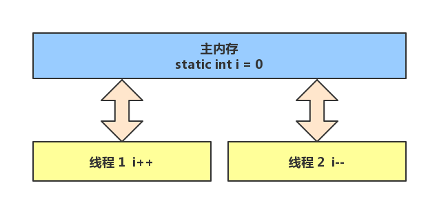
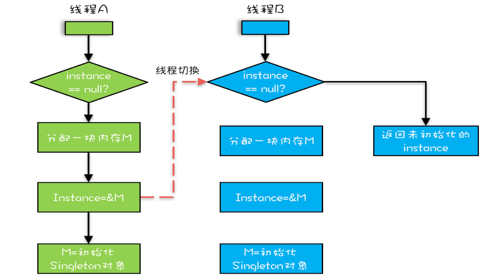

## 并发概念


### 进程和线程

- **进程：** 可以视为程序的一个实例。

- **线程：** 线程作为最小调度单位，进程作为资源分配的最小单位。

- **一个进程之内可以分为一到多个线程**。
- 一个线是一个指令流，将指令流中的一条条指令以一定的顺序交给 CPU 执行
- Java 中，**线程作为最小调度单位，进程作为资源分配的最小单位**。 在 windows 中进程是不活动的，只是作为线程的容器。


进程和线程的差异：

- 一个程序至少有一个进程，一个进程至少有一个线程。
- 线程比进程划分更细，所以执行开销更小，并发性更高
- 进程是一个实体，拥有独立的资源；而同一个进程中的资源是多个线程共享的。


### 并行与并发
单核 cpu 下，线程实际还是**串行执行**的。操作系统中有一个组件叫做任务调度器，将 cpu 的**时间片**（windows下时间片最小约为 15 毫秒）分给不同的程序使用，只是由于 cpu 在线程间（时间片很短）的切换非常快，人类感觉是 同时运行的 。总结为一句话就是： 微观串行，宏观并行 ，一般会将这种 **线程轮流使用 CPU** 的做法称为**并发**， concurrent
| cpu  | 时间片1 | 时间片2 | 时间片3 | 时间片4 |
|------|------|------|------|------|
| core | 线程1  | 线程2  | 线程3  | 线程4  |

多核 cpu下，每个 核（core） 都可以调度运行线程，这时候线程可以是**并行**的。
| CPU    | 时间片 1 | 时间片 2 | 时间片 3 | 时间片 4 |
|--------|-------|-------|-------|-------|
| core 1 | 线程 1  | 线程 1  | 线程 3  | 线程 3  |
| core 2 | 线程 2  | 线程 4  | 线程 2  | 线程 4  |

简单来说：
- 并发（concurrent）是**同一时间应对（dealing with）多件事情的能力**，就像单核cpu的时间片一样。
- 并行（parallel）是**同一时间动手做（doing）多件事情的能力**，就像多核cpu调度线程一样。


### 同步与异步
以调用方角度来讲，如果
- **需要等待结果返回，才能继续运行就是同步**
- **不需要等待结果返回，就能继续运行就是异步**

举例说明：
- 同步（巴巴干等着）就像是读取磁盘文件时，假设读取操作花费了 5 秒钟，如果没有线程调度机制，这 5 秒 cpu 什么都做不了，其它代码都得暂停...
- 异步就可以在读取操作的时候，开一个新线程去处理其他问题，读取完了在回来操作。


### 阻塞和非阻塞

同步和异步关注的多个线程的**执行顺序和协调**，阻塞和非阻塞关注的是线程的**执行状态**：

- **阻塞**：是指调用结果返回之前，当前线程会被挂起。调用线程只有在得到结果之后才会返回。
- **非阻塞**：是指在不能立刻得到结果之前，该调用不会阻塞当前线程。


### 竞态条件和临界区

两个线程对初始值为 0 的静态变量一个做自增，一个做自减，各做 5000 次，结果是 0 吗？
```java
static int i = 0;

public static void main(String[] args) throws InterruptedException {
    Thread t1 = new Thread(() -> {
        for (int j = 0; j < 5000; j++) {
            i++;
        }
    }, "t1");

    Thread t2 = new Thread(() -> {
        for (int j = 0; j < 5000; j++) {
            i--;
        }
    }, "t2");

    t1.start();
    t2.start();
    t1.join();
    t2.join();
    log.debug("{}", i);
}
```
这段代码的结果可能是正数、负数、零。为什么呢？因为 Java 中对静态变量的自增，自减并不是原子操作，要彻底理解，必须从字节码来进行分析。

列如`i++`而言（i为静态变量），实际会产生如下JVM字节码指令：
```txt
getstatic i // 获取静态变量i的值
iconst_1 // 准备常量1
iadd // 自增
putstatic i // 将修改后的值存入静态变量i
```

Java 的内存模型如下，完成静态变量的自增，自减需要在**主存**和工作内存中进行数据交换。


如果是单线程，`i++`和`i--`的字节码总共8行代码，是顺序执行，不会存在问题。但是如果执行顺序存在交错，就会出现正数和负数的情况。这里的关键点在于最后一行代码:`putstatic i`执行时，发生线程上下文切换到另外一个线程执行。

像这种一段代码块内如果存在对**共享资源**的多线程读写操作，称这段代码块为**临界区（Critical Section）**
- 一个程序运行多个线程本身是没有问题的，问题出在多个线程访问**共享资源**
  - 多个线程读**共享资源**其实也没有问题
  - 在多个线程对**共享资源**读写操作时发生指令交错，就会出现问题


而这种多个线程在临界区内执行，由于代码的**执行序列不同**而导致结果无法预测，称之为发生了**竞态条件（Race Condition）**


### 管程

管程（Monitor），是指管理共享变量以及对共享变量的操作过程，让他们支持并发。

> Monitor 关注的是访问共享变量时，保证临界区代码的原子性


Java 采用的是管程技术，synchronized 关键字及 wait()、notify()、notifyAll() 这三个方法都是管程的组成部分。而**管程和信号量是等价的，所谓等价指的是用管程能够实现信号量，也能用信号量实现管程**。


## 并发的特点


### 提高效率
充分利用多核 cpu 的优势，提高运行效率。想象下面的场景，执行 3 个计算，最后将计算结果汇总。
```txt
计算 1 花费 10 ms
 
计算 2 花费 11 ms
 
计算 3 花费 9 ms
 
汇总需要 1 ms
```

- 如果是串行执行，那么总共花费的时间是 10 + 11 + 9 + 1 = 31ms
- 但如果是四核 cpu，各个核心分别使用线程 1 执行计算 1，线程 2 执行计算 2，线程 3 执行计算 3，那么 3 个线程是并行的，花费时间只取决于最长的那个线程运行的时间，即 11ms 最后加上汇总时间只会花费 **12ms**

> 🔔注意： 需要在多核 cpu 才能提高效率，单核仍然时是轮流执行

**结论**
1. 单核 cpu 下，多线程不能实际提高程序运行效率，只是为了能够在不同的任务之间切换，不同线程轮流使用cpu ，不至于一个线程总占用 cpu，别的线程没法干活。**提高的是cpu资源的利用率**
2. 多核 cpu 可以并行跑多个线程，但能否提高程序运行效率还是要分情况的。有些任务，经过精心设计，**将任务拆分，并行执行**，当然可以**提高程序的运行效率**。但不是所有计算任务都能拆分，也不是所有任务都需要拆分，任务的目的如果不同，谈拆分和效率没啥意义。
3. IO 操作不占用 cpu，只是我们一般拷贝文件使用的是【阻塞 IO】，这时相当于线程虽然不用 cpu，但需要一直等待 IO 结束，没能充分利用线程。所以才有后面的【非阻塞 IO】和【异步 IO】优化

### 并发的问题
我们知道了并发带来的好处：提升资源利用率、程序响应更快，同时也要认识到并发带来的问题，主要有：

- 安全性问题
- 活跃性问题
- 性能问题

## 安全性问题
并发最重要的问题是并发安全问题。

**并发安全**：是指保证程序的正确性，使得并发处理结果符合预期。就像`i--`和`i++`一样，上下文切换导致结果非预期。

并发安全需要保证几个基本特性：

- **可见性** - 是一个线程修改了某个共享变量，其状态能够立即被其他线程知晓，通常被解释为将线程本地状态反映到主内存上，`volatile` 就是负责保证可见性的。
- **原子性** - 简单说就是相关操作不会中途被其他线程干扰，一般通过同步机制（加锁：`sychronized`、`Lock`）实现。
- **有序性** - 是保证线程内串行语义，避免指令重排等。

### 缓存导致的可见性问题

在**单核**时代，所有的线程都是在一颗 CPU 上执行，CPU 缓存与内存的数据一致性容易解决。因为所有线程都是操作同一个 CPU 的缓存，一个线程对缓存的写，对另外一个线程来说**一定是可见**的。


**多核**时代，每颗 CPU 都有自己的缓存，这时 CPU 缓存与内存的数据一致性就没那么容易解决了，当多个线程在不同的 CPU 上执行时，这些线程操作的是不同的 CPU 缓存。

上述竞态条件和临界区的 `i--`和`i++`的问题，就存在**多核**场景下的可见性问题：
- 我们假设线程 t1 和 t2 **同时**开始执行，第一次 CPU 都会将 i=0 读取到各自的缓存中，执行完 `i++` 和 `i--` 后，各自的 CPU 缓存 1 和 -1，**同时**写入内存后，我们会发现内存中的 i 是 -1/1，而不是预期中的 0。 之后的结果自然就不是我们预期的 0 了。

### 线程切换带来的原子性问题

早期的操作系统基于进程来调度 CPU，不同进程间是不共享内存空间的，所以进程要做任务切换就要切换内存映射地址，而一个进程创建的所有线程，都是共享一个内存空间的，所以线程做任务切换成本就很低了。现代的操作系统都基于更轻量的线程来调度，现在我们提到的“任务切换”都是指“线程切换”。

Java 并发程序都是基于多线程的，自然也会涉及到任务切换，也许你想不到，任务切换竟然也是并发编程里诡异 Bug 的源头之一。任务切换的时机大多数是在时间片结束的时候，我们现在基本都使用高级语言编程，**高级语言里一条语句往往需要多条 CPU 指令**完成，例如上面代码中的 `i++` 至少需要三条 CPU 指令。

- 指令 1：首先，需要把变量 count 从内存加载到 CPU 的寄存器；
- 指令 2：之后，在寄存器中执行 +1 操作；
- 指令 3：最后，将结果写入内存（缓存机制导致可能写入的是 CPU 缓存而不是内存）。


操作系统做任务切换，可以发生在任何一条**CPU 指令**执行完，是的，是 CPU 指令，而不是高级语言里的一条语句。对于上面的三条指令来说，我们假设 `i=0`，如果线程 t1 在指令 3 执行完后做线程切换，线程 t2（`i--`） 执行完之后，再切回 t1，此时 t1 的指令3 会覆盖 t2 的值，我们得到的结果，不是我们期望的 0，而是 1。

也就是说，上述竞态条件和临界区的 `i--`和`i++` 的也是存在原子性问题的。

> 🔔注意：
> - 可见性只存在于**多核CPU**
> - 原子性是**单核CPU**和**多核CPU**都会存在的。

### 编译优化带来的有序性问题

**JVM 为了优化性能，会在不影响正确性的前提下，可以调整语句的执行顺序。**


在 Java 领域一个经典的案例就是利用双重检查创建单例对象，例如下面的代码：在获取实例 getInstance() 的方法中，我们首先判断 instance 是否为空，如果为空，则锁定 Singleton.class 并再次检查 instance 是否为空，如果还为空则创建 Singleton 的一个实例。

```java
public class Singleton {
  static Singleton instance;
  static Singleton getInstance(){
    if (instance == null) {
      synchronized(Singleton.class) {
        if (instance == null)
          instance = new Singleton();
        }
    }
    return instance;
  }
}
```

假设有两个线程 A、B 同时调用 getInstance() 方法，他们会同时发现 `instance == null` ，于是同时对 Singleton.class 加锁，此时 JVM 保证只有一个线程能够加锁成功（假设是线程 A），另外一个线程则会处于等待状态（假设是线程 B）；线程 A 会创建一个 Singleton 实例，之后释放锁，锁释放后，线程 B 被唤醒，线程 B 再次尝试加锁，此时是可以加锁成功的，加锁成功后，线程 B 检查 `instance == null` 时会发现，已经创建过 Singleton 实例了，所以线程 B 不会再创建一个 Singleton 实例。

这看上去一切都很完美，无懈可击，但实际上这个 getInstance() 方法并不完美。问题出在哪里呢？出在 new 操作上，我们以为的 new 操作应该是：

1. 分配一块内存 M；
2. 在内存 M 上初始化 Singleton 对象；
3. 然后 M 的地址赋值给 instance 变量。

但是实际上优化后的执行路径却是这样的：

1. 分配一块内存 M；
2. 将 M 的地址赋值给 instance 变量；
3. 最后在内存 M 上初始化 Singleton 对象。

优化后会导致什么问题呢？我们假设线程 A 先执行 getInstance() 方法，当执行完指令 2 时恰好发生了线程切换，切换到了线程 B 上；如果此时线程 B 也执行 getInstance() 方法，那么线程 B 在执行第一个判断时会发现 `instance != null` ，所以直接返回 instance，而此时的 instance 是没有初始化过的，如果我们这个时候访问 instance 的成员变量就可能触发空指针异常。




而**volatile 修饰的变量，可以禁用指令重排**。

因此给 Signleton 加上 volatile 即可：`static volatile Singleton instance;`


### 保证并发安全的思路
#### 互斥同步（阻塞同步）
互斥同步是最常见的并发正确性保障手段。

**同步是指在多线程并发访问共享数据时，保证共享数据在同一时刻只能被一个线程访问**。

**互斥是实现同步的一种手段**。互斥是保证临界区的竞态条件发生，同一时刻只能有一个线程执行临界区代码。

最典型的案例是使用 `synchronized` 或 `Lock` 。

synchronized，俗称**对象锁**，它采用互斥的方式让同一时刻至多只有一个线程能持有对象锁，其它线程再想获取这个【对象锁】时就会阻塞住。同时**互斥同步最主要的问题是线程阻塞和唤醒所带来的性能问题**，互斥同步属于一种悲观的并发策略。

因此上述的 `i++` 和 `i--` 的问题就可以这样解决：
```java
static int i = 0;
static final Object room = new Object();

public static void main(String[] args) throws InterruptedException {
    Thread t1 = new Thread(() -> {
        for (int j = 0; j < 5000; j++) {
            synchronized(room) {
                i++;
            }
        }
    }, "t1");

    Thread t2 = new Thread(() -> {
        for (int j = 0; j < 5000; j++) {
            synchronized(room) {
                i--;
            }
        }
    }, "t2");

    t1.start();
    t2.start();
    t1.join();
    t2.join();
    log.debug("{}", i);
}
```

#### 非阻塞同步
乐观锁是非阻塞同步的一种实现策略，常见的乐观锁有 Swap 和 CAS。乐观锁是一种思想，并非像 synchronized 那样的锁，比如 CAS 是乐观锁的一种实现，但是其内在却没有锁。

#### 无同步
无同步（Synchronization-Free）是指在并发编程中，**不依赖传统的锁机制**（如 synchronized、Lock）来保证线程安全，而是通过其他技术手段实现并发安全。

要保证线程安全，不一定非要进行同步。同步只是保证共享数据争用时的正确性，如果一个方法本来就不涉及共享数据，那么自然无须同步。

Java 中的 **无同步方案** 有：

- **可重入代码** - 也叫纯代码。如果一个方法，它的 **返回结果是可以预测的**，即只要输入了相同的数据，就能返回相同的结果，那它就满足可重入性，当然也是线程安全的。
- **线程本地存储** - 使用 **`ThreadLocal` 为共享变量在每个线程中都创建了一个本地副本**，这个副本只能被当前线程访问，其他线程无法访问，那么自然是线程安全的。


> CAS 就是无同步的核心技术


## 活跃性问题

### 死锁（Deadlock）
多个线程互相等待对方释放锁。

死锁是当线程进入无限期等待状态时发生的情况，因为所请求的锁被另一个线程持有，而另一个线程又等待第一个线程持有的另一个锁。

**避免死锁的思路**
- 按序加锁
- 超时释放锁
- 死锁检测

### 活锁（Livelock）
想象这样一个例子：两个人在狭窄的走廊里相遇，二者都很礼貌，试图移到旁边让对方先通过。但是他们最终在没有取得任何进展的情况下左右摇摆，因为他们都在同一时间向相同的方向移动。

活锁是一个递归的情况，两个或更多的线程会不断重复一个特定的代码逻辑。预期的逻辑通常为其他线程提供机会继续支持'this'线程。

**避免活锁**
解决“**活锁**”的方案很简单，谦让时，尝试等待一个随机的时间就可以了。由于等待的时间是随机的，所以同时相撞后再次相撞的概率就很低了。

### 饥饿（Starvation）
- 高优先级线程吞噬所有的低优先级线程的 CPU 时间。

饥饿问题最经典的例子就是哲学家问题。如图所示：有五个哲学家用餐，每个人要获得两把叉子才可以就餐。当 2、4 就餐时，1、3、5 永远无法就餐，只能看着盘中的美食饥饿的等待着。

**避免饥饿的方案**
- 保证资源充足
- 公平地分配资源
- 避免持有锁的线程长时间执行

这三个方案中，方案一和方案三的适用场景比较有限，因为很多场景下，资源的稀缺性是没办法解决的，持有锁的线程执行的时间也很难缩短。倒是方案二的适用场景相对来说更多一些。

那如何公平地分配资源呢？在并发编程里，主要是使用**公平锁**。所谓公平锁，是一种先来后到的方案，线程的等待是有顺序的，排在等待队列前面的线程会优先获得资源。

## 性能问题

并发执行一定比串行执行快吗？线程越多执行越快吗？

答案是：**并发不一定比串行快**。因为有创建线程和线程上下文切换的开销。

### 上下文切换

#### 什么是上下文切换？

当 CPU 从执行一个线程切换到执行另一个线程时，CPU 需要保存当前线程的本地数据，程序指针等状态，并加载下一个要执行的线程的本地数据，程序指针等。这个开关被称为“上下文切换”。


#### 减少上下文切换的方法

- 无锁并发编程 - 多线程竞争锁时，会引起上下文切换，所以多线程处理数据时，可以用一些办法来避免使用锁，如将数据的 ID 按照 Hash 算法取模分段，不同的线程处理不同段的数据。
- CAS 算法 - Java 的 Atomic 包使用 CAS 算法来更新数据，而不需要加锁。
- 使用最少线程 - 避免创建不需要的线程，比如任务很少，但是创建了很多线程来处理，这样会造成大量线程都处于等待状态。
- 使用协程 - 在单线程里实现多任务的调度，并在单线程里维持多个任务间的切换。


### 资源限制

#### 什么是资源限制

资源限制是指在进行并发编程时，程序的执行速度受限于计算机硬件资源或软件资源。

#### 资源限制引发的问题

在并发编程中，将代码执行速度加快的原则是将代码中串行执行的部分变成并发执行，但是如果将某段串行的代码并发执行，因为受限于资源，仍然在串行执行，这时候程序不仅不会加快执行，反而会更慢，因为增加了上下文切换和资源调度的时间。

#### 如何解决资源限制的问题

在资源限制情况下进行并发编程，根据不同的资源限制调整程序的并发度。

- 对于硬件资源限制，可以考虑使用集群并行执行程序。
- 对于软件资源限制，可以考虑使用资源池将资源复用。

## 参考
- https://dunwu.github.io/
- https://www.bilibili.com/video/BV16J411h7Rd