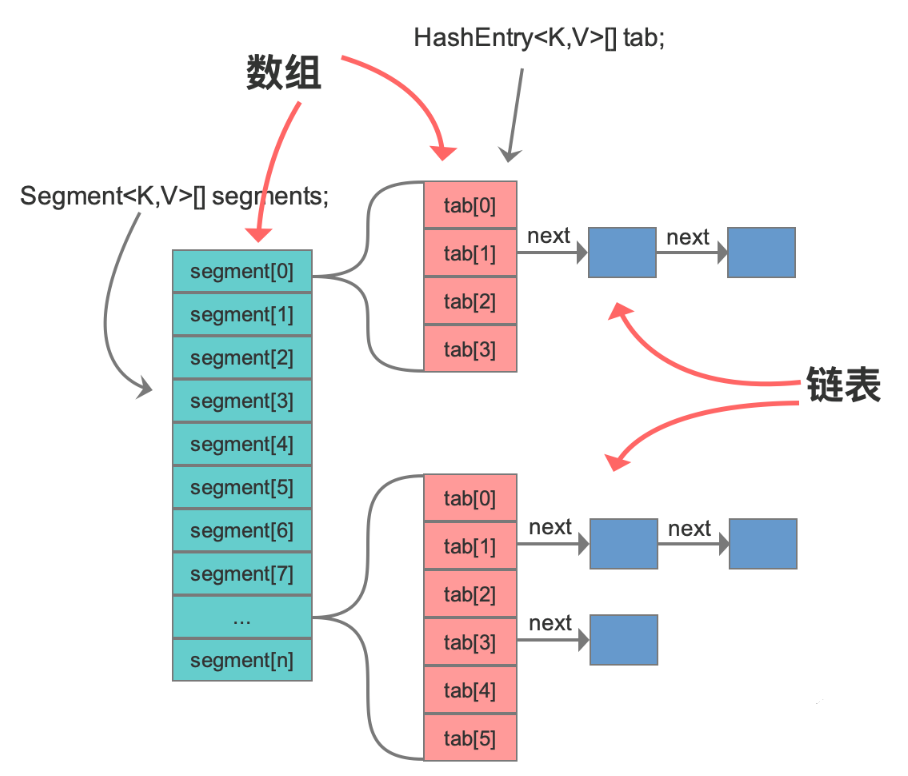

# Java 并发和容器

## 同步容器

### 同步容器简介

在 Java 中，同步容器主要包括 2 类：

- `Vector`、`Stack`、`Hashtable`
  - `Vector` - `Vector` 实现了 `List` 接口。`Vector` 实际上就是一个数组，和 `ArrayList` 类似。但是 `Vector` 中的方法都是 `synchronized` 方法，即进行了同步措施。
  - `Stack` - `Stack` 也是一个同步容器，它的方法也用 `synchronized` 进行了同步，它实际上是继承于 `Vector` 类。
  - `Hashtable`- `Hashtable` 实现了 `Map` 接口，它和 `HashMap` 很相似，但是 `Hashtable` 进行了同步处理，而 `HashMap` 没有。
- `Collections` 类中提供的静态工厂方法创建的类（由 `Collections.synchronizedXXX` 等方法）

### 同步容器的问题

同步容器的同步原理就是在其 `get`、`set`、`size` 等主要方法上用 `synchronized` 修饰。

#### 性能问题

`synchronized` 的互斥同步会产生阻塞和唤醒线程的开销。显然，这种方式比没有使用 `synchronized` 的容器性能要差很多。

> 注：尤其是在 Java 1.6 没有对 `synchronized` 进行优化前，阻塞开销很高。

#### 安全问题

同步容器真的绝对安全吗？

其实也未必。在做复合操作（非原子操作）时，仍然需要加锁来保护。常见复合操作如下：

- **迭代**：反复访问元素，直到遍历完全部元素；
- **跳转**：根据指定顺序寻找当前元素的下一个（下 n 个）元素；
- **条件运算**：例如若没有则添加等；


`ConcurrentModificationException` 异常

在对 `Vector` 等容器并发地进行迭代修改时，会报 `ConcurrentModificationException` 异常。

但是在并发容器中不会出现这个问题。

## 并发容器简介

同步容器将所有对容器状态的访问都串行化，以保证线程安全性，这种策略会严重降低并发性。

Java 1.5 后提供了多种并发容器，**使用并发容器来替代同步容器，可以极大地提高伸缩性并降低风险**。

J.U.C 包中提供了几个非常有用的并发容器作为线程安全的容器：

| 并发容器                | 对应的普通容器 | 描述                                                                                          |
| ----------------------- | -------------- | --------------------------------------------------------------------------------------------- |
| `ConcurrentHashMap`     | `HashMap`      | Java 1.8 之前采用分段锁机制细化锁粒度，降低阻塞，从而提高并发性；Java 1.8 之后基于 CAS 实现。 |
| `ConcurrentSkipListMap` | `SortedMap`    | 基于跳表实现的                                                                                |
| `CopyOnWriteArrayList`  | `ArrayList`    |                                                                                               |
| `CopyOnWriteArraySet`   | `Set`          | 基于 `CopyOnWriteArrayList` 实现。                                                            |
| `ConcurrentSkipListSet` | `SortedSet`    | 基于 `ConcurrentSkipListMap` 实现。                                                           |
| `ConcurrentLinkedQueue` | `Queue`        | 线程安全的无界队列。底层采用单链表。支持 FIFO。                                               |
| `ConcurrentLinkedDeque` | `Deque`        | 线程安全的无界双端队列。底层采用双向链表。支持 FIFO 和 FILO。                                 |
| `ArrayBlockingQueue`    | `Queue`        | 数组实现的阻塞队列。                                                                          |
| `LinkedBlockingQueue`   | `Queue`        | 链表实现的阻塞队列。                                                                          |
| `LinkedBlockingDeque`   | `Deque`        | 双向链表实现的双端阻塞队列。                                                                  |

J.U.C 包中提供的并发容器命名一般分为三类：

- `Concurrent`
  - 这类型的锁竞争相对于 `CopyOnWrite` 要高一些，但写操作代价要小一些。
  - 此外，`Concurrent` 往往提供了较低的遍历一致性，即：当利用迭代器遍历时，如果容器发生修改，迭代器仍然可以继续进行遍历。代价就是，在获取容器大小 `size()` ，容器是否为空等方法，不一定完全精确，但这是为了获取并发吞吐量的设计取舍，可以理解。与之相比，如果是使用同步容器，就会出现 `fail-fast` 问题，即：检测到容器在遍历过程中发生了修改，则抛出 `ConcurrentModificationException`，不再继续遍历。
- `CopyOnWrite` - 一个线程写，多个线程读。读操作时不加锁，写操作时通过在副本上加锁保证并发安全，空间开销较大。
- `Blocking` - 内部实现一般是基于锁，提供阻塞队列的能力。

:x: 错误示例，产生 `ConcurrentModificationException` 异常：

```java
public void removeKeys(Map<String, Object> map, final String... keys) {
    map.keySet().removeIf(key -> ArrayUtil.contains(keys, key));
}
```

:x: 错误示例，产生 `ConcurrentModificationException` 异常：

```java
public static <K, V> Map<K, V> removeKeys(Map<String, Object> map, final String... keys) {
	for (K key : keys) {
		map.remove(key);
	}
	return map;
}
```

### 并发场景下的 Map

如果对数据有强一致要求，则需使用 `Hashtable`；在大部分场景通常都是弱一致性的情况下，使用 `ConcurrentHashMap` 即可；如果数据量在千万级别，且存在大量增删改操作，则可以考虑使用 `ConcurrentSkipListMap`。


> 强一致性要求系统在数据更新后，所有后续的读取操作都能立即看到最新的值。
> 弱一致性允许系统在数据更新后，不保证所有后续读取操作都能立即看到最新值。

### 并发场景下的 List

读多写少用 `CopyOnWriteArrayList`。

写多读少用 `ConcurrentLinkedQueue` ，但由于是无界的，要有容量限制，避免无限膨胀，导致内存溢出。

## Map

Map 接口的两个实现是 ConcurrentHashMap 和 ConcurrentSkipListMap，它们从应用的角度来看，主要区别在于**ConcurrentHashMap 的 key 是无序的，而 ConcurrentSkipListMap 的 key 是有序的**。所以如果你需要保证 key 的顺序，就只能使用 ConcurrentSkipListMap。

使用 ConcurrentHashMap 和 ConcurrentSkipListMap 需要注意的地方是，它们的 key 和 value 都不能为空，否则会抛出`NullPointerException`这个运行时异常。

### ConcurrentHashMap

`ConcurrentHashMap` 是线程安全的 `HashMap` ，用于替代 `Hashtable`。

#### `ConcurrentHashMap` 的特性

`ConcurrentHashMap` `实现了` `ConcurrentMap` 接口，而 `ConcurrentMap` 接口扩展了 `Map` 接口。

```java
public class ConcurrentHashMap<K,V> extends AbstractMap<K,V>
    implements ConcurrentMap<K,V>, Serializable {
    // ...
}
```

`ConcurrentHashMap` 的实现包含了 `HashMap` 所有的基本特性，如：数据结构、读写策略等。

`ConcurrentHashMap` 没有实现对 `Map` 加锁以提供独占访问。因此无法通过在客户端加锁的方式来创建新的原子操作。但是，一些常见的复合操作，如：“若没有则添加”、“若相等则移除”、“若相等则替换”，都已经实现为原子操作，并且是围绕 `ConcurrentMap` 的扩展接口而实现。

```java
public interface ConcurrentMap<K, V> extends Map<K, V> {

    // 仅当 K 没有相应的映射值才插入
    V putIfAbsent(K key, V value);

    // 仅当 K 被映射到 V 时才移除
    boolean remove(Object key, Object value);

    // 仅当 K 被映射到 oldValue 时才替换为 newValue
    boolean replace(K key, V oldValue, V newValue);

    // 仅当 K 被映射到某个值时才替换为 newValue
    V replace(K key, V value);
}
```

不同于 `Hashtable`，`ConcurrentHashMap` 提供的迭代器不会抛出 `ConcurrentModificationException`，因此不需要在迭代过程中对容器加锁。

> 注意：一些需要对整个 `Map` 进行计算的方法，如 `size` 和 `isEmpty` ，由于返回的结果在计算时可能已经过期，所以**并非实时的精确值**。这是一种策略上的权衡，在并发环境下，这类方法由于总在不断变化，所以获取其实时精确值的意义不大。`ConcurrentHashMap` 弱化这类方法，以换取更重要操作（如：`get`、`put`、`containesKey`、`remove` 等）的性能。

#### ConcurrentHashMap 的用法

示例：不会出现 `ConcurrentModificationException`

`ConcurrentHashMap` 的基本操作与 `HashMap` 的用法基本一样。不同于 `HashMap`、`Hashtable`，`ConcurrentHashMap` 提供的迭代器不会抛出 `ConcurrentModificationException`，因此不需要在迭代过程中对容器加锁。


#### ConcurrentHashMap 的原理

> `ConcurrentHashMap` 一直在演进，尤其在 Java 1.7 和 Java 1.8，其数据结构和并发机制有很大的差异。

- Java 1.7
  - 数据结构：**数组＋单链表**
  - 并发机制：采用分段锁机制细化锁粒度，降低阻塞，从而提高并发性。
- Java 1.8
  - 数据结构：**数组＋单链表＋红黑树**
  - 并发机制：取消分段锁，之后基于 CAS + synchronized 实现。


##### Java 1.7 的实现

分段锁，是将内部进行分段（Segment），里面是 `HashEntry` 数组，和 `HashMap` 类似，哈希相同的条目也是以链表形式存放。
`HashEntry` 内部使用 `volatile` 的 `value` 字段来保证可见性，也利用了不可变对象的机制，以改进利用 `Unsafe` 提供的底层能力，比如 volatile access，去直接完成部分操作，以最优化性能，毕竟 `Unsafe` 中的很多操作都是 JVM intrinsic 优化过的。



在进行并发写操作时，`ConcurrentHashMap` 会获取可重入锁（`ReentrantLock`），以保证数据一致性。所以，在并发修改期间，相应 `Segment` 是被锁定的。

##### Java 1.8 的实现

- 数据结构改进：与 HashMap 一样，将原先 **数组＋单链表** 的数据结构，变更为 **数组＋单链表＋红黑树** 的结构。当出现哈希冲突时，数据会存入数组指定桶的单链表，当链表长度达到 8，则将其转换为红黑树结构，这样其查询的时间复杂度可以降低到 $$O(logN)$$，以改进性能。
- 并发机制改进：
  - 取消 segments 字段，**直接采用 `transient volatile HashEntry<K,V>[] table` 保存数据，采用 table 数组元素作为锁，从而实现了对每一行数据进行加锁，进一步减少并发冲突的概率**。
  - 使用 CAS + `sychronized` 操作，在特定场景进行无锁并发操作。使用 Unsafe、LongAdder 之类底层手段，进行极端情况的优化。现代 JDK 中，synchronized 已经被不断优化，可以不再过分担心性能差异，另外，相比于 ReentrantLock，它可以减少内存消耗，这是个非常大的优势。


## List

### CopyOnWriteArrayList

`CopyOnWriteArrayList` 是线程安全的 `ArrayList`。`CopyOnWrite` 字面意思为**写的时候会将共享变量新复制一份**出来。复制的好处在于**读操作是无锁的**（也就是无阻塞）。

CopyOnWriteArrayList **仅适用于写操作非常少的场景**，而且能够容忍读写的短暂不一致。如果读写比例均衡或者有大量写操作的话，使用 CopyOnWriteArrayList 的性能会非常糟糕。

#### CopyOnWriteArrayList 原理

CopyOnWriteArrayList 内部维护了一个数组，成员变量 array 就指向这个内部数组，所有的读操作都是基于 array 进行的，如下图所示，迭代器 Iterator 遍历的就是 array 数组。


（1）读操作

在 `CopyOnWriteAarrayList` 中，读操作不同步，因为它们在内部数组的快照上工作，所以多个迭代器可以同时遍历而不会相互阻塞。

CopyOnWriteArrayList 的读操作是不用加锁的，性能很高。

（2）写操作

所有的写操作都是同步的。他们在备份数组的副本上工作。写操作完成后，后备阵列将被替换为复制的阵列，并释放锁定。支持数组变得易变，所以替换数组的调用是原子。

写操作后创建的迭代器将能够看到修改的结构。

写时复制集合返回的迭代器不会抛出 `ConcurrentModificationException`，因为它们在数组的快照上工作，并且无论后续的修改如何，都会像迭代器创建时那样完全返回元素。

**添加操作** - 添加的逻辑很简单，先将原容器 copy 一份，然后在新副本上执行写操作，之后再切换引用。当然此过程是要加锁的。


**删除操作** - 删除操作同理，将除要删除元素之外的其他元素拷贝到新副本中，然后切换引用，将原容器引用指向新副本。同属写操作，需要加锁。


> 读性能差不多是写性能的一百倍。

## Set

Set 接口的两个实现是 CopyOnWriteArraySet 和 ConcurrentSkipListSet，使用场景可以参考前面讲述的 CopyOnWriteArrayList 和 ConcurrentSkipListMap，它们的原理都是一样的。

## Queue

Java 并发包里面 Queue 这类并发容器是最复杂的，你可以从以下两个维度来分类。一个维度是**阻塞与非阻塞**，所谓阻塞指的是：**当队列已满时，入队操作阻塞；当队列已空时，出队操作阻塞**。另一个维度是**单端与双端**，单端指的是只能队尾入队，队首出队；而双端指的是队首队尾皆可入队出队。Java 并发包里**阻塞队列都用 Blocking 关键字标识，单端队列使用 Queue 标识，双端队列使用 Deque 标识**。

### BlockingQueue

`BlockingQueue` 顾名思义，是一个**阻塞队列**。**`BlockingQueue` 基本都是基于锁实现**。在 `BlockingQueue` 中，**当队列已满时，入队操作阻塞；当队列已空时，出队操作阻塞**。

`BlockingQueue` 接口定义如下：

```java
public interface BlockingQueue<E> extends Queue<E> {}
```

核心 API：

```java
// 获取并移除队列头结点，如果必要，其会等待直到队列出现元素
E take() throws InterruptedException;
// 插入元素，如果队列已满，则等待直到队列出现空闲空间
void put(E e) throws InterruptedException;
```

`BlockingQueue` 对插入操作、移除操作、获取元素操作提供了四种不同的方法用于不同的场景中使用：

- 抛出异常；
- 返回特殊值（`null` 或 `true`/`false`，取决于具体的操作）；
- 阻塞等待此操作，直到这个操作成功；
- 阻塞等待此操作，直到成功或者超时指定时间。

总结如下：

|         | **Throws exception** | **Special value** | **Blocks**         | **Times out**        |
| ------- | -------------------- | ----------------- | ------------------ | -------------------- |
| Insert  | add(e)               | offer(e)          | put(e)             | offer(e, time, unit) |
| Remove  | remove()             | poll()            | take()             | poll(time, unit)     |
| Examine | element()            | peek()            | **not applicable** | **not applicable**   |

`BlockingQueue` 的各个实现类都遵循了这些规则。

`BlockingQueue` 不接受 `null` 值元素。

JDK 提供了以下阻塞队列：

- `ArrayBlockingQueue` - 一个由**数组结构组成的有界阻塞队列**。
- `LinkedBlockingQueue` - 一个由**链表结构组成的有界阻塞队列**。
- `PriorityBlockingQueue` - 一个**支持优先级排序的无界阻塞队列**。
- `SynchronousQueue` - 一个**不存储元素的阻塞队列**。
- `DelayQueue` - 一个使用优先级队列实现的无界阻塞队列。
- `LinkedTransferQueue` - 一个**由链表结构组成的无界阻塞队列**。

`BlockingQueue` 基本都是基于锁实现。


### ArrayBlockingQueue 类

`ArrayBlockingQueue` 是由数组结构组成的**有界阻塞队列**。

#### ArrayBlockingQueue 要点

`ArrayBlockingQueue` 类定义如下：

```java
public class ArrayBlockingQueue<E> extends AbstractQueue<E>
        implements BlockingQueue<E>, java.io.Serializable {
    // 数组的大小就决定了队列的边界，所以初始化时必须指定容量
    public ArrayBlockingQueue(int capacity) { //... }
    public ArrayBlockingQueue(int capacity, boolean fair) { //... }
    public ArrayBlockingQueue(int capacity, boolean fair, Collection<? extends E> c) { //... }
}
```

说明：

- `ArrayBlockingQueue` 实现了 `BlockingQueue`，也是一个阻塞队列。
- `ArrayBlockingQueue` 实现了 `Serializable`，支持序列化。
- `ArrayBlockingQueue` 是基于数组实现的有界阻塞队列。所以初始化时必须指定容量。

#### ArrayBlockingQueue 原理

`ArrayBlockingQueue` 的重要成员如下：

```java
// 用于存放元素的数组
final Object[] items;
// 下一次读取操作的位置
int takeIndex;
// 下一次写入操作的位置
int putIndex;
// 队列中的元素数量
int count;

// 以下几个就是控制并发用的同步器
final ReentrantLock lock;
private final Condition notEmpty;
private final Condition notFull;
```

`ArrayBlockingQueue` 内部以 `final` 的数组保存数据，数组的大小就决定了队列的边界。

`ArrayBlockingQueue` 实现并发同步的原理就是，读操作和写操作都需要获取到 AQS 独占锁才能进行操作。

- 如果队列为空，这个时候读操作的线程进入到读线程队列排队，等待写线程写入新的元素，然后唤醒读线程队列的第一个等待线程。
- 如果队列已满，这个时候写操作的线程进入到写线程队列排队，等待读线程将队列元素移除，然后唤醒写线程队列的第一个等待线程。

对于 `ArrayBlockingQueue`，我们可以在构造的时候指定以下三个参数：

- 队列容量，其限制了队列中最多允许的元素个数；
- 指定独占锁是公平锁还是非公平锁。非公平锁的吞吐量比较高，公平锁可以保证每次都是等待最久的线程获取到锁；
- 可以指定用一个集合来初始化，将此集合中的元素在构造方法期间就先添加到队列中。

### LinkedBlockingQueue 类

`LinkedBlockingQueue` 是由链表结构组成的有界阻塞队列。容易被误解为无边界，但其实其行为和内部代码都是基于有界的逻辑实现的，只不过如果我们没有在创建队列时就指定容量，那么其容量限制就自动被设置为 `Integer.MAX_VALUE`，成为了无界队列。

#### LinkedBlockingQueue 要点

`LinkedBlockingQueue` 类定义如下：

```java
public class LinkedBlockingQueue<E> extends AbstractQueue<E>
        implements BlockingQueue<E>, java.io.Serializable {}
```

- `LinkedBlockingQueue` 实现了 `BlockingQueue`，也是一个阻塞队列。
- `LinkedBlockingQueue` 实现了 `Serializable`，支持序列化。
- `LinkedBlockingQueue` 是基于单链表实现的阻塞队列，可以当做无界队列也可以当做有界队列来使用。
- `LinkedBlockingQueue` 中元素按照插入顺序保存（FIFO）。

#### LinkedBlockingQueue 原理

`LinkedBlockingQueue` 中的重要数据结构：

```java
// 队列容量
private final int capacity;
// 队列中的元素数量
private final AtomicInteger count = new AtomicInteger(0);
// 队头
private transient Node<E> head;
// 队尾
private transient Node<E> last;

// take, poll, peek 等读操作的方法需要获取到这个锁
private final ReentrantLock takeLock = new ReentrantLock();
// 如果读操作的时候队列是空的，那么等待 notEmpty 条件
private final Condition notEmpty = takeLock.newCondition();
// put, offer 等写操作的方法需要获取到这个锁
private final ReentrantLock putLock = new ReentrantLock();
// 如果写操作的时候队列是满的，那么等待 notFull 条件
private final Condition notFull = putLock.newCondition();
```

这里用了两对 `Lock` 和 `Condition`，简单介绍如下：

- `takeLock` 和 `notEmpty` 搭配：如果要获取（take）一个元素，需要获取 `takeLock` 锁，但是获取了锁还不够，如果队列此时为空，还需要队列不为空（`notEmpty`）这个条件（`Condition`）。
- `putLock` 需要和 `notFull` 搭配：如果要插入（put）一个元素，需要获取 `putLock` 锁，但是获取了锁还不够，如果队列此时已满，还需要队列不是满的（notFull）这个条件（`Condition`）。


## 参考
- https://dunwu.github.io/
- https://www.bilibili.com/video/BV16J411h7Rd