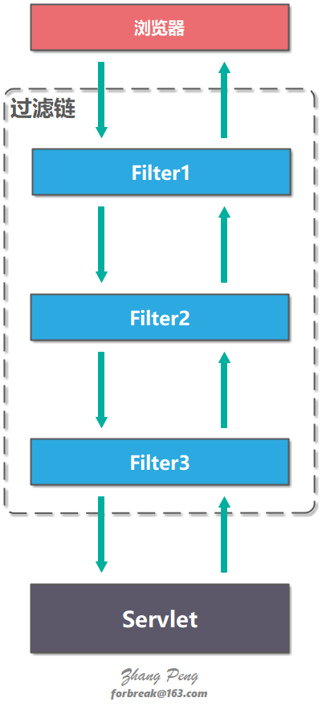

# JavaWeb 之 Filter 和 Listener

引入了 Servlet 规范后，你不需要关心 Socket 网络通信、不需要关心 HTTP 协议，也不需要关心你的业务类是如何被实例化和调用的，因为这些都被 Servlet 规范标准化了，你只要关心怎么实现的你的业务逻辑。这对于程序员来说是件好事，但也有不方便的一面。如果这个规范不能满足你的业务的个性化需求，就有问题了，因此设计一个规范或者一个中间件，要充分考虑到可扩展性。Servlet 规范提供了两种扩展机制：**Filter**和**Listener**。

## Filter

**Filter 是过滤器，这个接口允许你对请求和响应做一些统一的定制化处理**。

Filter 提供了过滤链（Filter Chain）的概念，一个过滤链包括多个 Filter。客户端请求 request 在抵达 Servlet 之前会经过过滤链的所有 Filter，服务器响应 response 从 Servlet 抵达客户端浏览器之前也会经过过滤链的所有 FIlter。



### 过滤器方法

Filter 接口有三个方法：

- `init`：初始化 `Filter`
- `destroy`：销毁 `Filter`
- `doFilter`：将请求传给下个 `Filter` 或 `Servlet`

`init` 和 `destroy` 方法只会被调用一次；`doFilter` 每次有客户端请求都会被调用一次。

```java
public interface Filter {

	/**
	 * web 程序启动时调用此方法, 用于初始化该 Filter
	 * @param config
	 *            可以从该参数中获取初始化参数以及ServletContext信息等
	 * @throws ServletException
	 */
	public void init(FilterConfig config) throws ServletException;

	/**
	 * 客户请求服务器时会经过
	 *
	 * @param request
	 *            客户请求
	 * @param response
	 *            服务器响应
	 * @param chain
	 *            过滤链, 通过 chain.doFilter(request, response) 将请求传给下个 Filter 或
	 *            Servlet
	 * @throws ServletException
	 * @throws IOException
	 */
	public void doFilter(ServletRequest request, ServletResponse response,
			FilterChain chain) throws ServletException, IOException;

	/**
	 * web 程序关闭时调用此方法, 用于销毁一些资源
	 */
	public void destroy();

}
```

### 过滤器配置

`Filter` 需要配置在 `web.xml` 中才能生效。一个 `Filter` 需要配置 `<filter>` 与 `<filter-mapping>` 标签。

- `<filter>` 配置 Filter 名称，实现类以及初始化参数。
- `<filter-mapping>` 配置什么规则下使用该 Filter。
- `<filter>` 的 filterName 与 `<filter-mapping>` 的 filterName 必须匹配。
- `<url-pattern>` 配置 URL 的规则，可以配置多个，可以使用通配符（`*`）。
- `<dispatcher>` 配置到达 Servlet 的方式，有 4 种取值：REQUEST、FORWARD、INCLUDE、ERROR。可以同时配置多个 `<dispatcher>`。如果没有配置任何 `<dispatcher>`，默认为 REQUEST。
  - REQUEST - 表示仅当直接请求 Servlet 时才生效。
  - FORWARD - 表示仅当某 Servlet 通过 FORWARD 到该 Servlet 时才生效。
  - INCLUDE - JSP 中可以通过 `<jsp:include>` 请求某 Servlet。仅在这种情况表有效。
  - ERROR - JSP 中可以通过 `<%@ page errorPage="error.jsp" %>` 指定错误处理页面。仅在这种情况表有效。

## Listener

监听器（`Listener`）也需要配置在 `web.xml` 中才能生效。 用它于监听 web 应用程序中的`ServletContext`, `HttpSession`和 `ServletRequest`等域对象的创建与销毁事件，以及监听这些域对象中的属性发生修改的事件。


### 监听器的分类

在 Servlet 规范中定义了多种类型的监听器，它们用于监听的事件源分别为`ServletContext`，`HttpSession`和`ServletRequest`这三个域对象
Servlet 规范针对这三个对象上的操作，又把多种类型的监听器划分为三种类型：

1. 监听域对象自身的创建和销毁的事件监听器。
2. 监听域对象中的属性的增加和删除的事件监听器。
3. 监听绑定到 HttpSession 域中的某个对象的状态的事件监听器。

### 监听对象的创建和销毁

#### ServletContextListener

**`ServletContextListener` 接口用于监听 `ServletContext` 对象的创建和销毁事件。**

实现了 `ServletContextListener` 接口的类都可以对 `ServletContext` 对象的创建和销毁进行监听。

- 当 `ServletContext` 对象被创建时，激发 `contextInitialized (ServletContextEvent sce)` 方法。
- 当 `ServletContext` 对象被销毁时，激发 `contextDestroyed(ServletContextEvent sce)` 方法。

`ServletContext` 域对象创建和销毁时机：

- 创建：服务器启动针对每一个 Web 应用创建 `ServletContext`
- 销毁：服务器关闭前先关闭代表每一个 web 应用的 `ServletContext`

## Filter 和 Listener

Filter 和 Listener 的本质区别：

- **Filter 是干预过程的**，它是过程的一部分，是基于过程行为的。
- **Listener 是基于状态的**，任何行为改变同一个状态，触发的事件是一致的。


## 参考资料

- https://dunwu.github.io/