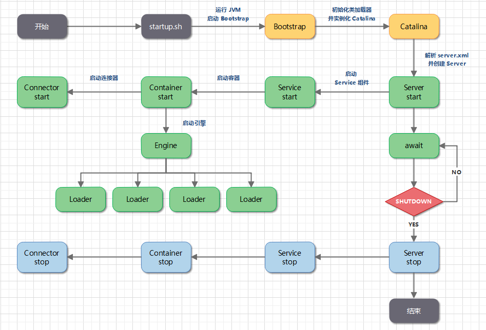

# Tomcat 快速入门

> 🎁 版本说明
>
> 当前最新版本：Tomcat 8.5.24
>
> 环境要求：JDK7+

## 1. Tomcat 简介

### 1.1. Tomcat 是什么

Tomcat 是由 Apache 开发的一个 Servlet 容器，实现了对 Servlet 和 JSP 的支持，并提供了作为 Web 服务器的一些特有功能，如 Tomcat 管理和控制平台、安全域管理和 Tomcat 阀等。

由于 Tomcat 本身也内含了一个 HTTP 服务器，它也可以被视作一个单独的 Web 服务器。但是，不能将 Tomcat 和 Apache HTTP 服务器混淆，Apache HTTP 服务器是一个用 C 语言实现的 HTTP Web 服务器；这两个 HTTP web server 不是捆绑在一起的。Tomcat 包含了一个配置管理工具，也可以通过编辑 XML 格式的配置文件来进行配置。

### 1.2. Tomcat 重要目录

- **/bin** - Tomcat 脚本存放目录（如启动、关闭脚本）。 `*.sh` 文件用于 Unix 系统； `*.bat` 文件用于 Windows 系统。
- **/conf** - Tomcat 配置文件目录。
- **/logs** - Tomcat 默认日志目录。
- **/webapps** - webapp 运行的目录。

### 1.3. web 工程发布目录结构

一般 web 项目路径结构

```
|-- webapp                         # 站点根目录
    |-- META-INF                   # META-INF 目录
    |   `-- MANIFEST.MF            # 配置清单文件
    |-- WEB-INF                    # WEB-INF 目录
    |   |-- classes                # class文件目录
    |   |   |-- *.class            # 程序需要的 class 文件
    |   |   `-- *.xml              # 程序需要的 xml 文件
    |   |-- lib                    # 库文件夹
    |   |   `-- *.jar              # 程序需要的 jar 包
    |   `-- web.xml                # Web应用程序的部署描述文件
    |-- <userdir>                  # 自定义的目录
    |-- <userfiles>                # 自定义的资源文件
```

- `webapp`：工程发布文件夹。其实每个 war 包都可以视为 webapp 的压缩包。

- `META-INF`：META-INF 目录用于存放工程自身相关的一些信息，元文件信息，通常由开发工具，环境自动生成。

- `WEB-INF`：Java web 应用的安全目录。所谓安全就是客户端无法访问，只有服务端可以访问的目录。
- `/WEB-INF/classes`：存放程序所需要的所有 Java class 文件。

- `/WEB-INF/lib`：存放程序所需要的所有 jar 文件。

- `/WEB-INF/web.xml`：web 应用的部署配置文件。它是工程中最重要的配置文件，它描述了 servlet 和组成应用的其它组件，以及应用初始化参数、安全管理约束等。

### 1.4. Tomcat 功能

Tomcat 支持的 I/O 模型有：

- NIO：非阻塞 I/O，采用 Java NIO 类库实现。
- NIO2：异步 I/O，采用 JDK 7 最新的 NIO2 类库实现。
- APR：采用 Apache 可移植运行库实现，是 C/C++ 编写的本地库。

Tomcat 支持的应用层协议有：

- HTTP/1.1：这是大部分 Web 应用采用的访问协议。
- AJP：用于和 Web 服务器集成（如 Apache）。
- HTTP/2：HTTP 2.0 大幅度的提升了 Web 性能。

## 2. Tomcat 入门

### 2.1. 安装

**前提条件**

Tomcat 8.5 要求 JDK 版本为 1.7 以上。

进入 [Tomcat 官方下载地址](https://archive.apache.org/dist/tomcat/tomcat-8/v8.5.0/) 选择合适版本下载，并解压到本地。

**Windows**

添加环境变量 `CATALINA_HOME` ，值为 Tomcat 的安装路径。

进入安装目录下的 bin 目录，运行 startup.bat 文件，启动 Tomcat


### 2.2. 配置

本节将列举一些重要、常见的配置项。详细的 Tomcat8 配置可以参考 [Tomcat 8 配置官方参考文档](http://tomcat.apache.org/tomcat-8.5-doc/config/index.html) 。

#### 2.2.1. Server

> Server 元素表示整个 Catalina servlet 容器。
>
> 因此，它必须是 `conf/server.xml` 配置文件中的根元素。它的属性代表了整个 servlet 容器的特性。

**属性表**

| 属性      | 描述                                                                     | 备注                                         |
| --------- | ------------------------------------------------------------------------ | -------------------------------------------- |
| className | 这个类必须实现 org.apache.catalina.Server 接口。                         | 默认 org.apache.catalina.core.StandardServer |
| address   | 服务器等待关机命令的 TCP / IP 地址。如果没有指定地址，则使用 localhost。 |                                              |
| port      | 服务器等待关机命令的 TCP / IP 端口号。设置为-1 以禁用关闭端口。          |                                              |
| shutdown  | 必须通过 TCP / IP 连接接收到指定端口号的命令字符串，以关闭 Tomcat。      |                                              |

#### 2.2.2. Service

> Service 元素表示一个或多个连接器组件的组合，这些组件共享一个用于处理传入请求的引擎组件。Server 中可以有多个 Service。

**属性表**

| 属性      | 描述                                                                                                               | 备注                                            |
| --------- | ------------------------------------------------------------------------------------------------------------------ | ----------------------------------------------- |
| className | 这个类必须实现`org.apache.catalina.Service`接口。                                                                  | 默认 `org.apache.catalina.core.StandardService` |
| name      | 此服务的显示名称，如果您使用标准 Catalina 组件，将包含在日志消息中。与特定服务器关联的每个服务的名称必须是唯一的。 |                                                 |

**实例 - `conf/server.xml` 配置文件示例**

```xml
<?xml version="1.0" encoding="UTF-8"?>
<Server port="8080" shutdown="SHUTDOWN">
  <Service name="xxx">
  ...
  </Service>
</Server>
```

###  启动

####  部署方式

这种方式要求本地必须安装 Tomcat 。

将打包好的 war 包放在 Tomcat 安装目录下的 `webapps` 目录下，然后在 bin 目录下执行 `startup.bat` 或 `startup.sh` ，Tomcat 会自动解压 `webapps` 目录下的 war 包。

成功后，可以访问 `http://localhost:8080/xxx` （xxx 是 war 包文件名）。

> **注意**
>
> 以上步骤是最简单的示例。步骤中的 war 包解压路径、启动端口以及一些更多的功能都可以修改配置文件来定制 （主要是 `server.xml` 或 `context.xml` 文件）。

####  IDE 插件

常见 Java IDE 一般都有对 Tomcat 的支持。

以 Intellij IDEA 为例，提供了 **Tomcat and TomEE Integration** 插件（一般默认会安装）。

**使用步骤**

- 点击 Run/Debug Configurations > New Tomcat Server > local ，打开 Tomcat 配置页面。
- 点击 Confiure... 按钮，设置 Tomcat 安装路径。
- 点击 Deployment 标签页，设置要启动的应用。
- 设置启动应用的端口、JVM 参数、启动浏览器等。
- 成功后，可以访问 `http://localhost:8080/`（当然，你也可以在 url 中设置上下文名称）。


##  Tomcat 架构


Tomcat 要实现 2 个核心功能：

- **处理 Socket 连接**，负责网络字节流与 Request 和 Response 对象的转化。
- **加载和管理 Servlet**，以及**处理具体的 Request 请求**。

为此，Tomcat 设计了两个核心组件：

- **连接器（Connector）**：负责和外部通信
- **容器（Container）**：负责内部处理

##  Tomcat 生命周期

###  Tomcat 的启动过程



1. Tomcat 是一个 Java 程序，它的运行从执行 `startup.sh` 脚本开始。`startup.sh` 会启动一个 JVM 来运行 Tomcat 的启动类 `Bootstrap`。
2. `Bootstrap` 会初始化 Tomcat 的类加载器并实例化 `Catalina`。
3. `Catalina` 会通过 Digester 解析 `server.xml`，根据其中的配置信息来创建相应组件，并调用 `Server` 的 `start` 方法。
4. `Server` 负责管理 `Service` 组件，它会调用 `Service` 的 `start` 方法。
5. `Service` 负责管理 `Connector` 和顶层容器 `Engine`，它会调用 `Connector` 和 `Engine` 的 `start` 方法。


## 参考资料

- https://dunwu.github.io/