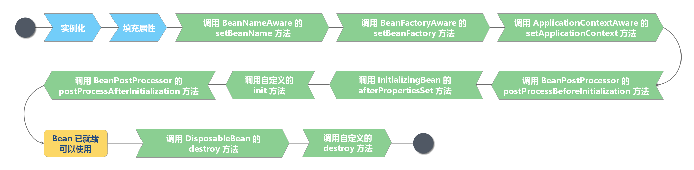

# Spring Bean

在 Spring 中，构成应用程序主体由 Spring IoC 容器管理的对象称为 Bean。**Bean 是由 Spring IoC 容器实例化、装配和管理的对象**。 Bean 以及它们之间的依赖关系反映在容器使用的配置元数据中。

## Spring Bean 定义

### BeanDefinition

Spring IoC 容器本身，并不能识别配置的元数据。为此，要将这些配置信息转为 Spring 能识别的格式——`BeanDefinition` 对象。

**`BeanDefinition` 是 Spring 中定义 Bean 的配置元信息接口**，它包含：

- Bean 类名
- Bean 行为配置元素，如：作用域、自动绑定的模式、生命周期回调等
- 其他 Bean 引用，也可称为合作者（Collaborators）或依赖（Dependencies）
- 配置设置，如 Bean 属性（Properties）

#### BeanDefinition 元信息

`BeanDefinition` 元信息如下：

| 属性（Property）                                                                                                                                | 说明                                             |
| ----------------------------------------------------------------------------------------------------------------------------------------------- | ------------------------------------------------ |
| [Class](https://docs.spring.io/spring-framework/docs/current/reference/html/core.html#beans-factory-class)                                      | 全类名，必须是具体类，不能用抽象类或接口         |
| [Name](https://docs.spring.io/spring-framework/docs/current/reference/html/core.html#beans-beanname)                                            | Bean 的名称或者 ID                               |
| [Scope](https://docs.spring.io/spring-framework/docs/current/reference/html/core.html#beans-factory-scopes)                                     | Bean 的作用域（如：`singleton`、`prototype` 等） |
| [Constructor arguments](https://docs.spring.io/spring-framework/docs/current/reference/html/core.html#beans-factory-collaborators)              | Bean 构造器参数（用于依赖注入）                  |
| [Properties](https://docs.spring.io/spring-framework/docs/current/reference/html/core.html#beans-factory-collaborators)                         | Bean 属性设置（用于依赖注入）                    |
| [Autowiring mode](https://docs.spring.io/spring-framework/docs/current/reference/html/core.html#beans-factory-autowire)                         | Bean 自动绑定模式（如：通过名称 byName）         |
| [Lazy initialization mode](https://docs.spring.io/spring-framework/docs/current/reference/html/core.html#beans-factory-lazy-init)               | Bean 延迟初始化模式（延迟和非延迟）              |
| [Initialization method](https://docs.spring.io/spring-framework/docs/current/reference/html/core.html#beans-factory-lifecycle-initializingbean) | Bean 初始化回调方法名称                          |
| [Destruction method](https://docs.spring.io/spring-framework/docs/current/reference/html/core.html#beans-factory-lifecycle-disposablebean)      | Bean 销毁回调方法名称                            |

#### BeanDefinition 构建

BeanDefinition 构建方式：

- 通过 `BeanDefinitionBuilder`

- 通过 `AbstractBeanDefinition` 以及派生类

### Spring Bean 命名

#### Spring Bean 命名规则

每个 Bean 拥有一个或多个标识符（identifiers），这些标识符在 Bean 所在的容器必须是唯一的。通常，一个 Bean 仅有一个标识符，如果需要额外的，可考虑使用别名（Alias）来扩充。

在基于 XML 的配置元信息中，开发人员**可以使用 `id` 属性、`name` 属性或来指定 Bean 标识符**。通常，Bean 的标识符由字母组成，允许出现特殊字符。如果要想引入 Bean 的别名的话，可在 `name` 属性使用半角逗号（“,”）或分号（“;”) 来间隔。

Spring 中，**为 Bean 指定 `id` 和 `name` 属性不是必须的**。如果不指定，Spring 会自动为 Bean 分配一个唯一的名称。尽管 Bean 的命名没有限制，不过**官方建议采用驼峰命名法来命名 Bean**。

#### Spring Bean 命名生成器

Spring 提供了两种 Spring Bean 命名生成器：

- `DefaultBeanNameGenerator`：默认通用 `BeanNameGenerator` 实现。
- `AnnotationBeanNameGenerator`：基于注解扫描的 `BeanNameGenerator` 实现。

```java
public interface BeanNameGenerator {
   String generateBeanName(BeanDefinition definition, BeanDefinitionRegistry registry);
}
```

#### Spring Bean 别名

Spring 支持通过 `<alias>` 属性为 Bean 设置别名。

Bean 别名（Alias）的作用：

- 复用现有的 `BeanDefinition`
- 更具有场景化的命名方法，比如：
  - `<alias name="myApp-dataSource" alias="subsystemA-dataSource"/>`
  - `<alias name="myApp-dataSource" alias="subsystemB-dataSource"/>`

```xml
<bean id="user" class="io.github.dunwu.spring.core.bean.entity.person.User">
  <!-- 属性略 -->
</bean>
<alias name="user" alias="aliasUser" />
```

## Spring Bean 生命周期



1. Spring 对 Bean 进行实例化（相当于 new XXX()）

2. Spring 将值和引用注入到 Bean 对应的属性中

3. 如果 Bean 实现了 `BeanNameAware` 接口，Spring 将 Bean 的 ID 传递给 `setBeanName` 方法
   - 作用是通过 Bean 的引用来获得 Bean ID，一般业务中是很少有用到 Bean 的 ID 的
4. 如果 Bean 实现了 `BeanFactoryAware` 接口，Spring 将调用 `setBeanDactory` 方法，并把 `BeanFactory` 容器实例作为参数传入。
   - 作用是获取 Spring 容器，如 Bean 通过 Spring 容器发布事件等
5. 如果 Bean 实现了 `ApplicationContextAware` 接口，Spring 容器将调用 `setApplicationContext` 方法，把应用上下文作为参数传入
   - 作用与 `BeanFactory` 类似都是为了获取 Spring 容器，不同的是 Spring 容器在调用 `setApplicationContext` 方法时会把它自己作为 `setApplicationContext` 的参数传入，而 Spring 容器在调用 `setBeanFactory` 前需要使用者自己指定（注入）`setBeanFactory` 里的参数 `BeanFactory`
6. 如果 Bean 实现了 `BeanPostProcess` 接口，Spring 将调用 `postProcessBeforeInitialization` 方法
   - 作用是在 Bean 实例创建成功后对其进行增强处理，如对 Bean 进行修改，增加某个功能
7. 如果 Bean 实现了 `InitializingBean` 接口，Spring 将调用 `afterPropertiesSet` 方法，作用与在配置文件中对 Bean 使用 `init-method` 声明初始化的作用一样，都是在 Bean 的全部属性设置成功后执行的初始化方法。
8. 如果 Bean 实现了 `BeanPostProcess` 接口，Spring 将调用 `postProcessAfterInitialization` 方法
   - `postProcessBeforeInitialization` 是在 Bean 初始化前执行的，而 `postProcessAfterInitialization` 是在 Bean 初始化后执行的
9. 经过以上的工作后，Bean 将一直驻留在应用上下文中给应用使用，直到应用上下文被销毁
10. 如果 Bean 实现了 `DispostbleBean` 接口，Spring 将调用它的 `destory` 方法，作用与在配置文件中对 Bean 使用 `destory-method` 属性的作用一样，都是在 Bean 实例销毁前执行的方法。

## Spring Bean 注册

注册 Spring Bean 实际上是将 `BeanDefinition` 注册到 IoC 容器中。

### XML 配置元信息

Spring 的传统配置方式。在 `<bean>` 标签中配置元数据内容。

缺点是当 JavaBean 过多时，产生的配置文件足以让你眼花缭乱。

### 注解配置元信息

使用 `@Bean`、`@Component`、`@Import` 注解注册 Spring Bean。

### Java API 配置元信息

- 命名方式：`BeanDefinitionRegistry#registerBeanDefinition(String,BeanDefinition)`
- 非命名方式：`BeanDefinitionReaderUtils#registerWithGeneratedName(AbstractBeanDefinition,BeanDefinitionRegistry)`
- 配置类方式：`AnnotatedBeanDefinitionReader#register(Class...)`

## Spring Bean 实例化

Spring Bean 实例化方式：

- 常规方式
  - 通过构造器（配置元信息：XML、Java 注解和 Java API）
  - 通过静态方法（配置元信息：XML、Java 注解和 Java API）
  - 通过 Bean 工厂方法（配置元信息：XML、Java 注解和 Java API）
  - 通过 `FactoryBean`（配置元信息：XML、Java 注解和 Java API）
- 特殊方式
  - 通过 `ServiceLoaderFactoryBean`（配置元信息：XML、Java 注解和 Java API ）
  - 通过 `AutowireCapableBeanFactory#createBean(java.lang.Class, int, boolean)`
  - 通过 `BeanDefinitionRegistry#registerBeanDefinition(String,BeanDefinition)`

## Spring Bean 初始化和销毁

Spring Bean 初始化和销毁的方式有以下几种：

1. 使用 `@PostConstruct` 和 `@PreDestroy` 注解分别指定相应的初始化方法和销毁方法。
2. 实现 `InitializingBean` 接口的 `afterPropertiesSet()` 方法来编写初始化方法；实现 `DisposableBean` 接口的 `destroy()` 方法来编写销毁方法。

   - `InitializingBean` 接口包含一个 `afterPropertiesSet` 方法，可以通过实现该接口，然后在这个方法中编写初始化逻辑。
   - `DisposableBean`接口包含一个 `destory` 方法，可以通过实现该接口，然后在这个方法中编写销毁逻辑。

3. 自定义初始化方法
   - XML 配置：`<bean init-method="init" destroy="destroy" ... />`
   - Java 注解：`@Bean(initMethod = "init", destroyMethod = "destroy")`
   - Java API：`AbstractBeanDefinition#setInitMethodName(String)` 和 `AbstractBeanDefinition#setDestroyMethodName(String)` 分别定义初始化和销毁方法

注意：如果同时存在，执行顺序会按照序列执行。

Bean 的延迟初始化

- xml 方式：`<bean lazy-init="true" ... />`
- 注解方式：`@Lazy`

Spring 提供了一个 `BeanPostProcessor` 接口，提供了两个方法 `postProcessBeforeInitialization` 和 `postProcessAfterInitialization`。其中`postProcessBeforeInitialization` 在组件的初始化方法调用之前执行，`postProcessAfterInitialization` 在组件的初始化方法调用之后执行。它们都包含两个入参：

- `bean`：当前组件对象；
- `beanName`：当前组件在容器中的名称。

## Spring Bean 垃圾回收

Spring Bean 垃圾回收步骤：

1. 关闭 Spring 容器（应用上下文）
2. 执行 GC
3. Spring Bean 覆盖的 `finalize()` 方法被回调

## Spring Bean 作用范围

| Scope                                                                                                                         | Description                                                                                                                                                                                                                                                  | 翻译                                                                                                                                                                                                 |
| :---------------------------------------------------------------------------------------------------------------------------- | :----------------------------------------------------------------------------------------------------------------------------------------------------------------------------------------------------------------------------------------------------------- | ---------------------------------------------------------------------------------------------------------------------------------------------------------------------------------------------------- |
| [singleton](https://docs.spring.io/spring-framework/docs/current/reference/html/core.html#beans-factory-scopes-singleton)     | (Default) Scopes a single bean definition to a single object instance for each Spring IoC container.                                                                                                                                                         | (默认) 将每个 Spring IoC 容器的单个 bean 定义范围限定为单个对象实例                                                                                                                                  |
| [prototype](https://docs.spring.io/spring-framework/docs/current/reference/html/core.html#beans-factory-scopes-prototype)     | Scopes a single bean definition to any number of object instances.                                                                                                                                                                                           | 将单个 bean 定义范围扩展到任意数量的对象实例。                                                                                                                                                       |
| [request](https://docs.spring.io/spring-framework/docs/current/reference/html/core.html#beans-factory-scopes-request)         | Scopes a single bean definition to the lifecycle of a single HTTP request. That is, each HTTP request has its own instance of a bean created off the back of a single bean definition. Only valid in the context of a web-aware Spring `ApplicationContext`. | 将单个 Bean 定义范围扩展到单个 HTTP 请求的生命周期。也就是说，每个 HTTP 请求都有自己的 Bean 实例，这个 Bean 实例是基于单个 Bean 定义创建的。仅在 Web 感知的 Spring ApplicationContext 的上下文中有效 |
| [session](https://docs.spring.io/spring-framework/docs/current/reference/html/core.html#beans-factory-scopes-session)         | Scopes a single bean definition to the lifecycle of an HTTP `Session`. Only valid in the context of a web-aware Spring `ApplicationContext`.                                                                                                                 | 将单个 Bean 定义作用于 HTTP Session 的生命周期。仅在 Web 感知的 Spring ApplicationContext 的上下文中有效                                                                                             |
| [application](https://docs.spring.io/spring-framework/docs/current/reference/html/core.html#beans-factory-scopes-application) | Scopes a single bean definition to the lifecycle of a `ServletContext`. Only valid in the context of a web-aware Spring `ApplicationContext`.                                                                                                                | 将单个 Bean 定义作用于 ServletContext 的生命周期。仅在 Web 感知的 Spring ApplicationContext 的上下文中有效                                                                                           |
| [websocket](https://docs.spring.io/spring-framework/docs/current/reference/html/web.html#websocket-stomp-websocket-scope)     | Scopes a single bean definition to the lifecycle of a `WebSocket`. Only valid in the context of a web-aware Spring `ApplicationContext`.                                                                                                                     | 将单个 bean 定义作用于 WebSocket 的生命周期。仅在 Web 感知的 Spring ApplicationContext 的上下文中有效                                                                                                |

## 参考资料

- [Spring 官方文档之 Core Technologies](https://docs.spring.io/spring-framework/docs/current/spring-framework-reference/core.html#beans)
- [《小马哥讲 Spring 核心编程思想》](https://time.geekbang.org/course/intro/265)
