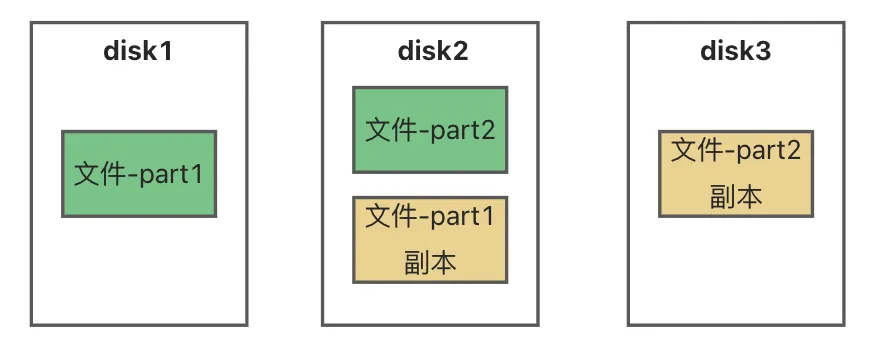
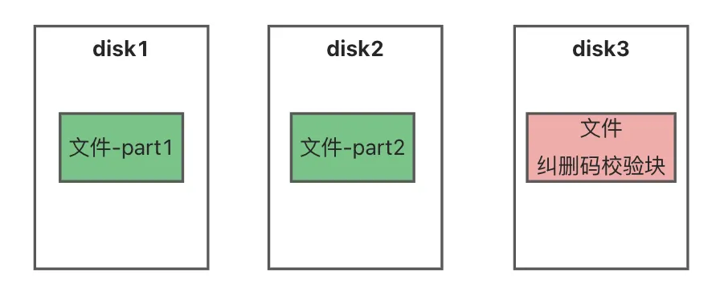
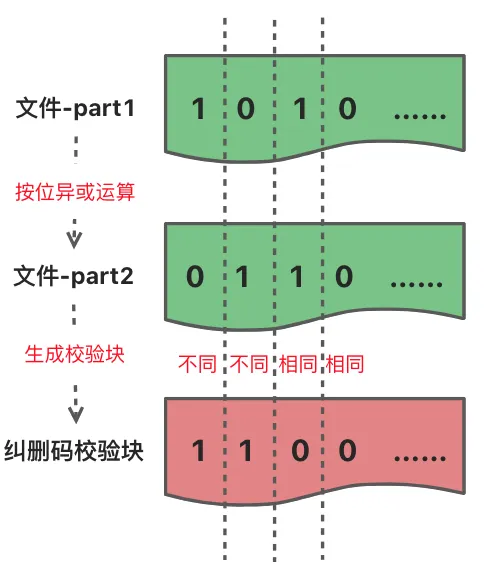
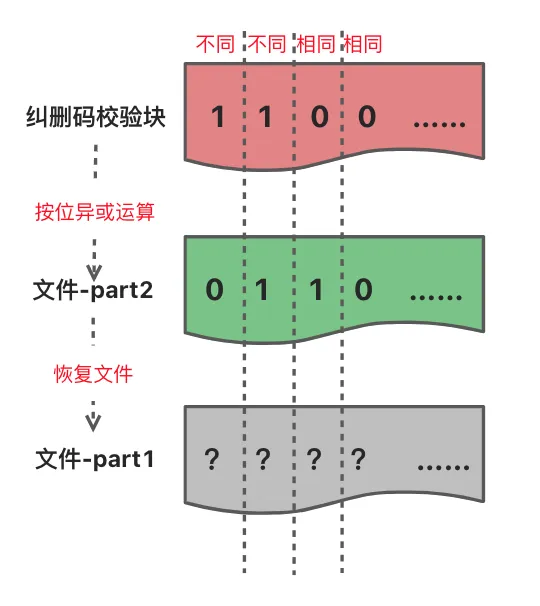
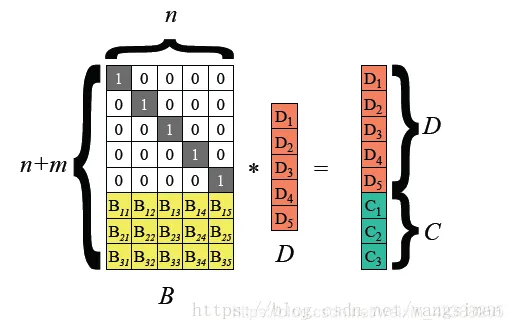
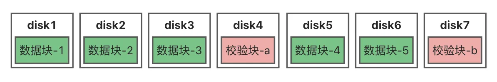

## 介绍

MinIO 是一种高性能、S3 兼容的对象存储。
它专为大规模 AI/ML、数据湖和数据库工作负载而构建，并且它是由软件定义的存储。
不需要购买任何专有硬件，就可以在云上和普通硬件上拥有分布式对象存储。
MinIO 拥有开源 GNU AGPL v3 和商业企业许可证的双重许可。

## 使用场景

适用于存储图片、视频、日志、备份等非结构化数据。

## minio client VS minio java api

|    指标\方式    |  mc.exe   | java minio api |
| :--------: | :-------: | :------------: |
|  文件数量  | 66630 个  |    66630 个    |
| 文件总大小 |  9.35 GB  |    9.35 GB     |
|   线程数   | （avg）18 |       18       |
|  下载耗时  |   476 s   |      259s      |
|    备注    | 推荐使用  |  连接超时频繁  |

---

注意：
> 两者适合键值对的场景，数据量太大需要分页则不合适。
> api 数据量太大获取列表会崩溃

## mysql vs minio 空间占用对比

查询 mysql 所有库的 容量大小

```shell
SELECT
table_schema as '数据库',
sum(table_rows) as '记录数',
sum(truncate(data_length/1024/1024, 2)) as '数据容量(MB)',
sum(truncate(index_length/1024/1024, 2)) as '索引容量(MB)',
sum(truncate(DATA_FREE/1024/1024, 2)) as '碎片占用(MB)'
from information_schema.tables
group by table_schema
order by sum(data_length) desc, sum(index_length) desc;
```

通过执行此 SQL，可以明显看出 mysql 索引占用了一部分容量，这部分使用 minio 是不会有的。mysql 除了索引还有其他空间占用，此处不过多讨论。

## 官方网站

中文官网：https://www.minio.org.cn/
英文官网：https://min.io/
官方演示服务器：https://play.minio.org.cn

- 用户名: minioadmin
- 密码: minioadmin

## 下载安装

windows 下载地址：https://dl.minio.org.cn/server/minio/release/windows-amd64/minio.exe

## 基本使用

### 启动服务

找到 minio.exe 所在的路径，启用 cmd 输入：
`.\minio.exe server D:\minio --console-address ":9090"`
其中 `D:\minio` 为上传文件所在路径
根据控制台信息，可以看到有两个端口，其中一个端口为 api 调用端口。
启动服务，随便访问一个端口，会自动跳转到客户端的端口。如：http://127.0.0.1:9090
默认账号：minioadmin，默认秘密：minioadmin

### 创建 Bucket

第一次登陆，可在页面主页看到 `Create a Bucket`,点击后输入 Bucket 的名字，如 test，点击`Create Bucket`。

创建之后，即可在页面中看到该 Bucket 的详细信息，同时也能在 D:\minio 下看见一个 test 的文件夹。

### 上传和下载文件

在 Object Browser 界面，点击 Bucket 进入详情界面，点击 upload 上传文件。
成功之后，选中文件即可下载。

## 存储方式

常见的存储方式有三种：文件存储、块存储、对象存储，minio 采用的是对象存储

### 文件存储


最常见的存储方式，比如电脑的硬盘，以文件或文件夹的方式存储，通过文件路径访问

### 块存储


块存储会将数据拆分成块，并单独存储各个块。每个数据块都有一个唯一标识符。当用户请求数据时，底层存储软件会将数据块重新组装成文件返回给用户。它通常会部署在存储区域网络（SAN）环境中，常见的如 RAID 和 LVM 技术

### 对象存储


类似于网盘，将文件存储在云端或者服务端。本质上是键值（Key-Value）存储，每个对象有唯一标识符，以及描述数据的元数据。元数据包括创建时间、失效时间、访问控制等信息。常见的有亚马逊 S3，阿里云 OSS

## 纠删码

MinIO 通过纠删码实现数据冗余，纠删码相比于多副本，可以提高磁盘的空间利用率。

### 纠删码与副本比较

假设有一个 100M 的文件，存储到 3 个磁盘中，实现任意一个磁盘损坏不丢失数据。

- 副本方式
  将 100M 文件分割成 part1，part2 两个 50M 大小的文件，每个文件保存 2 份。实际占用 200M 的存储空间
  
- 纠删码方式
  将 100M 文件分割成 part1，part2 两个 50M 大小的文件，通过纠删码算法对 part1 和 part2 两个进行计算，生成一个 50M 的校验块，当 part1、part2 任意一个损坏时，可以通过校验块逆向恢复文件。实际占用 150M 的存储空间。
  

### 纠删码数据恢复原理

纠删码（Erasure Codes）能够总体上分为 XOR 码和 RS 码两类，XOR 码编、解码只需要按位异或（bit-wise exclusive-OR）即可完成，速度较快；MinIO 使用 Reed-Solomon 码生成数据校验块，具有更好磁盘利用率，但是需要更多的计算开销。
由于，XOR 码编比较简单，便于理解，我们以 XOR 码编为例讲解数据恢复原理。
XOR 即异或运算，用符号 ^ 表示，是一种二进制位运算符号。**两个值相同，异或运算结果为 0，两个值不同，结果为 1**。

- 编码 ( A ^ B = C )
  
- 解码恢复数据 ( C ^ B = A )
  

### Reed-Solomon 码（RS 码）

MinIO 使用 Reed-Solomon 码生成数据校验块。

Reed-Solomon 码可以根据 M 个数据块，生成 N 个校验块, 其中 N <= M 。
从 M + N 中取出任意 M 个块就能解码出原始数据。即 RS 码最多容忍 N 个块同时丢失。
因此，RS 码可以获得更好的磁盘利用率，但是需要更多的计算开销。

举例：假设一共有 7 块磁盘，允许任意 2 块硬盘损坏而不丢失数据。100mb 大小的文件应如何存储？实际占用多少存储空间？

答案：M + N = 7 N = 2 M = 7 -2 = 5
因此，将 100mb 的文件分割成 5 份 20mb 的数据块，利用 RS 码生成 2 个 20mb 的校验块。将数据块和校验块分别存储到不同的硬盘上。
实际占用 （ 5 _ 20 ）+（ 2 _ 20 ）= 140M。


## 参考

> https://www.yuque.com/wukong-zorrm/os3zhw/mdevk5
