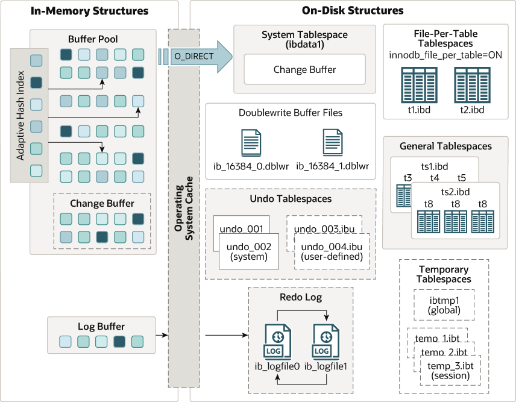
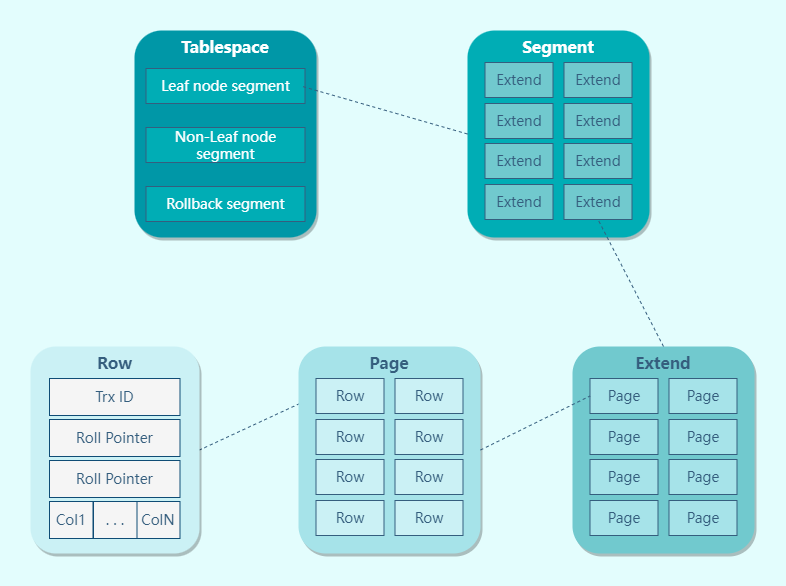

## 概述
在文件系统中，Mysql 将每个数据库（也可以称为 schema）保存为数据目录下的一个子目录。创建表示，Mysql 会在数据库子目录下创建一个和表同名的 `.frm` 文件保存表的定义。因为 Mysql 使用文件系统的目录和文件来保存数据库和表的定义，大小写敏感性和具体平台密切相关。Windows 中大小写不敏感；类 Unix 中大小写敏感。**不同的存储引擎保存数据和索引的方式是不同的，但表的定义则是在 Mysql 服务层统一处理的。**

MySQL 的存储引擎采用了插件的形式，每个存储引擎都面向一种特定的数据库应用环境。同时开源的 MySQL 还允许开发人员设置自己的存储引擎。

## 存储引擎相关操作

### 查看存储引擎命令

```sql
# 查看支持的存储引擎
SHOW ENGINES;

# 查看默认的存储引擎
SHOW VARIABLES LIKE 'storage_engine';

# 查看某表所使用的存储引擎
SHOW CREATE TABLE `table_name`;

# 查看某数据库中的某表所使用的存储引擎
SHOW TABLE STATUS LIKE 'table_name';
SHOW TABLE STATUS FROM `database_name` WHERE `name` = "table_name";
```

### 设置存储引擎命令

```sql
# 建表时指定存储引擎，如果不显示指定，默认是 INNODB
CREATE TABLE t1 (i INT) ENGINE = INNODB;
CREATE TABLE t2 (i INT) ENGINE = CSV;
CREATE TABLE t3 (i INT) ENGINE = MEMORY;

# 修改存储引擎
ALTER TABLE t ENGINE = InnoDB;

# 修改默认存储引擎，也可以在配置文件 my.cnf 中修改默认引擎
SET default_storage_engine=NDBCLUSTER;
```

默认情况下，每当 `CREATE TABLE` 或 `ALTER TABLE` 不能使用默认存储引擎时，都会生成一个警告。为了防止在所需的引擎不可用时出现令人困惑的意外行为，可以启用 `NO_ENGINE_SUBSTITUTION SQL` 模式。如果所需的引擎不可用，则此设置将产生错误而不是警告，并且不会创建或更改表

## Mysql 存储引擎简介

### Mysql 内置的存储引擎

- **InnoDB** - InnoDB 是 MySQL 5.5 版本以后的默认存储引擎。并且提供了行级锁和外键的约束。性能不错且支持自动崩溃恢复。
- **MyISAM** - MyISAM 是 MySQL 5.5 版本以后的默认存储引擎。特性丰富但不支持事务，也不支持行级锁和外键，也没有崩溃恢复功能。
- **CSV** - 可以将 CSV 文件作为 Mysql 的表来处理，但这种表不支持索引。
- **Memory** - 数据存储在内存，以便得到更快的响应速度。不过如果 mysqld 进程崩溃，则会导致所有的数据丢失。
- **NDB** - 也叫做 NDB Cluster 存储引擎，主要用于 MySQL Cluster 分布式集群环境，类似于 Oracle 的 RAC 集群。
- **Archieve** - Archieve 存储引擎非常适合用于归档数据。
  - Archieve 存储引擎只支持 `INSERT` 和 `SELECT` 操作。
  - Archieve 存储引擎采用 zlib 算法压缩数据，压缩比可达到 1: 10。

### 如何选择合适的存储引擎

大多数情况下，InnoDB 都是正确的选择，除非需要用到 InnoDB 不具备的特性。

如果应用需要选择 InnoDB 以外的存储引擎，可以考虑以下因素：

- 事务：如果业务场景是 OLTP，则 InnoDB 是首选存储引擎。如果不需要支持事务，且主要是 SELECT 和 INSERT 操作，MyISAM 是不错的选择。所以，如果 Mysql 部署方式为主备模式，并进行读写分离。那么可以这么做：主节点只支持写操作，默认引擎为 InnoDB；备节点只支持读操作，默认引擎为 MyISAM。
- 并发：MyISAM 只支持表级锁，而 InnoDB 还支持行级锁。所以，InnoDB 并发性能更高。
- 外键：InnoDB 支持外键。
- 备份：InnoDB 支持在线热备份。
- 崩溃恢复：MyISAM 崩溃后发生损坏的概率比 InnoDB 高很多，而且恢复的速度也更慢。
- 其它特性：MyISAM 支持压缩表和空间数据索引。

## InnoDB 简介

InnoDB 是 MySQL 5.5 版本以后的默认存储引擎。只有在需要 InnoDB 不支持的特性时，才考虑使用其它存储引擎。

InnoDB 也使用 B+Tree 作为索引结构，但具体实现方式却与 MyISAM 截然不同。MyISAM 索引文件和数据文件是分离的，索引文件仅保存数据记录的地址。而**在 InnoDB 中，表数据文件本身就是按 B+Tree 组织的一个索引结构**，这棵树的叶节点 data 域保存了完整的数据记录。这个**索引的 key 是数据表的主键**，因此**InnoDB 表数据文件本身就是主索引**。

InnoDB 采用 MVCC 来支持高并发，并且实现了四个标准的隔离级别。其默认级别是可重复读（REPEATABLE READ），并且通过间隙锁（next-key locking）防止幻读。

InnoDB 是基于聚簇索引建立的，与其他存储引擎有很大不同。在索引中保存了数据，从而避免直接读取磁盘，因此对查询性能有很大的提升。

内部做了很多优化，包括从磁盘读取数据时采用的可预测性读、能够加快读操作并且自动创建的自适应哈希索引、能够加速插入操作的插入缓冲区等。

支持真正的在线热备份。其它存储引擎不支持在线热备份，要获取一致性视图需要停止对所有表的写入，而在读写混合场景中，停止写入可能也意味着停止读取。

InnoDB 物理文件结构为：

- `.frm` 文件：与表相关的元数据信息都存放在 frm 文件，包括表结构的定义信息等。

- `.ibd` 文件或 `.ibdata` 文件： 这两种文件都是存放 InnoDB 数据的文件，之所以有两种文件形式存放 InnoDB 的数据，是因为 InnoDB 的数据存储方式能够通过配置来决定是使用**共享表空间**存放存储数据，还是用**独享表空间**存放存储数据。

  独享表空间存储方式使用`.ibd`文件，并且每个表一个`.ibd`文件 共享表空间存储方式使用`.ibdata`文件，所有表共同使用一个`.ibdata`文件（或多个，可自己配置）

## InnoDB 存储架构



InnoDB 存储架构分为内存结构和磁盘结构。

InnoDB 内存结构的核心组件有：

- Buffer Pool
- Change Buffer
- Adaptive Hash Index
- Log Buffer

InnoDB 磁盘结构的核心组件有：

- Tablespace
- Doublewrite Buffer
- redo log
- undo log

## InnoDB 表空间



### 行（row）

数据库表中的记录都是按行（row）进行存放的，每行记录根据不同的行格式，有不同的存储结构。


### 页（page）

记录是按照行来存储的，但是数据库的读取并不以「行」为单位，否则一次读取（也就是一次 I/O 操作）只能处理一行数据，效率会非常低。

因此，**InnoDB 的数据是按「页」为单位来读写的**，也就是说，当需要读一条记录的时候，并不是将这个行记录从磁盘读出来，而是以页为单位，将其整体读入内存。

**默认每个页的大小为 16KB**，也就是最多能保证 16KB 的连续存储空间。

页是 InnoDB 存储引擎磁盘管理的最小单元，意味着数据库每次读写都是以 16KB 为单位的，一次最少从磁盘中读取 16K 的内容到内存中，一次最少把内存中的 16K 内容刷新到磁盘中。

页的类型有很多，常见的有数据页、undo 日志页、溢出页等等。数据表中的行记录是用「数据页」来管理的，数据页的结构可以去看这篇文章：[换一个角度看 B+ 树(opens new window)](https://xiaolincoding.com/mysql/index/page.html)

总之知道表中的记录存储在「数据页」里面就行。

### 区（extent）

我们知道 InnoDB 存储引擎是用 B+ 树来组织数据的。

B+ 树中每一层都是通过双向链表连接起来的，如果是以页为单位来分配存储空间，那么链表中相邻的两个页之间的物理位置并不是连续的，可能离得非常远，那么磁盘查询时就会有大量的随机 I/O，随机 I/O 是非常慢的。

解决这个问题也很简单，就是让链表中相邻的页的物理位置也相邻，这样就可以使用顺序 I/O 了，那么在范围查询（扫描叶子节点）的时候性能就会很高。

那具体怎么解决呢？

**在表中数据量大的时候，为某个索引分配空间的时候就不再按照页为单位分配了，而是按照区（extent）为单位分配。每个区的大小为 1MB，对于 16KB 的页来说，连续的 64 个页会被划为一个区，这样就使得链表中相邻的页的物理位置也相邻，就能使用顺序 I/O 了**。

### 段（segment）

表空间是由各个段（segment）组成的，段是由多个区（extent）组成的。段一般分为数据段、索引段和回滚段等。

- 索引段：存放 B + 树的非叶子节点的区的集合；
- 数据段：存放 B + 树的叶子节点的区的集合；
- 回滚段：存放的是回滚数据的区的集合。


## MyISAM

MyISAM 是 MySQL 5.5 版本以前的默认存储引擎。

MyISAM 设计简单，数据以紧密格式存储。对于只读数据，或者表比较小、可以容忍修复操作，则依然可以使用 MyISAM。

MyISAM 引擎使用 B+Tree 作为索引结构，**叶节点的 data 域存放的是数据记录的地址**。

MyISAM 提供了大量的特性，包括：全文索引、压缩表、空间函数等。但是，MyISAM 不支持事务和行级锁。并且 MyISAM 不支持崩溃后的安全恢复。

MyISAM 物理文件结构为：

- `.frm`文件：与表相关的元数据信息都存放在 frm 文件，包括表结构的定义信息等。
- `.MYD` (`MYData`) 文件：MyISAM 存储引擎专用，用于存储 MyISAM 表的数据。
- `.MYI` (`MYIndex`)文件：MyISAM 存储引擎专用，用于存储 MyISAM 表的索引相关信息。

## InnoDB vs. MyISAM

InnoDB 和 MyISAM 的对比：

| 对比项 | MyISAM                                        | InnoDB                           |
| ------ | --------------------------------------------- | -------------------------------- |
| 主外键 | 不支持                                        | 支持                             |
| 事务   | 不支持                                        | 支持                             |
| 锁     | 支持表级锁                                    | 支持表级锁、行级锁               |
| 索引   | 采用非聚簇索引                                | 主键采用聚簇索引，以提高 IO 效率 |
| 表空间 | 小                                            | 大                               |
| 关注点 | 性能                                          | 事务                             |
| 计数器 | 维护了计数器，`SELECT COUNT(*)` 效率为 `O(1)` | 没有维护计数器，需要全表扫描     |


## 参考资料

- https://dunwu.github.io/
