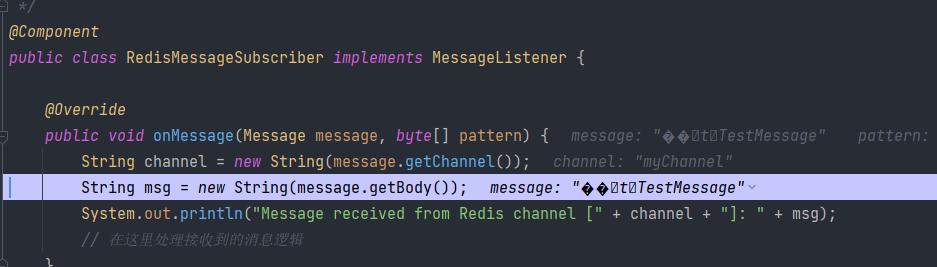

# Redis 发布订阅

> Redis 发布订阅 (pub/sub) 是一种消息通信模式：发送者 (pub) 发送消息，订阅者 (sub) 接收消息。Redis 客户端可以订阅任意数量的频道。
>
> Redis 有两种发布订阅模式
>
> - 基于频道（Channel）的发布订阅
> - 基于模式（Pattern）的发布订阅
>
> 关键词：`订阅`、`SUBSCRIBE`、`PSUBSCRIBE`、`PUBLISH`、`观察者模式`

## 观察者模式

Redis 发布订阅应用了设计模式中经典的“观察者模式”。

**观察者模式**（Observer）是一种行为设计模式，允许你定义一种订阅机制，可在对象事件发生时通知多个 “观察” 该对象的其他对象。

- 当一个对象状态的改变需要改变其他对象，或实际对象是事先未知的或动态变化的时，可使用观察者模式。
- 当应用中的一些对象必须观察其他对象时，可使用该模式。但仅能在有限时间内或特定情况下使用。


## Redis 订阅模式

Redis 有两种发布订阅模式：

（1）**基于频道（Channel）的发布订阅**

服务器状态在 `pubsub_channels` 字典保存了所有频道的订阅关系： `SUBSCRIBE` 命令负责将客户端和被订阅的频道关联到这个字典里面， 而 `UNSUBSCRIBE` 命令则负责解除客户端和被退订频道之间的关联。

【示例】订阅指定频道示例

打开客户端一，执行以下命令

```shell
> SUBSCRIBE first second
Reading messages... (press Ctrl-C to quit)
1) "subscribe"
2) "first"
3) (integer) 1
1) "subscribe"
2) "second"
3) (integer) 2
```

打开客户端二，执行以下命令

```shell
> PUBLISH second Hello
1) "1"
```

此时，客户端一会收到以下内容

```shell
1) "message"
2) "second"
3) "Hello"
```

（2）**基于模式（Pattern）的发布订阅**

服务器状态在 `pubsub_patterns` 链表保存了所有模式的订阅关系： `PSUBSCRIBE` 命令负责将客户端和被订阅的模式记录到这个链表中， 而 `UNSUBSCRIBE` 命令则负责移除客户端和被退订模式在链表中的记录。

【示例】订阅符合指定模式的频道

打开客户端一，执行以下命令

```shell
> PSUBSCRIBE news.*
Reading messages... (press Ctrl-C to quit)
1) "psubscribe"
2) "news.*"
3) (integer) 1
```

打开客户端二，执行以下命令

```shell
> PUBLISH news.A Hello
1) "1"
```

打开客户端三，执行以下命令

```shell
> PUBLISH news.B World
1) "1"
```

此时，客户端一会收到以下内容

```shell
1) "pmessage"
2) "news.*"
3) "news.A"
4) "Hello"
1) "pmessage"
2) "news.*"
3) "news.B"
4) "World"
```

## 发布订阅命令

Redis 提供了以下与订阅发布有关的命令：

| 命令                                                     | 描述                       |
| -------------------------------------------------------- | -------------------------- |
| [`SUBSCRIBE`](https://redis.io/commands/subscribe/)      | 订阅指定频道               |
| [`UNSUBSCRIBE`](https://redis.io/commands/unsubscribe)   | 取消订阅指定频道           |
| [`PSUBSCRIBE`](https://redis.io/commands/psubscribe)     | 订阅符合指定模式的频道     |
| [`PUNSUBSCRIBE`](https://redis.io/commands/punsubscribe) | 取消订阅符合指定模式的频道 |
| [`PUBLISH`](https://redis.io/commands/publish/)          | 发送信息到指定的频道       |
| [`PUBSUB`](https://redis.io/commands/pubsub/)            | 查看发布订阅状态           |


## 案例

### windows 安装 redis
在 github 中找到 redis 的版本发布页面，选择相应的版本。
点击链接：https://github.com/tporadowski/redis
找到右边的 release ，点击跳转后，选择合适的版本下载安装（如*.zip）。

在Redis的安装目录下打开cmd窗口

查看版本：
```shell
redis-server --version
```

然后执行命令来启动服务：
```shell
redis-server.exe redis.windows.conf
```

打开Redis客户端进行连接
使用redis-cli.exe命令来打开Redis客户端：
```shell
redis-cli.exe -h 127.0.0.1 -p 6379
#windows 本地默认连接的话，可直接使用 redis-cli.exe，后面可省略
```
### java8 订阅模式（JavaSE）

添加maven依赖
```shell
<dependency>
    <groupId>redis.clients</groupId>
    <artifactId>jedis</artifactId>
    <version>3.7.0</version>
</dependency>
```

先启动订阅者（会阻塞线程等待消息）

RedisSubscriber
```shell
import redis.clients.jedis.Jedis;
import redis.clients.jedis.JedisPubSub;

import java.util.logging.Logger;

public class RedisSubscriber {
    private static final Logger log = Logger.getLogger(RedisSubscriber.class.toString());

    public static void main(String[] args) {
        Jedis jedis = new Jedis("localhost", 6379);
        JedisPubSub subscriber = new JedisPubSub() {
            @Override
            public void onMessage(String channel, String message) {
                log.info(message);
            }
        };

        // 订阅频道（阻塞线程）
        jedis.subscribe(subscriber, "myChannel");
    }
}
```

再运行发布者发送消息
RedisPublisher

```shell
import redis.clients.jedis.Jedis;

public class RedisPublisher {
    public static void main(String[] args) {
        Jedis jedis = new Jedis("localhost", 6379);
        jedis.publish("myChannel", "Hello Redis!");
        jedis.close();
    }
}
```


### java8 订阅模式（SpringBoot）

1. 添加依赖
```xml
<dependency>
    <groupId>org.springframework.boot</groupId>
    <artifactId>spring-boot-starter-web</artifactId>
</dependency>
<dependency>
    <groupId>redis.clients</groupId>
    <artifactId>jedis</artifactId>
</dependency>
<dependency>
    <groupId>org.springframework.data</groupId>
    <artifactId>spring-data-redis</artifactId>
</dependency>
```

2. 配置Redis连接（application.yml）
```yaml
spring:
  redis:
    host: localhost
    port: 6379
    password:
```

3. 配置类
```java
@Configuration
public class RedisConfig {

    @Bean
    RedisMessageListenerContainer container(RedisConnectionFactory connectionFactory,
                                            MessageListenerAdapter listenerAdapter) {
        RedisMessageListenerContainer container = new RedisMessageListenerContainer();
        container.setConnectionFactory(connectionFactory);
        container.addMessageListener(listenerAdapter, new ChannelTopic("myChannel"));
        return container;
    }

    @Bean
    MessageListenerAdapter listenerAdapter(RedisMessageSubscriber subscriber) {
        return new MessageListenerAdapter(subscriber, "onMessage");
    }
}
```

4. 消息监听器
```java
@Component
public class RedisMessageSubscriber implements MessageListener {

    @Override
    public void onMessage(Message message, byte[] pattern) {
        String channel = new String(message.getChannel());
        String msg = new String(message.getBody());
        System.out.println("Message received from Redis channel [" + channel + "]: " + msg);
        // 在这里处理接收到的消息逻辑
    }
}
```

5. 发布消息实现
```java
@Component
public class RedisMessagePublisher {

    @Resource
    private RedisTemplate<String,String> redisTemplate;

    public void publish(String channel, String message) {
        redisTemplate.convertAndSend(channel, message);
        System.out.println("Message published to Redis channel [" + channel + "]: " + message);
    }
}
```

6. 使用示例
```java
@RestController
public class TestController {

    @Autowired
    private RedisMessagePublisher redisMessagePublisher;

    @GetMapping("/send")
    public String sendMessage(@RequestParam String msg) {
        redisMessagePublisher.publish("myChannel",msg);
        return "消息已发送";
    }
}
```

7.运行验证
1. 启动SpringBoot应用
2. 访问 `http://localhost:8080/send?msg=TestMessage`
3. 控制台将输出：收到消息: TestMessage

---

### 可能遇到的问题
redis 订阅者接收 String 消息乱码：


解决方法也很简单，修改订阅者的 RedisTemplate 为 StringRedisTemplate：
```shell
@Component
public class RedisMessagePublisher {

    @Resource
    private StringRedisTemplate stringRedisTemplate;

    public void publish(String channel, String message) {
        stringRedisTemplate.convertAndSend(channel, message);
        System.out.println("Message published to Redis channel [" + channel + "]: " + message);
    }
}
```


### 关键区别说明
| 特性                | JavaSE实现               | SpringBoot实现             |
|---------------------|-------------------------|---------------------------|
| 依赖管理            | 手动管理Jedis依赖        | Spring Boot Starter管理    |
| 线程模型            | 需手动处理阻塞线程       | 自动线程池管理             |
| 配置复杂度          | 简单直接                | 通过配置类集中管理         |
| 消息监听方式        | 继承JedisPubSub         | 注解驱动（@RedisListener）|
| 连接管理            | 手动创建/关闭           | 自动连接池管理             |

---


两种方案均可实现Redis的发布/订阅功能，SpringBoot方案更适合生产环境，而JavaSE方案更适合学习底层原理。

## 参考资料

- [《Redis 设计与实现》](https://item.jd.com/11486101.html)
