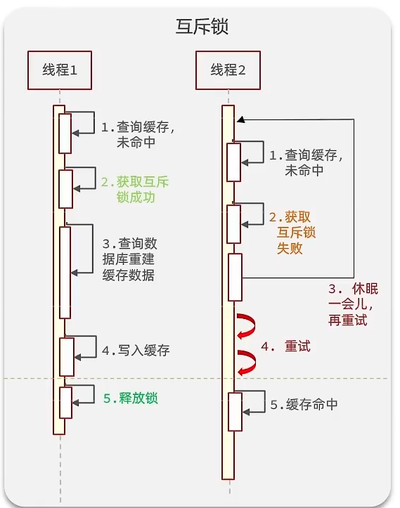
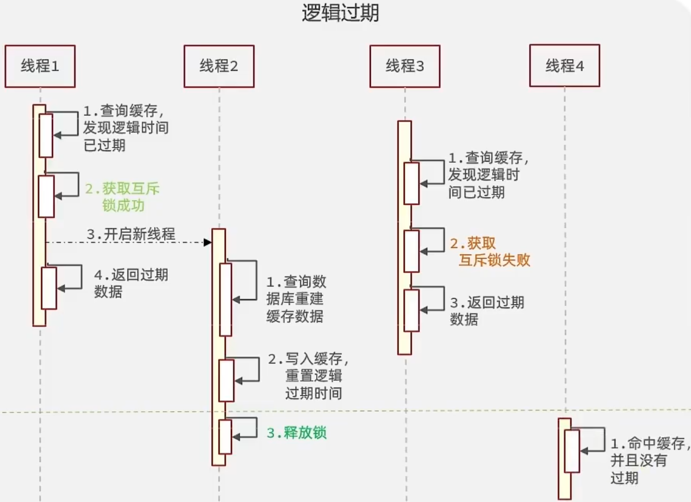

# 缓存
## 缓存穿透
**查询一个不存在的数据，mysql查询不到数据也不会直接写入缓存，就会导致每次请求都查数据库**，这就是缓存穿透。

### 解决方案一

**缓存空数据**；查询返回的数据为空，仍把这个空结果进行缓存
- 优点：简单
- 缺点：消耗内存，可能发生不一致的问题

### 解放方案二
**布隆过滤器**，经典加一层，去redis查找之前，先来它这里确认一遍。它可以用于检索一个元素是否在一个集合中，先生成一个BitMap数组，里面全是0。存储数据时，根据hash值计算数组索引，将其对应的值改为1。 查找数据的时候，使用相同hash函数获取hash值，判断对应位置是否为1。
- 优点：节约空间，没有多余的key
- 缺点：实现复杂，存在误判的概率，bitMap数组越大，误判越小。

## 缓存击穿
给某一个key设置了过期时间，当kev过期的时候，恰好这时间点对这个key有大量的并发请求过来，这些并发的请求可能会瞬间把DB压垮

### 解决方案一
**互斥锁**，在线程一redis缓存过期时，获取锁，查询DB，重建缓存。此时其他线程无法获取锁，无法进行后续select操作。
- 优点：强一致性
- 缺点：性能较差



### 解决方案二
**逻辑过期**
- 优点：性能好
- 缺点：一致性差



## 缓存雪崩

缓存雪崩是指在同一时段大量的缓存key同时失效或者Redis服务宕机，导致大量请求到达数据库，带来巨大压力。

**解决方案**
- 给不同的Key的TTL添加随机值
- 利用Redis集群提高服务的可用性：哨兵模式、集群模式
- 给缓存业务添加降级限流策略：ngxin或spring cloud gateway
- 给业务添加多级缓存：Guava或Caffeine

## 双写一致性
是指：redis做为缓存，mysql的数据如何与redis进行同步，**当修改了数据库的数据也要同时更新缓存的数据，缓存和数据库的数据要保持一致**。

- 读操作:缓存命中，直接返回;缓存未命中查询数据库，写入缓存，设定超时时间
- 写操作:延迟双删，`删除缓存->修改数据库--延时-->删除缓存`。

只删一次的话，无论时先删缓存还是先删数据库，都会因为线程速度不一致的问题导致DB和redis不一致。这就是为啥要删除两次。那为什么要延迟？是主从数据库中使用。

**强一致性**
redis读多写少，因此也可以**读写锁**，可以保证强一致性，但是性能差
- 共享锁:读锁readLock，加锁之后，其他线程可以共享读操作
- 排他锁:独占锁writeLock也叫，加锁之后，阻塞其他线程读写操作

**允许延时一致的业务**，采用异步通知
- **异步通知保证数据的最终一致性，使用MQ中间件**
- 使用canal


## 持久化
redis作为缓存，数据的持久化是怎么做的？

主要通过RDB和AOF来实现的，具体查看  <br/>

## 数据过期策略
加入 redis 的key 过期之后，会立即删除吗？

Redis对数据设置数据的有效时间，数据过期以后，就需要将数据从内存中删除掉。可以按照不同的规则进行删除，这种删除规则就被称之为数据的删除策略(数据过期策略)。
### 惰性删除
设置该key过期时间后，我们不去管它，当需要该key时，我们在检查其是否过期，如果过期，我们就删掉它，反之返回该key
- 优点:对CPU友好，只会在使用该key时才会进行过期检查，对于很多用不到的key不用浪费时间进行过期检查
- 缺点:对内存不友好，如果一个key已经过期，但是一直没有使用，那么该key就会一直存在内存中，内存永远不会释放

### 定期删除 
每隔一段时间，我们就对一些key进行检查，删除里面过期的key(从一定数量的数据库中取出一定数量的随机key进行检查，并删除其中的过期key)。

定期清理有两种模式:
- SLOW模式是定时任务，执行频率默认为10hz，每次不超过25ms，以通过修改配置文件redis.conf 的hz选项来调整这个次数
- FAST模式执行频率不固定，但两次间隔不低于2ms，每次耗时不超过1ms

**总结**
- 优点:可以通过限制删除操作执行的时长和频率来减少删除操作对 CPU 的影响。另外定期删除，也能有效释放过期键占用的内存。
- 缺点:难以确定删除操作执行的时长和频率。


> Redis的过期删除策略:惰性删除+定期删除两种策略进行配合使用
## 数据淘汰策略
假如缓存过多，内存是有限的，内存被占满了怎么办?

**当Redis中的内存不够用时，此时在向Redis中添加新的key，那么Redis就会按照某一种规则将内存中的数据删除掉，这种数据的删除规则被称之为内存的淘汰策略。**


Redis 提供了下面8种内存淘汰策略供用户选：

- **不淘汰**
  - **`noeviction`** - 当内存使用达到阈值的时候，所有引起申请内存的命令会报错。这是 Redis 默认的策略。
- **在过期键中进行淘汰**
  - **`volatile-random`** - 在设置了过期时间的键空间中，随机移除某个 key。
  - **`volatile-ttl`** - 在设置了过期时间的键空间中，具有更早过期时间的 key 优先移除。
  - **`volatile-lru`** - 在设置了过期时间的键空间中，优先移除最近未使用的 key。
  - **`volatile-lfu`** （Redis 4.0 新增）- 淘汰所有设置了过期时间的键值中，最少使用的键值。
- **在所有键中进行淘汰**
  - **`allkeys-lru`** - 在主键空间中，优先移除最近未使用的 key。
  - **`allkeys-random`** - 在主键空间中，随机移除某个 key。
  - **`allkeys-lfu`** (Redis 4.0 新增) - 淘汰整个键值中最少使用的键值。


# 分布式锁
redis分布式锁，是如何实现的?

通常情况下，分布式锁使用的场景集群情况下的定时任务、抢单、幂等性场景

分布式锁的本质和互斥锁一样，Redis实现分布式锁主要利用Redis的setnx命令。setnx是SETifnot exists(如果不存在，则 SET)的简写。
```shell
#获取锁:
# 添加锁，NX是互斥、EX是设置超时时间
SET lock value NX EX 10
#释放锁:
# 释放锁，删除即可
DEL key
```

Redis实现分布式锁如何合理的控制锁的有效时长?
- 根据业务执行时间预估
- 给锁续期

> 加锁、设置过期时间等操作都是基于lua（包装原子性）脚本完成

Redisson的这个锁，可以重入吗?
可以重入，多个锁重入需要判断是否是当前线程，在redis中进行存储的时候使用的hash结构来存储线程信息和重入的次数

Redisson锁能解决主从数据一致的问题吗？
不能解决，但是可以使用redisson提供的红锁来解决，但是这样的话，性能就太低了，如果业务中非要保证数据的强一致性，建议采用zookeeper实现的分布式锁


# 队列相关

# 参考
- https://www.bilibili.com/video/BV1yT411H7YK
- - https://dunwu.github.io/