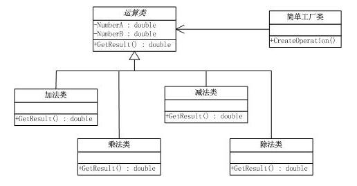

# 设计模式之简单工厂模式

## 简介

### 简单工厂模式思想

**简单工厂模式 (Simple Factory)** 又叫静态工厂方法（Static Factory Method）模式。

简单工厂模式通常是定义一个工厂类，这个类可以**根据不同变量返回不同类的产品实例**。

简单工厂模式是一种**对象创建型模式**。但是简单工厂模式**不属于**23 种 Gof 设计模式之一。

### 简单工厂模式要点

**优点**：简单工厂模式的工厂类是整个模式的关键。其中包含了必要的**逻辑判断**，根据外部信息，决定究竟应该创建哪个具体类的对象。通过使用简单工厂模式，用户无需了解对象如何创建的，只要传入必要信息就可以了。

**缺点**：工厂类集中了所有实例的创建逻辑，**违背了高内聚责任分配原则**。随着系统中具体产品类不断增多，势必要不断修改工厂类，不易维护和扩展。同时，这也**违背了开放封闭原则**。

> **开放封闭原则**：一个软件实体如类、模块和函数应该对扩展开放，对修改关闭。

## 实例

如何实现一个具有加减乘除基本功能的计算器？

对于这四种运算来说，都需要两个操作数，差别仅在于返回的结果不同。

由此，我们可以抽象化它们的共性，提炼出一个父类。这个类中包含两个操作数，一个返回结果方法，这个方法期望在子类中得以实现。

以下通过具体代码来说明。



【Product (Operation) 】

产品角色，简单工厂模式所创建的所有对象的父类，它负责描述**所有实例所共有的公共接口**。

```java
// Product角色，所有实例所共有的公共接口
abstract class Operation {
    public int numA;
    public int numB;
    public abstract int GetResult();
}
```

【ConcreteProduct 组】

具体产品角色，实现 Product 中的接口。

```java
// ConcreteProduct 角色，实现 Product 中的接口
class Add extends Operation {
    @Override
    public int GetResult() {
        return numA + numB;
    }
}

//ConcreteProduct 角色，实现 Product 中的接口
class Sub extends Operation {
    @Override
    public int GetResult() {
        return numA - numB;
    }
}

//ConcreteProduct 角色，实现 Product 中的接口
class Mul extends Operation {
    @Override
    public int GetResult() {
        return numA * numB;
    }
}

//ConcreteProduct 角色，实现 Product 中的接口
class Div extends Operation {
    @Override
    public int GetResult() {
        if (numB == 0) {
            System.out.println("ERROR!");
            return -1;
        }
        return numA / numB;
    }
}
```

【Factory (OperationFactory) 】

工厂角色，简单工厂模式的**核心**，它负责实现**创建所有实例的内部逻辑**。工厂类的创建产品类的方法可以被外界直接调用，创建所需的产品对象。

```java
// 工厂角色，简单工厂模式的核心，它负责实现创建所有实例的内部逻辑
class OperationFactory {
    public static Operation CreateOperation (char operate) {
        Operation oper = null;
        switch(operate) {
        case '+':
            oper = new Add();
            break;
        case '-':
            oper = new Sub();
            break;
        case '*':
            oper = new Mul();
            break;
        case '/':
            oper = new Div();
            break;
        default:
            break;
        }
        return oper;
    }
}
```

【客户端】

```java
public class SimpleFactoryPattern {
    public static void main(String[] args) {
        int numA = 10;
        int numB = 3;
        int result = 0;
        Operation oper = OperationFactory.CreateOperation('+');
        oper.numA = numA;
        oper.numB = numB;
        result = oper.GetResult();
        System.out.println(numA + " + " + numB + " = " + result);
    }
}
```

【输出】

```
10 + 3 = 13
```

## 参考资料

- [《Head First 设计模式》](https://book.douban.com/subject/2243615/)
- [《大话设计模式》](https://book.douban.com/subject/2334288/)