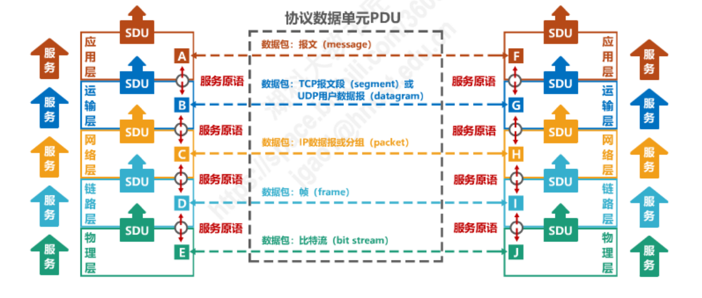

计算机网络学习笔记

<!-- more -->


## 1.计算机网络概述

### 1.1.互联网的构成

**网络：**（Network）由若干节点（Node）和连接这些节点的链路（Link）组成

**网络边缘**:位于互联网边缘与互联网相连的计算机和其他设备,如桌面计算机、移动计算机、服务器、其他智能终端设备

**网络核心**:由互联端系统的分组交换设备和通信链路构成的网状网络

如：分组交换路由器、链路层交换机、通信链路(光纤、铜缆、无线电、激光链路)

**网络：**

### 1.2.网络分类

#### 1.2.1.按覆盖范围分类

**个域网PAN（ Personal Area Network）**

* 能在便携式消费电器与通信设备之间进行短距离通信的网络

* 覆盖范围一般在10米半径以内，如蓝牙耳机等

**局域网LAN（Local Area Network）**

* 局部地区形成的区域网络，如企业网络

* 分布地区范围有限，可大可小，大到一栋建筑、小到办公室内的组网

* 电脑WLAN接入，打印机共享等等

**城域网MAN（Metropolitan Area Network ）**

* 范围覆盖一个城市的网络

**广域网WAN（Wide Area Network）**

* 覆盖很大地理区域，乃至覆盖地区和国家

  

#### 1.2.2.按交换技术分类

* 电路交换网络
* 报文交换网络
* 分组交换网络

#### 1.2.3.按使用者分类

* 共用网
* 专用网

#### 1.2.4.按传输介质分类

* 有线网络
* 无线网络

#### 1.2.5.按拓扑结构分类

* 总线型网络
* 星型网络
* 环形网络
* 网状型网络


### 1.3.接入网

**边缘路由器**：顾名思义，就是局域网和广域网交界处的路由器。

**各种异构网络通过边缘路由器接入**

**接入网的用途**

* 将主机连接到边缘路由器上
* 边缘路由器是端系统Host去往任何其他远程端系统的路径上的第一台路由器

**接入网分类：**

* 光纤到户FTTH（fiber to the home）：就是光纤接到家中
* 数字用户线DSL（Digital Subscriber Line）：是对在[本地电话网](https://baike.baidu.com/item/本地电话网/5924475?fromModule=lemma_inlink)线上所提供的数字数据传输的一整套技术的总称，是通过**铜线**或者**本地电话网**提供数字连接的一种技术

* 同轴电缆：是一种电线及信号传输线
* 无线接入：无线接入是指从交换节点到用户终端之间，部分或全部采用了无线手段，比如WiFi？

* 企业和家庭网络：企业贵

### 1.4.网络核心的两大功能

**①路由**

确定数据分组从源到目标所使用的路径（全局操作）

**②转发**

路由器或交换机将接受到的数据分组转发出去（即移动到该设备的某个输出口）（本地操作）


### 1.5.网络分层

#### 1.5.1.OSI七层模型

|     分类      |         功能 | 
| :-----------: | :------------- | 
| 应用层（Application Layer） | 通过应用层协议，提供应用程序（进程间的交互）便携的网络服务调用 | 
| 表示层（Presentation Layer) |      关注所传递信息的语法和语义，管理数据的表示方法，传输的数据结构 | 
|       会话层（Session Layer）     |     利用传输层提供的服务，在应用程序之间建立和维持会话，并能使会话获得同步 | 
|传输层（Transport Layer）|1、将数据从源端口发送到目的端口（进程到进程），以及传输出现错误的处理 <br> 2、网络层定位到一台主机（host），传输层的作用域具体到主机上的某一个进程 <br> 3、网络层的控制主要面向运营商，传输层为终端用户提供端到端的数据传输控制<br>4、两类模式：可靠的传输模式，或不可靠传输模式<br>5、可靠传输：可靠的端到端数据传输，适合于对通信质量有要求的应用场景，如文件传输等<br>6、不可靠传输：更快捷、更轻量的端到端数据传输，适合于对通信质量要求不高，对通信响应速度要求高的应用场景，如语音对话、视频会议等|
|网络层（Network Layer）|1、将数据包跨越网络从源设备发送到目的设备（host to host）<br>2、路由（Routing）：在网络中选取从源端到目的端转发路径，常常会根据网络可达性动态选取最佳路径，也可以使用静态路由<br>3、路由协议：路由器之间交互路由信息所遵循的协议规范，使得单个路由器能够获取网络的可达性等信息<br>4、服务质量（QoS）控制：处理网络拥塞、负载均衡、准入控制、保障延迟<br>5、异构网络互联：在异构编址和异构网络中路由寻址和转发|
| 数据链路层（Data Link Layer）| 1、实现相邻（Neighboring）网络实体间的数据传输<br>2、成帧（Framing）：从物理层的比特流中提取出完整的帧<br>3、错误检测与纠正：为提供可靠数据通信提供可能<br>4、物理地址（MAC address）：48位，理论上唯一网络标识，烧录在网卡，不便更改。用于识别各主机<br>5、流量控制，避免“淹没（overwhelming）:当快速的发送端遇上慢速的接收端，接收端缓存溢出<br>6、共享信道上的访问控制（MAC）：同一个信道，同时传输信号。如同：同一个Wifi热点（AP）连接着多个无线用户（手机），则多个用户同时需要发送数据，如何控制发送顺序？或者说，协调各主机争用总线。|
|物理层（Physical Layer）| 1、决定采用怎样的传输介质<br>2、决定采用怎样的物理接口<br>3、决定使用怎样的信号表示比特0和1|


 #### 1.5.2.TCP/IP 4层模型
|     分类      |         功能 |  内部 |
| :-----------: | :------------- |  :-------------|
|应用层|解决通过应用进程的交互来实现特定网络应用的问题|HTTP……SMTP；DNS……RTP|
|传输层|解决进程之间基于网络的通信问题|TCP；UDP（分号对应上一行|
|传输网层|暂未总结| IP：<br>1、IP协议可以为各种网络应用提供服务(上一行）<br>2、使用ip协议互连不同的网络接口（下一行）|
|网络接口层|可以拆分为数据链路层和物理层，适合教学|网络接口1、2、3……|


#### 1.5.3.两种模型比较 

 OSI的失败：糟糕的时机、技术、实现、政策。
 |     OSI模型的不足      |         TCP/IP模型的不足 | 
| :----------- | :------------- | 
|	1、从未真正被实现：TCP/IP已成为实施标准，OSI缺少厂家支持<br> 2、技术实现糟糕：<br> &ensp;&ensp; ① OSI分成缺少技术考虑：某些层内容少，有些层太多。模型和协议过于复杂。<br >&ensp;&ensp;② 分层功能重复出现<br>3、非技术原因：TCP/IP实现为UNIX一部分，免费；OSI被认为是政府和机构的加强标准|1、核心概念未能提现：未明确区分服务、接口和协议等核心概念<br>2、不具备通用性：不适用于描述TCP/IP之外的其他协议栈<br>3、混用接口与分层的设计：链路层和物理层一起呗定义为网络接口层，而非真正意义上的分层<br>4、模型欠缺完整性：未包含物理层和数据链路层；物理层和链路层是至关重要的部分|


### 1.6.三种交换方式

#### 1.6.1.电路交换

一开始是电话和电话直接用一根线连接在一起；后面出现电话交换机，之后电话只需要连到交换机上，由交换机转发。

* 电话交换机接通电话线的方式称为电路交换；
* 从通信资源的分配角度来看，交换（Switching）就是按照某种方式动态地分配传输路线的资源；
* 电路交换的三个步骤：
  * 建立连接（分配通信资源）
  * 通话（一直占用通信资源）
  * 释放连接（归还通信资源）


#### 1.6.2.报文交换和分组交换

**报文交换：**在报文交换中没有专用的电路来传输数据。相反，我们可以通过添加一个标头，在数据准备好的任何时候发送一块数据，它就是分组或数据包（packet）。标头里包含了数据包的目标地址。


**分组交换：**当数据过大时，拆分数据，此时就变成了分组交换。

分组交换包括三方：

* 发送方：构造分组，发送分组。
* 路由器：缓存分组，转发分组。
* 接收方：接收分组，还原报文。

过程如下：

```tex
100001111[头部]
```


当数据量过大时，会拆分如下的两个数据包发送：

```tex
10001111[头部]……1110011[头部]
```

目标收到之后，在去掉头部拼接在一起，就构成了完整的数据。

```tex
10001111……1110011
```


#### 1.6.3.三种交换方式的对比


| 交换方式 | 优点                                                         | 缺点                                                         |
| -------- | ------------------------------------------------------------ | ------------------------------------------------------------ |
| 电路交换 | 1)通信时延小<br/>2)有序传输<br/>3)没有冲突<br/>4)适用范围广<br/>5)实时性强<br/>6)控制简单 | 1)建立连接时间长<br/>2)线路独占，使用效率低<br/>3)灵活性差<br/>4)难以规格化 |
| 报文交换 | 1)无需建立连接<br/>2)动态分配线路<br/>3)提高线路可靠性<br/>4)提高线路利用率<br/>5)提供多目标服务 | 1）引起了转发时延<br/>2）需要较大存储缓存空间<br/>3）需要传拍额外的信息量 |
| 分组交换 | 1)无需建立连接)<br/>2)线路利用率高<br/>3)简化了存储管理<br/>4)加速传输<br/>5减少出错概率和重发数据量 | 1)引起了转发时延<br/>2)需要传铂额外的信息量<br/>3)对于数据报服务，存在失序、丢失或重复分组的问题;对于虚电路服务。存在呼叫建立、数据传输和虚电路释放三个过程 |


### 1.7.计算机网络的性能指标

* 速率
* 宽带
* 吞吐量
* 时延
* 时延带宽积
* 往返时间
* 利用率
* 丢包率

#### 1.7.1.速率

**比特**：是计算机中数据量的单位，也是信息论中信息量的单位，就是存储单位。一个比特就是二进制数字中的一个1或0。

* 常用单位：TB = K * GB = K * K * MB = K * K * K * KB = 2^10 * 2^10 * 2^10 * 2^10 B = 2^10 * 2^10 * 2^10 * 2^10 * 8 bit


**速率**：链接在计算机网络上的主机在数字信道上传送比特的速率，也称比特率或数据率。

* 常用单位：Tb/s = K * Gb/s = K * K * Mb/s = K * K * K * Kb/s  = 10^3 * 10^3 * 10^3 * 10^3 b/s
* b/s = bps = bit/s

eg:有一个待发送的数据块，大小为100MB，网卡的发送速率为100Mbps，则网卡发送完该数据块需要多长时间？

解：100MB 除以 100Mbps = 8.388 s；
平时估算时，M直接约掉：B 除以 b = 8 s

#### 1.7.2.带宽
**带宽：** 
* 在模拟信号系统中的意义：信号所包含的各种不同频段成分所占据的频率范围；
  * 常用单位：HZ（kHz，MHz，GHz）
* 在计算机网络中的意义：
  * 单位时间内从一点到另一点所能通过的最大数据率 

#### 1.7.3.吞吐量
**吞吐量：**
* 表示在单位时间内通过某个网络（或信道、接口） 的数据量。
* 被经常用于对现实世界中的网络的一种测量，以便知道实际上到底有多少数据量能够通过网络。
* 吞吐量收网络的带宽或额定速率的限制。

#### 1.7.4.时延
**时延：**
* 发送时延=分组长度（b）/发送速率（b/s）
* 传播时延=信道长度（m）/电磁波传输速率（m/s）
* 处理时延=一般不便于计算

eg：数据块长度为100MB，信道带宽为1Mb/s,传送举例为1000Km，计算发送时延和传播时延。
解：发送时延= 分组长度（b）除以 发送速率(b/s) = 100 * 2^20 * 8b 除以 10^6 b/s = 838.86 s
传播时延 = 信道长度 除以 电磁波传播速度 = 1000 * 10^3 除以 2*10^8 = 0.005 s

#### 1.7.5.时延带宽积

时延带宽积 = 传播时延 * 带宽

* 若发送端连续发送数据，则在所发送的第一个比特即将到达终点时，发送端就已经发送了**时延带宽积个比特**;
* 链路的时延带宽积又称为**以比特为单位的链路长度**。


#### 1.7.6.往返时间

* 在许多情况下，因特网上的信息不仅仅单方向传输，而是双向交互;
* 我们有时很需要知道双向交互一次所需的时间;
* 因此，往返时间RTT(Round-Trip Time)也是一个重要的性能指标


#### 1.7.7.利用率

* 利用率
  * 信道利用率：用来表示某信道有百分之几的时间是被利用的 (有数据通过)。
  * 网络利用率：全网络的信道利用率的加权平均。


* 根据排队论，当某信道的利用率增大时，该信道引起的时延也会迅速增加;
* 因此，**信道利用率并非越高越好**。
* D=Do/(1-u)，如果令Do表示网络空闲时的时延，D表示网络当前的时延，那么在适当的假定条件下，可以用前面的简单公式来表示D、Do和利用率U之间的关系:
  * 当网络的利用率达到50%时，时延就要加倍;
  * 当网络的利用率超过50%时，时延急剧增大:
  * 当网络的利用率接近100%时，时延就趋于无穷大;
  * 因此，一些拥有较大主干网的ISP通常会控制它们的信道利用率不超过50%。如果超过了，就要准备扩容，增大线路的带宽。当然也不能太低，保持在一个合理的范围内。

#### 1.7.8.丢包率

* 丢包率即分组丢失率，是指在一定的时间范围内，传输过程中**丢失的分组数量与总分组数量的比率**。
* 丢包率具体可分为接口丢包率、结点丢包率、链路丢包率、路径丢包率、网络丢包率等。
* 丢包率是网络运维人员非常关心的一个网络性能指标，但对于普通用户来说往往并不关心这个指标因为他们通常意识不到网络丢包。
* 分组丢失主要有两种情况:
  * 分组在传输过程中出现**误码**，被结点丢弃;
  * 分组到达一台队列已满的分组交换机时被丢弃;在通信量较大时就可能造成**网络拥塞**。

* 因此，丢包率反映了网络的拥塞情况:
  * 无拥塞时路径丢包率为0
  * 轻度拥塞时路径丢包率为1%~4%
  * 严重拥塞时路径丢包率为5%~15%

### 1.8.计算机网络体系结构

#### 1.8.1.常见的计算机网络体系结构

* OSI七层模型（**法律**上的国际标准）
* TCP/IP体系结构（**事实**上的国际标准）

#### 1.8.2.计算机网络体系结构分层的必要性

简单来说，就是简单功能复杂化。

#### 1.8.3.计算机网络体系结构分层思想举例

应用进程间基于网络通信，`ETH+HTTP+TCP+IP+ETH`，生成比特流

IP数据报：`HTTP+TCP+IP`;

帧：`ETH+HTTP+TCP+IP+ETH`

#### 1.8.4.计算机网络体系结构中的专用术语

* 实体：任何可发送或接收信息的**硬件**或**软件进程**。
  * 对等实体：收发双方**相同层次中的实体**。就是应用层-》应用层，网络层-》网络层；以此类推。

* 协议：控制两个对等实体进行逻辑通信的规则的集合。

* 协议的三要素：

  * 语法：定义所交换信息的格式
  * 语义：定义收发双方索要完成的操作。
  * 同步：定义收发双方的时序关系

  

* 服务：在协议的控制下，两个对等实体间的逻辑通信使得本层能够向上一层提供服务
  * 要实现本层协议，还需要使用下面一层所提供的服务。
  * 协议是“水平的”，服务是“垂直的”。
  * 实体看得见相邻下层所提供的服务，但并不知道实现该服务的具体协议。也就是说，下面的协议对上面的实体是"透明”的。
* 服务访问点：在同一系统中**相邻两层的实体交换信息的逻辑接口**，用于区分不同的服务类型。
  * 数据链路层的服务访问点为帧的“类型”字段。
  * 网络层的服务访问点为IP数据报首部中的“协议字段”。
  * 运输层的服务访问点为“端口号”。
* 上层使用下层所提供的服务必须通过与下层交换一些命令，这些命令称为服务原语。


* 协议数据单元PDU：**对等层次之间传送的数据包**称为该层的协议数据单元。
* 服务数据单元SDU：同一系统内，**层与层之间交换的数据包**称为服务数据单元。
* 多个SDU也可划分为几个PDU.多个SDU可以合成为一个PDU:


​	
