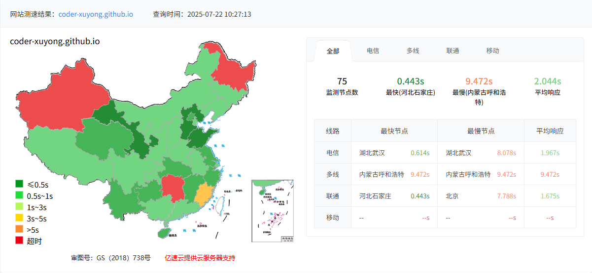
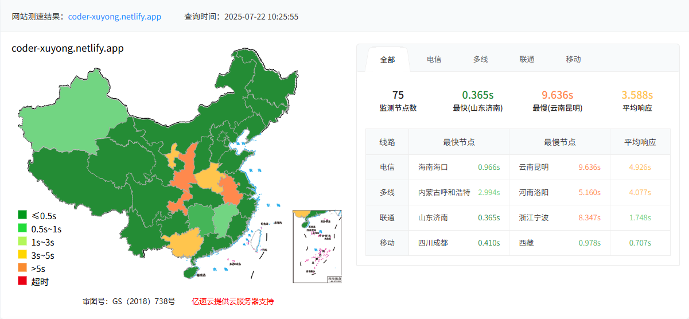

## 认识 hexo
简单来说，就是一个博客框架。社区很活跃，里面有很懂框架可以直接使用和自定义。
更多详情，直接查看官网： https://hexo.io/zh-cn/docs/index.html



## 本地搭建 hexo 记录
1.git 安装：略
2.node.js 安装：版本 22，详情略
3.启动终端安装框架:`npm install -g hexo-cli`
4.初始化 hexo 
```shell
hexo init <folder>
cd <folder>
npm install
```
5.在 hexo 根目录终端输入： `hexo server`，启动程序，访问 http://localhost:4000/ 不报错即成功。

## 常用命令
1.在终端输入 `hexo new page 导航栏名字`,如：`hexo new page about`

## 配置 github pages

**注意：** 创建github 仓库的时候，必须要一个 README.md，不然会失败。 

详情查看官网文档：https://hexo.io/zh-cn/docs/github-pages

### 进阶

- Netlify：https://www.cnblogs.com/codernie/p/9062104.html
- Vercel：https://www.cnblogs.com/aitec/articles/vercel.html

#### netlify 尝试

先说结论，不是很理想，对于githubpages的速度提升不是很大：
- 优点：netlify.app 可以过移动网的防火墙
- 缺点：微信浏览器无法访问。


| 指标      | github pages | netlify |
| ----------- | ----------- | ----------- | 
| 国内访问速度(avg) [站长之家](https://tool.chinaz.com/speedtest)   | 2.044s      | 3.588s |
| 国内访问速度(avg) [itdog](https://www.itdog.cn/http/)     | 1.356s      | 1.486s |
| 运营商访问   | 移动网无法访问        | 三大isp都可以访问 |
| 微信访问   | 可以访问        | 无法访问 |

> 国内访问速度是通过站长之家测试 [站长工具>国内测速](https://tool.chinaz.com/speedtest)

站长之家测试数据详情如下：




##### 具体操作步骤

提前说明，很简单，官网注册一个账号，使用github注册，绑定一个已有的blog项目，跟着指引走就可以了。

官网地址：https://app.netlify.com/

时间有点老，但是能用：https://blog.grin.cool/blog/hexo-blog

**注意：**

github pages 和 netlify 使用同一个分支，会冲突。
尝试将 github pages 关闭，但是由于不想删除 `.github\workflows\pages.yml`  ，导致一直关不掉。

于是重新修改逻辑，将 github pages 所需的静态文件放在分支 blog_pages 里面，再在 仓库中，按如下设置，
修改分支：Settings > Pages > Build and deployment > Branch> Deploy from a branch > blog_pages >  /(root)

**同时在仓库设置中启用工作流写入权限：**
- 访问仓库的 Settings > Actions > General
- Workflow permissions 部分：
    - 选择 Read and write permissions
    - 勾选 Allow GitHub Actions to create and approve pull requests

修改page.yml 文件的内容为：
```yaml
name: Pages

on:
  push:
    branches:
      - main  # 触发部署的源分支

jobs:
  build:
    runs-on: ubuntu-latest
    steps:
      - uses: actions/checkout@v4
        with:
          token: ${{ secrets.GITHUB_TOKEN }}
          ref: main
          submodules: recursive
      
      - name: Use Node.js 20
        uses: actions/setup-node@v4
        with:
          node-version: "20"
       
      - name: Cache NPM dependencies
        uses: actions/cache@v4
        with:
          path: node_modules
          key: ${{ runner.OS }}-npm-cache
      
      - name: Install Dependencies
        run: npm install
      
      - name: Build
        run: npm run build  # 生成静态文件到 public 目录

      - name: Deploy to Pages Branch
        uses: peaceiris/actions-gh-pages@v3
        with:
          github_token: ${{ secrets.GITHUB_TOKEN }}
          publish_dir: ./public
          publish_branch: blog_pages  # 目标分支名称
          force_orphan: true  # 确保分支只包含最新文件
```


备注：
> page.yml 文件内容是 deep seek 生成的，具体的意思和语法需要查看 [github actions](https://docs.github.com/zh/actions) 的语法。

##### gitalk 登陆失败
如图：


**解决方法：**

在 github 的仓库中，Your Avatar > Settings > Developer settings > OAuth Apps > Your_App_Name
里面有 Homepage URL 和 Authorization callback URL ，将其改为 xx.netlify.app 的地址

总结：gitalk 只能绑定一个域名地址；

> 参考：https://github.com/reportportal/reportportal/issues/2374

#### Vercel 尝试

由于 Vercel 国内被屏蔽掉了，必须要有域名，由于想白嫖，所以暂时不考虑

## 使用 theme

详情参考：https://butterfly.js.org/

## 配置评论系统
### giscus
详情参考：https://zhuanlan.zhihu.com/p/603658639

### gitalk
giscus 无法使用最新评论外挂模块，转 gitalk，具体详情参考：https://www.cnblogs.com/qisi007/p/13731562.html
https://www.summer889.com/2024/11/12/%E6%9C%89%E7%9A%84%E6%B2%A1%E7%9A%84/hexo%E5%8D%9A%E5%AE%A2%E8%AF%84%E8%AE%BA%E5%8A%9F%E8%83%BD/

**注意：**
> gitalk 文件名不能有中文，不然会失效

### twikoo
后面有时间在实践
https://niezicheng.github.io/blog-hexo/posts/a77c77c/

## 配置文章的路由


Add plugin to Hexo:

```shell
npm install hexo-abbrlink --save
```

Modify permalink in config.yml file:

```shell
permalink: posts/:abbrlink/ 
# or
permalink: posts/:abbrlink.html
```

Configs in `_config.yml`:

```yml
# abbrlink config
abbrlink:
  alg: crc32      # Algorithm used to calc abbrlink. Support crc16(default) and crc32
  rep: hex        # Representation of abbrlink in URLs. Support dec(default) and hex
  drafts: false   # Whether to generate abbrlink for drafts. (false in default)
  force: false    # Enable force mode. In this mode, the plugin will ignore the cache, and calc the abbrlink for every post even it already had an abbrlink. (false in default)
  writeback: true # Whether to write changes to front-matters back to the actual markdown files. (true in default)
```

### 样本

The generated link will look like the following:

```
crc16 & hex
https://post.zz173.com/posts/66c8.html

crc16 & dec
https://post.zz173.com/posts/65535.html
```

```
crc32 & hex
https://post.zz173.com/posts/8ddf18fb.html

crc32 & dec
https://post.zz173.com/posts/1690090958.html
```

### 参考
> https://github.com/ohroy/hexo-abbrlink?tab=readme-ov-file

## 遇见的问题

### md 文档中图片相对路径失效

网上攻略多数都是，hexo的图片默认不支持相对路径。需要配置 post_asset_folder 选项，设置从false改成true之后支持。**但是要求图片目录必须和文件名相同**。
如：
```shell
.
├── _posts
|   ├── test.md
|   └── test
```
极其不方便，然后发现有人专门写了插件，可以看原文：https://www.cnblogs.com/mlzrq/p/16099460.html

亲测可行

这个插件可以把图片可以为hexo的_posts目录下的任意目录下的资源图片，文章内可以使用相对路径引用，在模板渲染时，插件会将相对路径的图片转为inline模式，以base64编码直接在html内引用。这样就不会出现目录问题。

使用方式
1. 安装插件：

安装命令如下
```shell
npm i hexo-filter-inline-image
```
2. 配置hexo启用插件

_config.yml 增加以下配置
```yml
inline_image:  
    enabled: true
    compress: false
    remote: false
    limit: 2048
```
compress 是否启用图片压缩
remote 是否转换http和https图片,默认关闭
limit 限制图片大小（kb）在此以内才会进行转换

注意：
> 由于本身Hexo带有缓存会导致插件第一次使用可能会出现无效果，请使用hexo clean清除缓存后即可正常使用

### 未找到相关的 Issues 进行评论 请联系 @coder-xuyong 初始化创建

本地尝试登陆评论失败

上传到github 后，使用 https://coder-xuyong.github.io 登陆评论，成功！


## 自定义

### 自定义波浪特效
> https://snowtafir.top/posts/2022bn5s.html
> https://butterfly.js.org/posts/b37b5fe3/?highlight=%E5%BC%95%E5%85%A5

### butterfly 右下角悬浮菜单栏
js里面的的元素可能不对，需要自己校对一下（后面抛弃了，参考了源码的写法）
可以直接搜索源码方法 `getScrollPercent`，参考一下它被引用的 tocScrollFn 的 js的写法。
> https://snowtafir.top/posts/2020bkm9.html#butterfly%E5%8F%B3%E4%B8%8B%E8%A7%92%E6%82%AC%E6%B5%AE%E8%8F%9C%E5%8D%95%E6%A0%8F


### 主页分类卡片自定义

目标，层级分类自定义展开。
找到 themes\butterfly\scripts\helpers\aside_categories.js ，其中找到 hierarchicalList 方法下的这段代码

```js
const parentClass = isExpand && !parent && child ? 'parent' : ''
result += `<li class="card-category-list-item ${parentClass}">`
result += `<a class="card-category-list-link" href="${this.url_for(cat.path)}">`
result += `<span class="card-category-list-name">${cat.name}</span>`

if (showCount) {
  result += `<span class="card-category-list-count">${cat.length}</span>`
}

if (isExpand && !parent && child) {
  result += `<i class="fas fa-caret-left ${expandClass}"></i>`
}
```

将这段代码的 `&& !parent` 去除掉

但是这样，无法显示文章，因此，继续修改 aside_categories.js 文件

```js
// ....前面不变
const buttonLabel = this._p('aside.more_button')
  const showPosts = Object.prototype.hasOwnProperty.call(options, 'show_posts') ? options.show_posts : true
  const postLimit = options.post_limit || 20 // 默认显示20篇文章

  const prepareQuery = parent => {
    const query = parent ? { parent } : { parent: { $exists: false } }
    return categories.find(query).sort(orderby, order).filter(cat => cat.length)
  }

  const generatePostList = (posts) => {
    let result = ''
    const limitedPosts = posts.limit(postLimit).toArray()
    
    limitedPosts.forEach(post => {
      result += `<li class="card-article-list-item">
                  <a class="card-article-list-link" href="${this.url_for(post.path)}">
                    <span class="card-article-list-name">${post.title}</span>
                  </a>
                </li>`
    })
    
    // 添加"更多"链接
    if (posts.length > postLimit) {
      result += `<li class="card-article-list-item">
                  <a class="card-article-list-link" href="${this.url_for(posts.data[0].path.split('/')[0])}/">
                    <span class="card-article-list-name">${this._p('aside.more_article')} (${posts.length - postLimit})</span>
                  </a>
                </li>`
    }
    
    return result
  }

  const hierarchicalList = (remaining, level = 0, parent) => {
    let result = ''
    if (remaining > 0) {
      prepareQuery(parent).forEach(cat => {
        if (remaining > 0) {
          remaining -= 1
          let child = ''
          let postList = ''
          
          // 递归生成子分类
          if (!depth || level + 1 < depth) {
            const childList = hierarchicalList(remaining, level + 1, cat._id)
            child = childList.result
            remaining = childList.remaining
          }
          
          // 在最深层级生成文章列表
          const isLeafCategory = (!depth || level >= depth - 1) && !child && showPosts
          if (isLeafCategory && cat.posts && cat.posts.length > 0) {
            postList = `<ul class="card-article-list child">${generatePostList(cat.posts)}</ul>`
          }

          // 判断是否有展开内容
          const hasExpandContent = child || postList
          const hasChildClass = hasExpandContent ? 'parent' : ''

          result += `<li class="card-category-list-item ${hasChildClass}">`
          result += `<a class="card-category-list-link" href="${this.url_for(cat.path)}">`
          result += `<span class="card-category-list-name">${cat.name}</span>`

          if (showCount) {
            result += `<span class="card-category-list-count">${cat.length}</span>`
          }

          // 所有层级都显示展开图标（如果有内容）
          if (isExpand && hasExpandContent) {
            result += `<i class="fas fa-caret-left ${expandClass}"></i>`
          }

          result += '</a>'

          // 子分类列表
          if (child) {
            result += `<ul class="card-category-list child">${child}</ul>`
          }
          
          // 文章列表
          if (postList) {
            result += postList
          }

          result += '</li>'
        }
      })
    }
    return { result, remaining }
  }

// ···后面不变

```

同时修改自定义的css文件
```css

.card-category-list-link,
.card-article-list-link {
  display: flex;
  align-items: center;
  position: relative;
}

/* 图标样式 */
.card-category-list-link i {
  margin-left: auto;
  padding: 0 5px;
  transition: transform 0.3s ease;
  font-size: 14px;
}

/* 展开状态旋转图标 */
.card-category-list-link i.expand {
  transform: rotate(-90deg);
}

/* 文章列表样式 */
.card-article-list {
  padding-left: 20px;
}

.card-article-list-item {
  list-style: none;
  position: relative;
}

.card-article-list-item:before {
  content: "";
  position: absolute;
  left: -15px;
  top: 50%;
  transform: translateY(-50%);
  font-size: 16px;
}

/* 文章链接样式 */
.card-article-list-link {
  padding: 5px 0;
  font-size: 0.9em;
  color: #666;
}

/* 子分类缩进 */
.card-category-list .child {
  padding-left: 15px;
}
```

**加上按照文章order排序**：
将 `const limitedPosts = posts.limit(postLimit).toArray()` 给替换为如下的代码：
```js
  // 替换原有的 toArray() 调用
    const allPosts = posts.toArray();
    
    // 按 order 字段排序（升序）
    allPosts.sort((a, b) => {
      const orderA = a.order || Number.MAX_SAFE_INTEGER;
      const orderB = b.order || Number.MAX_SAFE_INTEGER;
      return orderA - orderB;
    });
    
    // 应用限制
    const limitedPosts = allPosts.slice(0, postLimit);
```

### 修改分类页面
主要修改这个方法：list_categories


### 加载动画
https://blog.anheyu.com/posts/52d8.html

## 参考
- https://www.cnblogs.com/mlzrq/p/16099460.html
- https://arcsin2.cloud/2023/02/23/Hexo-%E5%8D%9A%E5%AE%A2%E6%97%A0%E6%B3%95%E6%98%BE%E7%A4%BA%E5%9B%BE%E7%89%87%E8%A7%A3%E5%86%B3%E6%96%B9%E6%B3%95/