## cdn 概述和分析
通过 CDN（内容分发网络）将静态资源缓存到全球节点，显著提升访问速度。

因此可使用 cdn  提升 github pages 访问速度慢的问题。


## 阿里云域名获取

访问阿里云官网获取：https://wanwang.aliyun.com/domain
身份验证需要花费半小时的时间。

## 添加域名的 DNS 记录

域名购买成功后，且状态为正常。点击操作中的“解析”菜单，进入DNS配置操作。

添加两个记录，添加完成后需要等待，可以点击左上方“域名解析问题详细诊断”，查看结果。如图
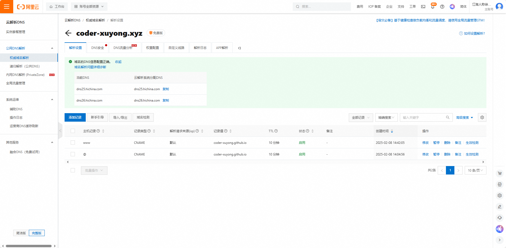


## github pages 绑定域名
将配置好的域名绑定到 github pages 中。并且勾选 Enforce HTTPS  。如图：
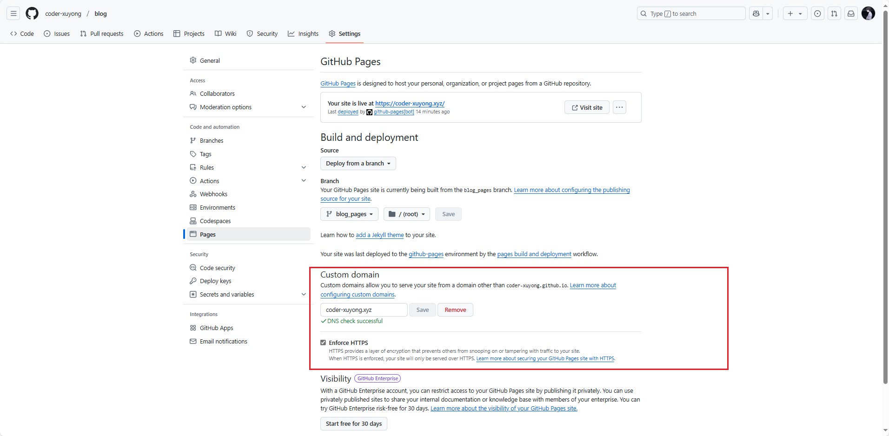

修改成功后，便可通过域名访问。
## 修改base路径

访问之后样式不对，缺少东西，是其他js和css的请求路径不对，多了一个 “blog”。
将 config.ts 中的 base 改为："/"
提交代码，pages action 部署之后，访问没有异常，便是成功部署完成。

## 绑定 cloudflare CDN
访问官网：https://www.cloudflare-cn.com/
点击右上角登陆，可能需要科学上网。
使用 Google 或者 apple 账号登陆。
登陆成功后，右上角可以选择切换中文。

添加域名，就是刚刚购买的，或者已拥有的
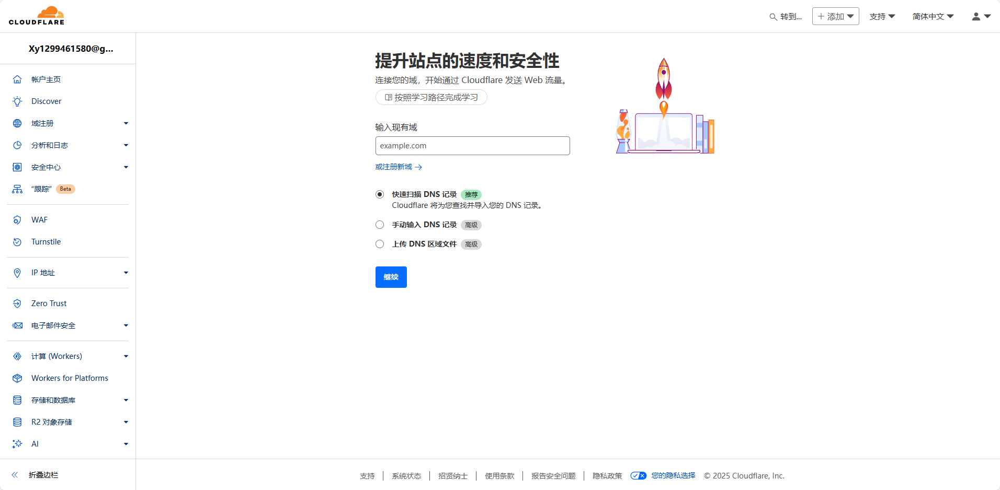
选择免费，点击继续
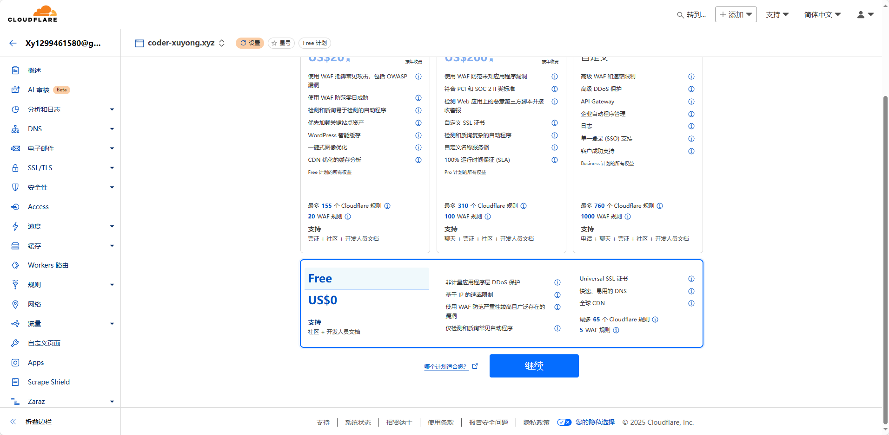
添加四个记录IP，类型为A 地址如下：
```shell
185.199.108.153
185.199.109.153
185.199.110.153
185.199.111.153
```
这是github pages 的地址，可以官网查看：https://docs.github.com/zh/pages/configuring-a-custom-domain-for-your-github-pages-site/managing-a-custom-domain-for-your-github-pages-site

配置完成后，继续下一步
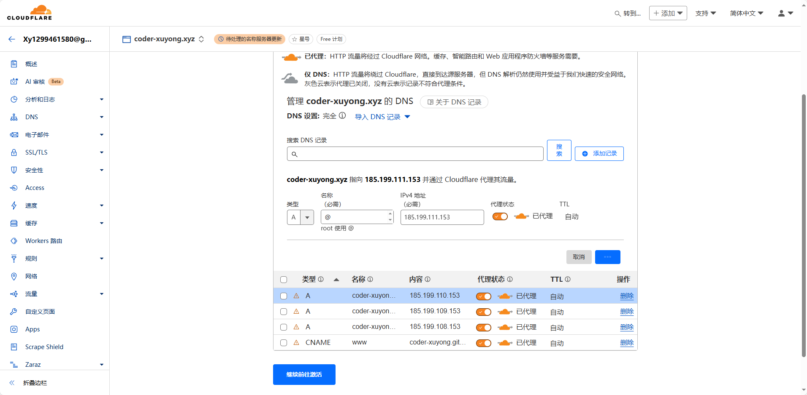

看提示，登陆阿里云的域名控制台，取保关闭了 DNSSEC （就是关闭 DNS 安全）；然后修改 DNS （从域名列表的操作菜单中的管理进去），将DNS改为如图中的两个。

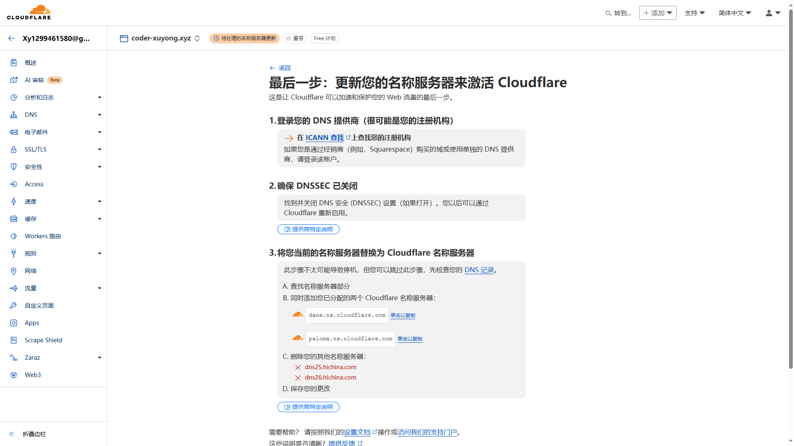


完成之后需要等待一段时间，可以点击 立即检查名称服务器 查看结果；也可以在阿里云 云解析DNS/权威域名解析/解析设置 中查看。

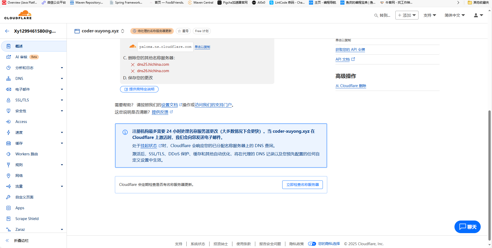

若发现域名访问出现“域名”重定向你太多次


需要修改cloudflare的SSL/TLS的配置，修改后的配置如图所示：

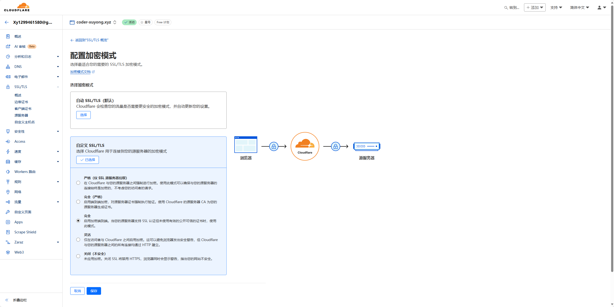


## 了解备案

一、是否需要备案的关键因素
中国 ICP 备案的核心要求是：**网站服务器位于中国大陆境内**。与域名注册商（如阿里云）、DNS 服务商（如 Cloudflare）无关。
因此，你的情况需要明确以下两点：

GitHub Pages 的服务器位置：GitHub Pages 的服务器默认部署在境外（如美国），属于“境外服务器”。

域名解析的最终 IP 地址：即使通过 Cloudflare 代理或 CDN，只要最终指向的是境外服务器，仍无需备案。

二、具体场景分析
1. 若未使用 Cloudflare 中国服务（如 CDN 国内节点）
无需备案
即使域名在阿里云注册且 DNS 托管在 Cloudflare，只要 GitHub Pages 的服务器在境外（如美国），且未通过 Cloudflare 将流量引入中国大陆服务器，则完全不需要备案。

2. 若使用 Cloudflare 中国服务（如国内 CDN 节点）
需备案
如果通过 Cloudflare 的国内节点（例如与百度云加速合作的节点），将流量路由至中国大陆服务器，则必须完成 ICP 备案。
（但 GitHub Pages 本身不提供中国大陆服务器，因此这种情况几乎不存在。）

三、注意事项
域名实名认证
阿里云注册的域名仍需完成**域名实名认证**（与备案无关），否则域名可能被注册商暂停解析。

中国大陆访问稳定性
未备案的境外网站在中国大陆访问时，可能受网络跨境波动影响，或被防火墙拦截（取决于内容是否合规）。

备案与 DNS 服务商无关
Cloudflare 仅负责 DNS 解析或代理加速，不改变服务器实际位置，因此不影响备案判定。

四、总结
无需备案的情况：
GitHub Pages（境外服务器） + 阿里云域名 + Cloudflare DNS（未指向中国大陆服务器） → **无需备案**。

需备案的情况：
若未来将网站迁移至中国大陆服务器（如阿里云、腾讯云境内节点） → **必须备案**。

## 阿里云域名备案实操

在阿里云控制台的右上方搜索或者点击 ICP备案 。进入之后，找到“开始备案”，按提示执行。

但……

根据中国的规定，备案需要域名和服务器。阿里云作为服务提供商，肯定要求用户同时有他们的服务器产品才能备案。用户如果只有域名，没有在阿里云购买服务器，无法备案！！！！！！！

## Cloudflare github pages 部署步骤（了解）

使用了这一步，就不需要绑定github pages了，相当于同一个功能，只是必须绑定域名

登陆成功后

选择 计算(Workers)/Worker 和 pages，如下图所示
 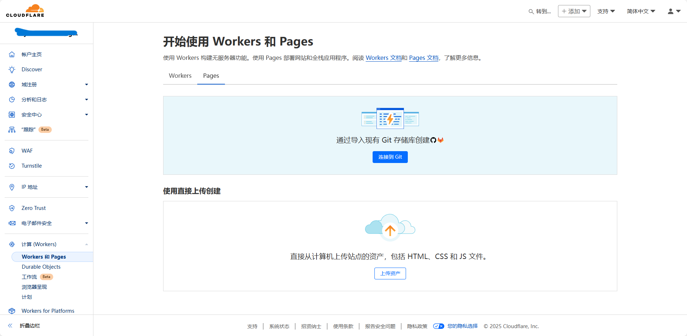

选择pages，连接 git 
  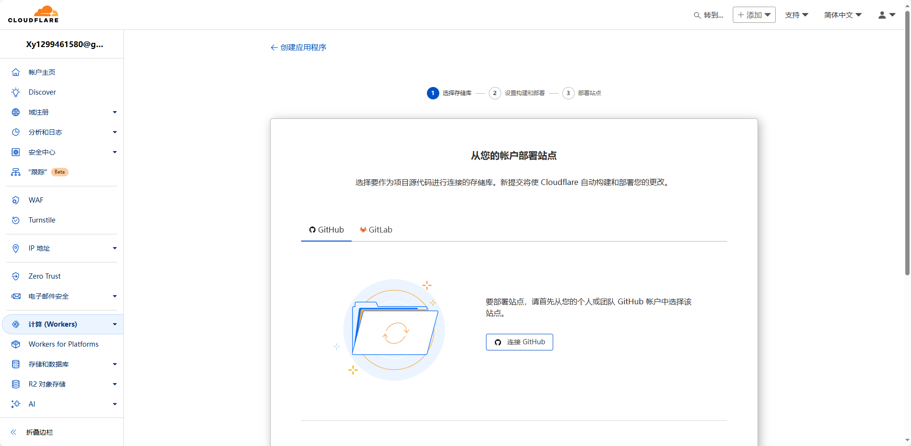
选择github，连接github，登陆之后选择仓库
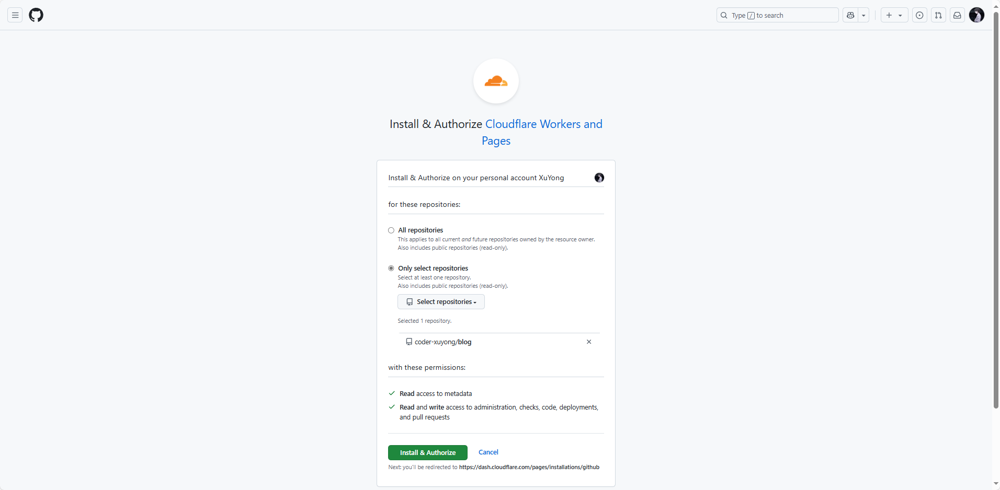
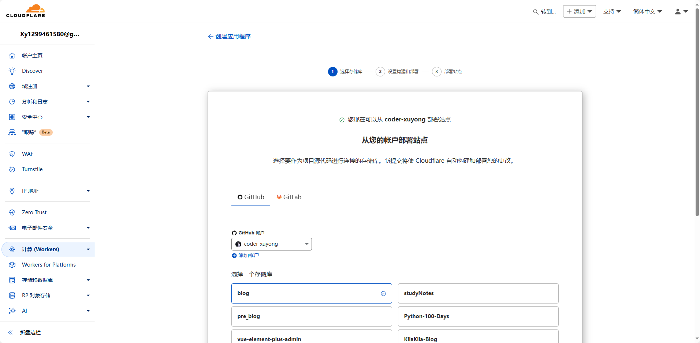
选择分支，确认构建命令和打包目录

出现构建错误

需要自定义 node 版本

但又出现了找不到打包目录的错误

修改构建输出目录

构建成功

可以访问 dev 结尾的网址预览项目

后续上传代码到github上，会自动打包


## 参考
> https://blog.csdn.net/lion_no_back/article/details/131075457
> https://blog.csdn.net/abjtxf/article/details/145431226
> https://qinyu.space/%E5%8D%9A%E5%AE%A2%E6%90%AD%E5%BB%BA/%E5%88%A9%E7%94%A8cloudflare%E5%8A%A0%E9%80%9Fgithub%E4%B8%BB%E9%A1%B5%E8%AE%BF%E9%97%AE/#